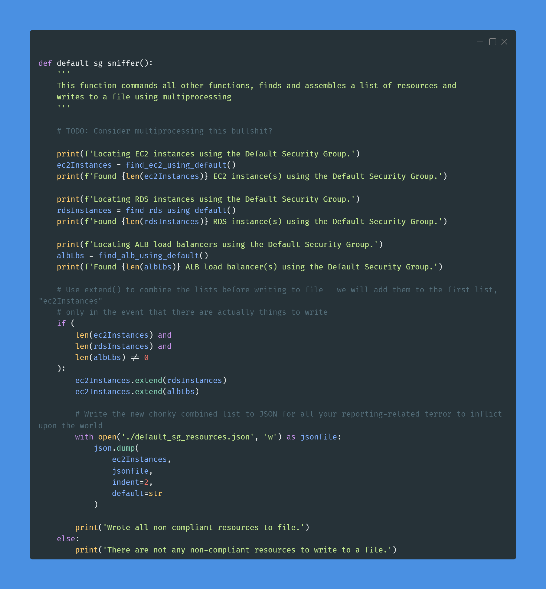

# 100 Days of Cloud & 100 Days of Cloud Security

#100DaysOfCloud #100DaysOfCyberSecurity snippets starting from 28 SEPT 2022 by your (allegedly) Favorite CISO: https://www.linkedin.com/in/jonathan-r-2b2742112/.

Hoping to spread some knowledge and encourage entry-level professionals to emulate this. For all intents and purposes the current industry hivemind would argue that as a CISO I, 1) probably shouldn't do this because "cIsOs DoNt NeEd To Be TeChNiCaL" and 2) A CISO shouldn't need to "prove" anything - which is a dangerous assumption and why we have busted ass security programs in F500 companies. Gatekeepers can bite my shiny metal ass.

In all seriousness, certs and degrees are fine but not everyone has the economic means to afford them at any given point. As a former hiring manager who built one of the most ambitious cyber security products INSIDE of a massive F500 company with more than 60% of the team being entry-level, I have an opinion that you can teach just about any skills to any candidate that can demonstrate they have a desire and passion to learn and display some personality in their projects.

When you create something like this, it demonstrates you can stick with something (100 days is a lot!), and how you document it and execute tells me far more about your aptitude and attitude than a cert or degree. By all means, don't feel bad for getting them, but for those looking to pivot or to highlight themselves: do this.

## Day 1


### Day 1 LinkedIn Post

[Post Link](https://www.linkedin.com/feed/update/urn:li:activity:6980913548331786240/)

Time to do something I never partook in: #100daysofcloud #100daysofcybersecurity. It kind of favors the micro-content and maybe you will learn a thing or two from your (allegedly) Favorite CISO.

In AWS, you're going to run into times where you need to know your Account ID, Account Name, Organizations ID, or current Region. Maybe it's for uniqueness, maybe its to provide to another command, maybe it is to fill in an environment variable, or maybe to write an IAM policy condition, or just because you want to know. Don't get so caught up in justification.

These are some of my favorite. Using Carbon to create these nifty terminal pictures too. I'll mostly focus on AWS with CLI & Python, may throw in some M365 E5 Security stuff in there too just to keep you on your toes. Feel free to make requests too and engage with me, or suffer the consequences of learning NOTHING HAHHAHAHAHA...okay, I'll stop.

Anyway, code for you copy-paste people:

```bash
sudo apt install -y jq
# Get your Account ID
AWS_ACCOUNT_ID=$(aws sts get-caller-identity | jq '.Account' -r)
echo $AWS_ACCOUNT_ID
# Get your Region
AWS_REGION=$(aws configure get region)
echo $AWS_REGION
# Get your Account name
AWS_ACCOUNT_NAME=$(aws organizations describe-account --account-id $AWS_ACCOUNT_ID | jq '.Account.Name' -r)
echo $AWS_ACCOUNT_NAME
# Get your AWS Organizations ID
AWS_ORGANIZATIONS_PRINCIPAL_ID=$(aws organizations describe-organization | jq '.Organization.Id' -r)
echo $AWS_ORGANIZATIONS_PRINCIPAL_ID
```

Stay Dangerous

#security #learning #python #cli #aws #cloudsecurity #bash

### Day 2 Code Snippet

```bash
sudo apt install -y jq
# Get your Account ID
AWS_ACCOUNT_ID=$(aws sts get-caller-identity | jq '.Account' -r)
echo $AWS_ACCOUNT_ID
# Get your Region
AWS_REGION=$(aws configure get region)
echo $AWS_REGION
# Get your Account name
AWS_ACCOUNT_NAME=$(aws organizations describe-account --account-id $AWS_ACCOUNT_ID | jq '.Account.Name' -r)
echo $AWS_ACCOUNT_NAME
# Get your AWS Organizations ID
AWS_ORGANIZATIONS_PRINCIPAL_ID=$(aws organizations describe-organization | jq '.Organization.Id' -r)
echo $AWS_ORGANIZATIONS_PRINCIPAL_ID
```

## Day 2


### Day 2 LinkedIn Post

[Post Link](https://www.linkedin.com/feed/update/urn:li:activity:6981255353304817664/)

Day 2 of #100daysofcloud & #100daysofcybersecurity is a Python script to locate any default VPCs in any AWS Region in your *current* Account. Script is in the attached Carbon Screenshot. I'll begin porting these to GitHub soon.

Every single AWS Account out there has default VPCs created in every Region, there are a lot of AWS services such as RDS, Neptune, Redshift, SageMaker, EC2, and so forth that look for the Default VPC to attach to. It's meant to help you out but is a relic of a bygone era when the hardest thing you may have had to do was properly create a VPC with Public & Private Subnets and not blackhole your NATGW lol.

Now with landing zones, IAC, and endless templates and console wizards there is hardly a need for it. While a vast majority of AWS incidents I have been involved in use an identity vector, there are still some that use the network vector especially for your "garden snake" variety attack like cryptojacking. Attackers will spin up massive ECS, EKS or EC2 fleets and mine. I've also seen SFTP servers hosted in a different Region go undetected as the adversary used it to exfiltrate data from within the trust boundary.

This is a big deal because the major detective controls in AWS are all Regional. Even if you use multi-region CloudTrail, would you be able to tell 100% that a Create operation is malicious? Are you even monitoring CloudTrail or just dumping it off? Maybe the IP Address will give it away - since the attacker needs to gain Initial Access first - but can you build an ML workload to detect anomalies between identities & IP addresses accurately?

Interestingly enough, there is not a cloud network oriented Technique/Sub-Technique in MITRE ATT&CK. The closest you get is T1583.003: Acquire Infrastructure: Virtual Private Server for Resource Development / living-off-the-land and for Persistence this is an identity-related one but, T1078.004: Valid Accounts: Cloud Accounts.

Day 3 I'll show you how to delete them and in the future we will have multi-account use cases. For this one you need ec2:DescribeVpcs and ec2:DescribeRegions permissions only.

Stay Dangerous

#cloudsecurity #awssecurity #aws #security #infosec #learning #cloud

### Day 2 Code Snippet

```python
import boto3

def get_aws_regions():
    '''
    Retrieves all opted-in AWS Regions for this Account
    '''
    ec2 = boto3.client('ec2')

    awsRegions = []

    try:
        # Get all Regions we are opted in for
        for r in ec2.describe_regions()['Regions']:
            regionName = str(r['RegionName'])
            optInStatus = str(r['OptInStatus'])
            if optInStatus == 'not-opted-in':
                continue
            else:
                awsRegions.append(regionName)
    except Exception as e:
        raise e
        
    print('Got all AWS Regions')

    del ec2

    return awsRegions

def find_default_vpcs():
    '''
    Loops through every AWS Region and looks for Default VPCs
    '''
    awsRegions = get_aws_regions()

    for region in awsRegions:
        # Create a new Session for the Region and pass it to an EC2 client
        session = boto3.Session(region_name=region)
        ec2 = session.client('ec2')
        # Find those VPCs - use a list comprehension to determine if there any VPCs to begin with
        if ec2.describe_vpcs()['Vpcs']:
            for vpc in ec2.describe_vpcs()['Vpcs']:
                # Now let's find the default VPC
                vpcId = vpc['VpcId']
                isDefault = vpc['IsDefault']
                if isDefault == True:
                    print(f'VPC {vpcId} in {region} is the Default VPC!')
                else:
                    print(f'VPC {vpcId} in {region} is a custom VPC.')
        else:
            print(f'There are no VPCs in {region}.')

find_default_vpcs()
```

## Day 3


### Day 3 LinkedIn Post

[Post Link](https://www.linkedin.com/feed/update/urn:li:share:6981629745717215233/)

It is Day 3 of #100daysofcloud & #100daysofcybersecurity and I have a spicy one for you that builds on Day 2 *AND* I have a GitHub that will keep the full code snippets, Carbon screenshots, and the post for posterity. More reason to engage here so we can extrapolate, exchange ideas, and give you a reason to look back.

The post & code will be mirrored after each post. Link will always be in the comments as to not anger the algorithm. I do this so people can see & learn not to stoke some bullshit impressions ego.

Day 3 has the extended script which teaches us how to separate discrete units of logics in our Python scripts into functions and call them from a main script. We are also making our first #SOAR (Security Orchestration & Automated Response) #playbook for sorts.

Focusing on the latter, SOAR is a muddy, multi-disciplinary space that describes any tool or "thing" which automates some security tasks for use and/or orchestrates it on our behalf. This can be a workflow tool that will automatically response to a given input - such as responding to a Splunk alert and sending alerts to PagerDuty, it can be a #CNAPP that generates an IAM Permissions Boundary for you, or a tool that will destroy instances spawned by a known malicious actor. You can use anything for SOAR, and in my experience, you're 99% better of BUILDING it yourself.

That said, SOAR is a contentious topic. You need a lot of Delete/Update/Describe/List permissions and if an adversary gained control of this SOAR #identity, bad things can happen. Also, product teams and your security organization may dislike of you having orbital nukes to crush their non-compliant resources. There is always the risk you delete something legit or have a runaway SOAR workflow that eats itself (I've seen that before). Before doing this you should weigh all the pros & cons and honestly without GREAT #Detection, using #Responsive #Controls is not good enough. All opt for Preventative measures AND #EDUCATE & #EMPOWER YOUR PARTNERS!!

On the #Python side, this script has functions which carry out specific tasks passed on an input. In our case we have a function for yeeting IGWs and another for Subnets. This helps keep your code clean, helps with debugging, looks cool as hell, and can improve performance for not needing to use a lot of try/except and for-loops within a big ass code monolith. You can go even further with defining Classes and calling your Python scripts like legit modules such as Boto3 and Pandas, but we'll do that...later?

Anyway, IAM Permissions needed are in GitHub too. If you do setup SOAR identities best practice is to control the trust boundary with who/what can use it. Minimum necessary permissions - try to keep identities per a playbook if you can (for destructive ones) - and maybe even use IP/network conditions (VPC, VPCE, SourceIp) and MFA.

Seriously though, destroy the Default VPCs, they are nothing but a free persistence & defense evasion area for adversaries.

Stay Dangerous

### Day 3 Code Snippet

#### Permissions

```json
{
    "Version": "2012-10-17",
    "Statement": [
        {
            "Sid": "VpcYeeter",
            "Effect": "Allow",
            "Action": [
                "ec2:DescribeInternetGateways",
                "ec2:DescribeNetworkInterfaces",
                "ec2:DeleteSubnet",
                "ec2:DescribeVpcs",
                "ec2:DescribeRegions",
                "ec2:DeleteInternetGateway",
                "ec2:DetachInternetGateway",
                "ec2:DeleteVpc",
                "ec2:DescribeSubnets"
            ],
            "Resource": "*",
            "Condition": {
                "ForAnyValue:StringEquals": {
                    "aws:SourceVpce": "vpce-123123" # REPLACE THIS VALUE IF YOURE USING VPC ENDPOINTS
                },
                "IpAddress": {
                    "aws:SourceIp": "192.168.1.1" # REPLACE THIS IF YOU WANT TO USE THE PRIVATE IP OF AN EIP/ENI!!!
                }
            }
        }
    ]
}
```

#### Code

```python
import boto3
from time import sleep

def get_aws_regions():
    '''
    Retrieves all opted-in AWS Regions for this Account
    '''
    ec2 = boto3.client('ec2')

    awsRegions = []

    try:
        # Get all Regions we are opted in for
        for r in ec2.describe_regions()['Regions']:
            regionName = str(r['RegionName'])
            optInStatus = str(r['OptInStatus'])
            if optInStatus == 'not-opted-in':
                continue
            else:
                awsRegions.append(regionName)
    except Exception as e:
        raise e
        
    print('Got all AWS Regions')

    del ec2

    return awsRegions

def seek_and_destroy_default_vpcs():
    '''
    Loops through every AWS Region and looks for Default VPCs
    '''
    awsRegions = get_aws_regions()

    for region in awsRegions:
        # Create a new Session for the Region and pass it to an EC2 client
        session = boto3.Session(region_name=region)
        ec2 = session.client('ec2')
        # Find those VPCs - use a list comprehension to determine if there any VPCs to begin with
        if ec2.describe_vpcs()['Vpcs']:
            for vpc in ec2.describe_vpcs()['Vpcs']:
                # Now let's find the default VPC
                vpcId = vpc['VpcId']
                isDefault = vpc['IsDefault']
                if isDefault == True:
                    # supply VPC ID to filter to find any ENIs with a list comprehension
                    if ec2.describe_network_interfaces(
                        Filters=[
                            {
                                'Name': 'vpc-id',
                                'Values': [vpcId]
                            }
                        ]
                    )['NetworkInterfaces']:
                        # ENIs found - likely has workloads or at least a NATGW that you should check on first...
                        print(f'Default VPC {vpcId} in {region} currently has attached ENIs and cannot be automatically deleted!')
                    else:
                        # Time to SOAR the shit out those default VPCs
                        # Delete the IGWs
                        seek_and_destroy_igws(aws_region=region,vpc_id=vpcId)
                        # Delete the Subnets
                        seek_and_destory_subnets(aws_region=region,vpc_id=vpcId)
                        try:
                            ec2.delete_vpc(VpcId=vpcId)
                            print(f'Yeeted {vpcId} in {region} straight to VPC Hell!')
                        except Exception as e:
                            print(f'Failed to delete {vpcId} in {region} due to \n {e}')
                else:
                    print(f'VPC {vpcId} in {region} is a custom VPC.')
        else:
            print(f'There are no VPCs in {region}.')

def seek_and_destroy_igws(aws_region, vpc_id):
    '''
    This function receives a VPC ID and uses it to find, detach and tear asunder any Internet Gateways and skip rope with its entrails
    '''
    session = boto3.Session(region_name=aws_region)
    ec2 = session.client('ec2')
    try:
        # get the IGW for the VPC
        for igw in ec2.describe_internet_gateways(
            Filters=[
                {
                    'Name': 'attachment.vpc-id',
                    'Values': [vpc_id]
                }
            ]
        )['InternetGateways']:
            igwId = igw['InternetGatewayId']
            # detach the IGW and wait for 2 seconds because a waiter does not exist and I do not want to write one...
            ec2.detach_internet_gateway(
                DryRun=False,
                InternetGatewayId=igwId,
                VpcId=vpc_id
            )
            sleep(2)
            ec2.delete_internet_gateway(
                DryRun=False,
                InternetGatewayId=igwId
            )
            print(f'Internet Gateway for {vpc_id} in {aws_region} was completely and utterly destroyed!')
    except Exception as e:
        print(f'Encountered error trying to remove/delete IGWs for {vpc_id} in {aws_region} \n {e}')

def seek_and_destory_subnets(aws_region, vpc_id):
    '''
    This function receives a VPC ID and uses it to find, and absolutely crush any and all Subnets brazen enough to exist
    '''
    session = boto3.Session(region_name=aws_region)
    ec2 = session.client('ec2')
    try:
        for subnet in ec2.describe_subnets(
            Filters=[
                {
                    'Name': 'vpc-id',
                    'Values': [vpc_id]
                }
            ]
        )['Subnets']:
            subnetId = subnet['SubnetId']
            ec2.delete_subnet(
                SubnetId=subnetId,
                DryRun=False
            )
        print(f'All Subnets for {vpc_id} in {aws_region} were beaten to a pulp and have left this mortal coil!')
    except Exception as e:
        print(f'Encountered error trying to delete Subnets for {vpc_id} in {aws_region} \n {e}')

seek_and_destroy_default_vpcs()
```

## Day 4


### Day 4 LinkedIn Post

[Post Link](https://www.linkedin.com/feed/update/urn:li:share:6982011824653099008/)

Day 4 of #100daysofcloud & #100daysofcybersecurity, sticking with the theme of #SOAR playbooks, automation, and the thrice-cursed AWS "default" resources. As always, #GitHub in the links with the full code snippet and required permissions for it.

In Day's 2 and 3 we discussed the #Default #VPC and other bygone relics which AWS keeps around. Included within EVERY VPC is the Default Security Group (SG), which you cannot delete, so you need to get creative.

The Default SG has a rule which allows "full talk-to-self" that means anything that SG is attached to has unfettered network access across all ports & protocols. It is the opposite of least privilege, it is an anti-pattern at best and lets network-savvy attackers easily live off the land at worst.

To make the SG even worse, and really all SGs, is the default egress rule allows all outbound traffic. SGs are #stateful, which means that any connection opened is allowed in, so even if there is not a direct rule allowing access - if you or an #adversary opens a connection it can talk unfettered because of the egress. The only way to stop that is with a #Network #ACL - which are more trouble than they're worth - or using something like Network #Firewall, #DNS Firewall or an appliance with very specifically crafted rules.

A best practice is to NOT use that SG and blow all the rules away. Day 4's script lets you do that. However, I do not account for edge cases, it only deletes the DEFAULT RULES IT COMES WITH. It will add a tag telling people not to use it and will print out any extra rules. Security Hub and other CSPMs will tell you if anyone is USING it. The other issue is for #ClickOps that SG is chosen by default because...well...it's the default. So if you are not using IAC fervently, I bet you have a resource using it.

As always, #Responsive / #Destructive tech is controversial. Do not run this thing without making sure no one is using it. If they are, educate them, you can easily create & associate better SGs and THEN you can blow that shit to pieces.

As an industry we are rightfully concentrating on identity but network attack paths will continue to be a problem and it's an area that is often neglected too much. Blow away Default VPCs before this one to avoid extra work. When the VPC dies the Default SG dies. All for now...

Stay Dangerous

#cloudsecurity #awssecurity #aws #security 

### Day 4 Code Snippet

#### Permissions

```json
{
    "Version": "2012-10-17",
    "Statement": [
        {
            "Sid": "VisualEditor0",
            "Effect": "Allow",
            "Action": [
                "ec2:RevokeSecurityGroupIngress",
                "ec2:DescribeSecurityGroupRules",
                "ec2:CreateTags",
                "ec2:RevokeSecurityGroupEgress",
                "ec2:DescribeRegions",
                "ec2:DescribeSecurityGroups"
            ],
            "Resource": "*"
        }
    ]
}
```

#### Code

```python
import boto3
import json

sts = boto3.client('sts')
AWS_ACCOUNT_ID = sts.get_caller_identity()['Account']
del sts

def get_aws_regions():
    '''
    Retrieves all opted-in AWS Regions for this Account
    '''
    ec2 = boto3.client('ec2')

    awsRegions = []

    try:
        # Get all Regions we are opted in for
        for r in ec2.describe_regions()['Regions']:
            regionName = str(r['RegionName'])
            optInStatus = str(r['OptInStatus'])
            if optInStatus == 'not-opted-in':
                continue
            else:
                awsRegions.append(regionName)
    except Exception as e:
        raise e
        
    print('Got all AWS Regions')

    del ec2

    return awsRegions

def default_sg_flayer():
    '''
    Loops through every AWS Region and looks for Default SGs, removes the ingress & egress default rules, adds a new tag,
    and then runs a report if there are any leftover rules
    '''
    awsRegions = get_aws_regions()

    for region in awsRegions:
        # Create a new Session for the Region and pass it to an EC2 client
        session = boto3.Session(region_name=region)
        ec2 = session.client('ec2')
        # Default Security Group always has a Group Name of 'default'
        response = ec2.describe_security_groups(
            Filters=[
                {
                    'Name': 'group-name',
                    'Values': ['default']
                }
            ]
        )
        # Ignore empty returns
        if not response['SecurityGroups']:
            continue
        else:
            # Parse Default SGs. Use For loop as there can be multiple SGs per Region
            for sg in response['SecurityGroups']:
                #print(json.dumps(sg,indent=4,default=str))
                sgId = sg['GroupId']
                # Remove the self-ref SG Rule, if there are any ingress rules
                if sg['IpPermissions']:
                    print(f'Removing ingress for Default SG {sgId} in {region}.')
                    default_sg_ingress_removal(region, sgId)
                # Remove the egress rule, if there are any egress rules
                if sg['IpPermissionsEgress']:
                    print(f'Removing egress for Default SG {sgId} in {region}.')
                    default_sg_egress_removal(region, sgId)
                # Add a new tag to the default SG as a warning
                print(f'Adding new warning name tag to Default SG {sgId} in {region}.')
                default_sg_tagger(region, sgId)
                # Report if there are any left over rules
                print(f'Checking if there are remaining rules for Default SG {sgId} in {region}.')
                default_sg_remaining_rules_report(region, sgId)

def default_sg_ingress_removal(region, security_group_id):
    '''
    Removes the Default SG self-referenced ingress rule ONLY
    '''
    session = boto3.Session(region_name=region)
    ec2 = session.client('ec2')

    try:
        r = ec2.revoke_security_group_ingress(
            DryRun=False,
            GroupId=security_group_id,
            IpPermissions=[
                {
                    'IpProtocol': '-1',
                    'UserIdGroupPairs': [
                        {
                            'GroupId': security_group_id,
                            'UserId': AWS_ACCOUNT_ID
                        }
                    ]
                }
            ]
        )
        if r['Return'] == True:
            print(f'Revoked self-referenced Ingress for Default SG {security_group_id} in {region}.')
        else:
            print(f'Failed to revoke self-referenced Ingress for Default SG {security_group_id} in {region}.')
    except Exception as e:
        print(f'Failed to revoke self-referenced Ingress for Default SG {security_group_id} in {region}.')
        print(e)

def default_sg_egress_removal(region, security_group_id):
    '''
    Removes the Default SG allow-all Egress rule ONLY
    '''
    session = boto3.Session(region_name=region)
    ec2 = session.client('ec2')

    try:
        r = ec2.revoke_security_group_egress(
            DryRun=False,
            GroupId=security_group_id,
            IpPermissions=[
                {
                    'IpProtocol': '-1',
                    'IpRanges': [
                        {
                            'CidrIp': '0.0.0.0/0'
                        }
                    ]
                }
            ]
        )
        if r['Return'] == True:
            print(f'Revoked allow-all Egress for Default SG {security_group_id} in {region}.')
        else:
            print(f'Failed to revoke allow-all Egress for Default SG {security_group_id} in {region}.')
    except Exception as e:
        print(f'Failed to revoke allow-all Egress for Default SG {security_group_id} in {region}.')
        print(e)

def default_sg_tagger(region, security_group_id):
    '''
    Adds tags to the Default SG so people know not to touch it...hopefully
    '''
    session = boto3.Session(region_name=region)
    ec2 = session.client('ec2')

    try:
        ec2.create_tags(
            DryRun=False,
            Resources=[security_group_id],
            Tags=[
                {
                    'Key': 'Name',
                    'Value': 'DEFAULT_DO_NOT_USE'
                }
            ]
        )
        print(f'Tagged Default SG {security_group_id} in {region}.')
    except Exception as e:
        print(f'Failed to tag Default SG {security_group_id} in {region}.')
        print(e)

def default_sg_remaining_rules_report(region, security_group_id):
    '''
    Describes if there are any other rules left on the default SG
    '''
    session = boto3.Session(region_name=region)
    ec2 = session.client('ec2')

    r = ec2.describe_security_group_rules(
        Filters=[
            {
                'Name': 'group-id',
                'Values': [security_group_id]
            },
        ]
    )
    if r['SecurityGroupRules']:
        print(
            json.dumps(
                r['SecurityGroupRules'],
                indent=4,
                default=str
            )
        )

default_sg_flayer()
```

## Day 5

### Day 5 LinkedIn Post

[Post Link](https://www.linkedin.com/feed/update/urn:li:activity:6982403353934753792/)

Day 5 of #100daysofcloud & #100daysofcybersecurity. No code today, Giants football is on and I got some #steakposting to get to later. Will back this up to GitHub tomorrow but there will not be any snippets, just theory today.

Sticking with the #network #security concepts for the next few days on AWS, going to cover off some other tools. I get that identity is overwhelmingly the largest vector of initial access, but not every compromised identity is a true admin, I'm sure the adversaries would love that. That is why they laterally move. That is why cryptojacking is such a boring attack. That is why data exfiltration is simple for #ransomware gangs and #doublextortion is a thing.

While paring down egress for Security Groups will be really hard to do for your edge, there are other tools you can add in for a hardened network edge. Firstly, for private security groups, write your SGs per layer of your app - be it Private Lambda, EC2s running a webapp, EKS Nodes, etc. You can reference the other SG you know incoming traffic will be instead of allowing an entire Subnet or VPC CIDR.

Application Load Balancers have some built in security settings such as overriding WAF Fail Open in case WAF ever falls down, ALB will not allow the uninspected traffic through. That is a tradeoff of availability for confidentiality and I do not know anyone who does that. HTTP Desync Attack protection helps mitigate HTTP request smuggling, and you can also drop invalid HTTP headers. You should also turn on access logging, it is in a weird CEF-like format, but Athena has a way to parse it.

Next up is AWS WAF. Web App Firewalls protect against web app attacks - if you do not know how to write the rules (AWS does make it easy) you can use the managed rule groups to counter known bad IPs, SQLI, XSS, CSRF, specific parts of the request, and more. While there are ways around some of the protections, like very large requests, with some of the more advanced features like CAPTCHA challenges and bot protection. The logs are easy to parse and can be moved with Firehose (and converted to Parquet) and you can even do some fun NSPM/ML work with it (that's for later). You can orchestrate across your Organization use FMS as well, even auto-attaching.

Next is CloudFront. Not a security tool on its own but CDNs help absorb DDOS (along with Shield), great log source, but with Lambda@Edge you can intercept requests and do some really interesting things dropping suspect requests that look like XSS by enforcing to setting certain headers. We'll do a Day on this soon.

Network Firewall is a stateful NGFW-ish tool, it's operates like a Gateway, and works a lot like Suricata IDS/IPS to. You can create fine-grained rules to inspect the request and drop traffic that doesn't match specific ports/protocols and IPs. You can write Suricata-type rules for deep inspection and it also supports FMS and AWS Managed Threat Lists. Great for ingress/egress centralization.

Stay Dangerous

### Day 5 Code Snippet

NO CODE SNIPPET

## Day 6



### Day 6 LinkedIn Post

[Post Link](https://www.linkedin.com/feed/update/urn:li:share:6982693255305953283/)

Day 6 of #100daysofcloud & #100daysofcybersecurity we're still on our network game. Meant to do this for Day 5, but regarding finding what resources use the Default SG can be done via #CSPM or #AWS Config - but let's do it the "hard way" - and it will prove a few points as well.

Financial considerations in security typically isn't broached outside of complaints about (lack of) budgets. That's valid, but not here. Despite being a "vendor #CISO" I'm very build-first. Outside of architecture and engineering chops a team needs are financial considerations - how to forecast usage/consumption and how it looks scaled up 2/5/10/20X for example. This is pertinent when it comes to AWS (and other #CSP) services since being regional it means needing to pay for it per-Region.

When it comes to a real cost-benefit analysis - is it worth to your team to run a $5/month bill up per every AWS Region when outside of your main region(s) it will just be an unnecessary discretionary cost. Why not whip up some scripts for #Detective Controls for things you want to find without needing to administer and pay for a multi-region deployment that has limited use.

That is where today's script comes in. Sure, you can throw on AWS Config & AWS Security Hub and write an Insight in SecHub to find resources using the default SG - but it's more money and work to just turn the services on before you see value. If you already know what you want, run a script: this script looks just at EC2, RDS and ALBs using Default SGs.

The second theme is around data consistency in your collection. Nearly every API has a different way it returns information, especially nested metadata. For security groups EC2 gives you a name, RDS has the ID and status, ALB just gives you IDs. You'll run into this a lot where every API you interface with needs its own parsing logic. You also need to ensure that you settle on what the data should look like - Pascal vs Camel Case, what you'll name the keys, if you maintain the API's naming or use your own, are you going to be further joining or enriching?

This script has an opinion. Normalized schema and pascal case, but you'll need to make the determination on your own. Recap: it's almost always more efficient to script your own detection, always be cognizant of costs, and settling on things as minor as schema and SLAs around your data collection leads to future #SecDataOps excellence.

Stay Dangerous

#awssecurity #cloudsecurity #security #bigdata

### Day 6 Code Snippet

#### Permissions

```json
{
    "Version": "2012-10-17",
    "Statement": [
        {
            "Sid": "VisualEditor0",
            "Effect": "Allow",
            "Action": [
                "elasticloadbalancing:DescribeLoadBalancers",
                "ec2:DescribeInstances",
                "ec2:DescribeRegions",
                "rds:DescribeDBInstances",
                "ec2:DescribeSecurityGroups"
            ],
            "Resource": "*"
        }
    ]
}
```

#### Code Snippets

```python
import boto3
import json

sts = boto3.client('sts')
AWS_ACCOUNT_ID = sts.get_caller_identity()['Account']
del sts

def get_aws_regions():
    '''
    Retrieves all opted-in AWS Regions for this Account
    '''
    ec2 = boto3.client('ec2')

    awsRegions = []

    try:
        # Get all Regions we are opted in for
        for r in ec2.describe_regions()['Regions']:
            regionName = str(r['RegionName'])
            optInStatus = str(r['OptInStatus'])
            if optInStatus == 'not-opted-in':
                continue
            else:
                awsRegions.append(regionName)
    except Exception as e:
        raise e
        
    print('Got all AWS Regions')

    del ec2

    return awsRegions

def default_sg_sniffer():
    '''
    This function commands all other functions, finds and assembles a list of resources and
    writes to a file using multiprocessing
    '''

    # TODO: Consider multiprocessing this bullshit?

    print(f'Locating EC2 instances using the Default Security Group.')
    ec2Instances = find_ec2_using_default()
    print(f'Found {len(ec2Instances)} EC2 instance(s) using the Default Security Group.')

    print(f'Locating RDS instances using the Default Security Group.')
    rdsInstances = find_rds_using_default()
    print(f'Found {len(rdsInstances)} RDS instance(s) using the Default Security Group.')

    print(f'Locating ALB load balancers using the Default Security Group.')
    albLbs = find_alb_using_default()
    print(f'Found {len(albLbs)} ALB load balancer(s) using the Default Security Group.')

    # Use extend() to combine the lists before writing to file - we will add them to the first list, "ec2Instances"
    # only in the event that there are actually things to write
    if (
        len(ec2Instances) and 
        len(rdsInstances) and 
        len(albLbs) != 0
    ):
        ec2Instances.extend(rdsInstances)
        ec2Instances.extend(albLbs)
        
        # Write the new chonky combined list to JSON for all your reporting-related terror to inflict upon the world
        with open('./default_sg_resources.json', 'w') as jsonfile:
            json.dump(
                ec2Instances,
                jsonfile,
                indent=2,
                default=str
            )

        print('Wrote all non-compliant resources to file.')
    else:
        print('There are not any non-compliant resources to write to a file.')

def find_ec2_using_default():
    '''
    Searches all Regions for EC2 instances using the Default Security Group
    '''
    awsRegions = get_aws_regions()

    # Empty list for instances
    instances = []

    for region in awsRegions:
        # Create a new Session for the Region and pass it to an EC2 client
        session = boto3.Session(region_name=region)
        ec2 = session.client('ec2')
        paginator = ec2.get_paginator('describe_instances')
        # Paginate through EC2s
        for page in paginator.paginate(
            Filters=[
                {
                    'Name': 'instance-state-name',
                    'Values': [
                        'running',
                        'stopped'
                    ]
                }
            ]
        ):
            for r in page['Reservations']:
                for i in r['Instances']:
                    instanceId = i['InstanceId']
                    # Loop SGs, there is typically only one, but this checks for more
                    for sg in i['SecurityGroups']:
                        # Continue looping, unless a "default" SG is found, then add instance to list & break
                        if sg['GroupName'] == 'default':
                            defaultEc2Dict = {
                                'AccountId': AWS_ACCOUNT_ID,
                                'AwsRegion': region,
                                'ResourceId': instanceId,
                                'ResourceType': 'EC2Instance'
                            }
                            # append to list
                            instances.append(defaultEc2Dict)
                            break
                        else:
                            continue

    return instances

def find_rds_using_default():
    '''
    Searches all Regions for RDS instances using the Default Security Group
    '''
    awsRegions = get_aws_regions()

    # Empty list for instances
    instances = []

    for region in awsRegions:
        # Create a new Session for the Region and pass it to an RDS client and an EC2 client
        session = boto3.Session(region_name=region)
        rds = session.client('rds')
        # EC2 Client is needed to find the name associated to an SG by ID
        ec2 = session.client('ec2')
        paginator = rds.get_paginator('describe_db_instances')
        for page in paginator.paginate():
            for r in page['DBInstances']:
                instanceId = r['DBInstanceIdentifier']
                # Loop SGs, there is typically only one, but this checks for more
                for sg in r['VpcSecurityGroups']:
                    sgId = sg['VpcSecurityGroupId']
                    # Pass the SG ID to the DescribeSecurityGroups API to parse the name. If the name is default add
                    # the DB information to the list and break the loop
                    if ec2.describe_security_groups(GroupIds=[sgId])['SecurityGroups'][0]['GroupName'] == 'default':
                        defaultRdsDict = {
                            'AccountId': AWS_ACCOUNT_ID,
                            'AwsRegion': region,
                            'ResourceId': instanceId,
                            'ResourceType': 'RDSInstance'
                        }
                        # append to list
                        instances.append(defaultRdsDict)
                        break
                    else:
                        continue

    return instances

def find_alb_using_default():
    '''
    Searches all Regions for Application Load Balancers using the Default Security Group
    '''
    awsRegions = get_aws_regions()

    # Empty list for lbs
    lbalancers = []

    for region in awsRegions:
        # Create a new Session for the Region and pass it to an ELBv2 client and en EC2 client
        session = boto3.Session(region_name=region)
        elbv2 = session.client('elbv2')
        # EC2 Client is needed to find the name associated to an SG by ID
        ec2 = session.client('ec2')
        paginator = elbv2.get_paginator('describe_load_balancers')
        # Paginate through ALBs
        for page in paginator.paginate():
            for l in page['LoadBalancers']:
                lbName = l['LoadBalancerName']
                # Similar to RDS & EC2, ALBs can have multiple load balancers, but like RDS only the ID is returned
                for sg in l['SecurityGroups']:
                    # Pass the SG ID to the DescribeSecurityGroups API to parse the name. If the name is default add
                    # the DB information to the list and break the loop
                    # The list of "SecurityGroups" only returns the IDs as is, no need for additional parsing...
                    if ec2.describe_security_groups(GroupIds=[sg])['SecurityGroups'][0]['GroupName'] == 'default':
                        defaultAlbDict = {
                            'AccountId': AWS_ACCOUNT_ID,
                            'AwsRegion': region,
                            'ResourceId': lbName,
                            'ResourceType': 'ALBLoadBalancer'
                        }
                        # append to list
                        lbalancers.append(defaultAlbDict)
                        break
                    else:
                        continue

    return lbalancers

default_sg_sniffer()
```

## Day 7

### Day 7 LinkedIn Post

### Day 7 Code Snippet

## Day 8

### Day 8 LinkedIn Post

### Day 8 Code Snippet

## Day 9

### Day 9 LinkedIn Post

### Day 9 Code Snippet

## Day 10

### Day 10 LinkedIn Post

### Day 10 Code Snippet

## Day 11

### Day 11 LinkedIn Post

### Day 11 Code Snippet

## Day 12

### Day 12 LinkedIn Post

### Day 12 Code Snippet

## Day 13

### Day 13 LinkedIn Post

### Day 13 Code Snippet

## Day 14

### Day 14 LinkedIn Post

### Day 14 Code Snippet