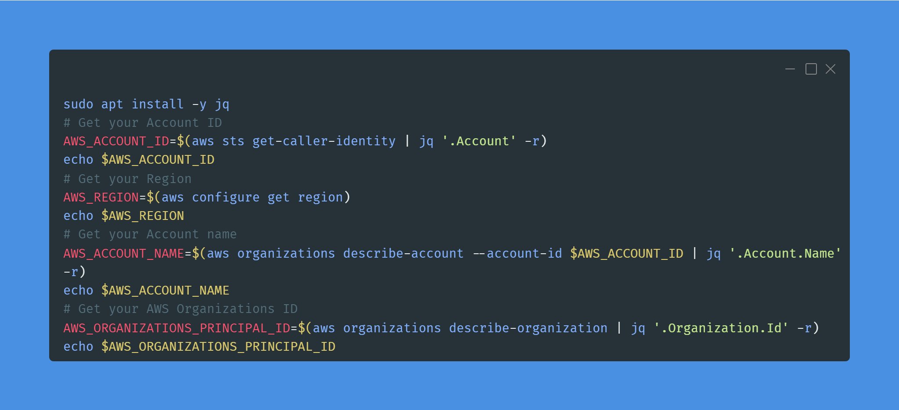
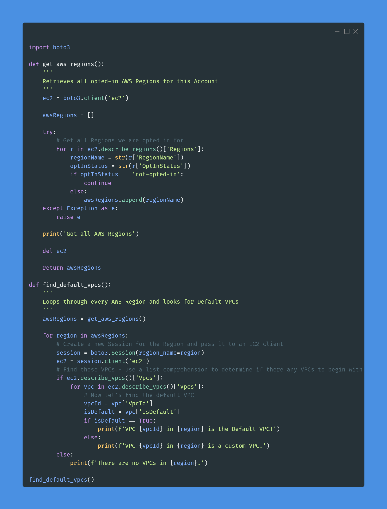
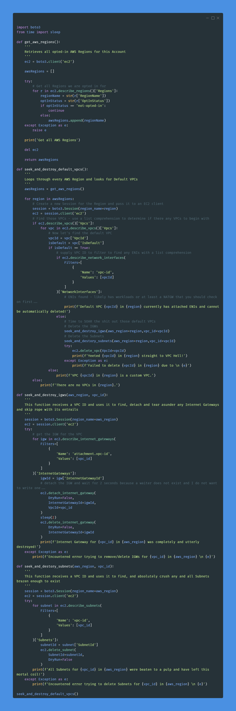

# 100 Days of Cloud & 100 Days of Cloud Security

#100DaysOfCloud #100DaysOfCyberSecurity snippets starting from 28 SEPT 2022 by your (allegedly) Favorite CISO: https://www.linkedin.com/in/jonathan-r-2b2742112/.

Hoping to spread some knowledge and encourage entry-level professionals to emulate this. For all intents and purposes the current industry hivemind would argue that as a CISO I, 1) probably shouldn't do this because "cIsOs DoNt NeEd To Be TeChNiCaL" and 2) A CISO shouldn't need to "prove" anything - which is a dangerous assumption and why we have busted ass security programs in F500 companies. Gatekeepers can bite my shiny metal ass.

In all seriousness, certs and degrees are fine but not everyone has the economic means to afford them at any given point. As a former hiring manager who built one of the most ambitious cyber security products INSIDE of a massive F500 company with more than 60% of the team being entry-level, I have an opinion that you can teach just about any skills to any candidate that can demonstrate they have a desire and passion to learn and display some personality in their projects.

When you create something like this, it demonstrates you can stick with something (100 days is a lot!), and how you document it and execute tells me far more about your aptitude and attitude than a cert or degree. By all means, don't feel bad for getting them, but for those looking to pivot or to highlight themselves: do this.

## Day 1



### Day 1 LinkedIn Post

[Post Link](https://www.linkedin.com/feed/update/urn:li:activity:6980913548331786240/)

Time to do something I never partook in: #100daysofcloud #100daysofcybersecurity. It kind of favors the micro-content and maybe you will learn a thing or two from your (allegedly) Favorite CISO.

In AWS, you're going to run into times where you need to know your Account ID, Account Name, Organizations ID, or current Region. Maybe it's for uniqueness, maybe its to provide to another command, maybe it is to fill in an environment variable, or maybe to write an IAM policy condition, or just because you want to know. Don't get so caught up in justification.

These are some of my favorite. Using Carbon to create these nifty terminal pictures too. I'll mostly focus on AWS with CLI & Python, may throw in some M365 E5 Security stuff in there too just to keep you on your toes. Feel free to make requests too and engage with me, or suffer the consequences of learning NOTHING HAHHAHAHAHA...okay, I'll stop.

Anyway, code for you copy-paste people:

```bash
sudo apt install -y jq
# Get your Account ID
AWS_ACCOUNT_ID=$(aws sts get-caller-identity | jq '.Account' -r)
echo $AWS_ACCOUNT_ID
# Get your Region
AWS_REGION=$(aws configure get region)
echo $AWS_REGION
# Get your Account name
AWS_ACCOUNT_NAME=$(aws organizations describe-account --account-id $AWS_ACCOUNT_ID | jq '.Account.Name' -r)
echo $AWS_ACCOUNT_NAME
# Get your AWS Organizations ID
AWS_ORGANIZATIONS_PRINCIPAL_ID=$(aws organizations describe-organization | jq '.Organization.Id' -r)
echo $AWS_ORGANIZATIONS_PRINCIPAL_ID
```

Stay Dangerous

#security #learning #python #cli #aws #cloudsecurity #bash

### Day 2 Code Snippet

```bash
sudo apt install -y jq
# Get your Account ID
AWS_ACCOUNT_ID=$(aws sts get-caller-identity | jq '.Account' -r)
echo $AWS_ACCOUNT_ID
# Get your Region
AWS_REGION=$(aws configure get region)
echo $AWS_REGION
# Get your Account name
AWS_ACCOUNT_NAME=$(aws organizations describe-account --account-id $AWS_ACCOUNT_ID | jq '.Account.Name' -r)
echo $AWS_ACCOUNT_NAME
# Get your AWS Organizations ID
AWS_ORGANIZATIONS_PRINCIPAL_ID=$(aws organizations describe-organization | jq '.Organization.Id' -r)
echo $AWS_ORGANIZATIONS_PRINCIPAL_ID
```

## Day 2



### Day 2 LinkedIn Post

[Post Link](https://www.linkedin.com/feed/update/urn:li:activity:6981255353304817664/)

Day 2 of #100daysofcloud & #100daysofcybersecurity is a Python script to locate any default VPCs in any AWS Region in your *current* Account. Script is in the attached Carbon Screenshot. I'll begin porting these to GitHub soon.

Every single AWS Account out there has default VPCs created in every Region, there are a lot of AWS services such as RDS, Neptune, Redshift, SageMaker, EC2, and so forth that look for the Default VPC to attach to. It's meant to help you out but is a relic of a bygone era when the hardest thing you may have had to do was properly create a VPC with Public & Private Subnets and not blackhole your NATGW lol.

Now with landing zones, IAC, and endless templates and console wizards there is hardly a need for it. While a vast majority of AWS incidents I have been involved in use an identity vector, there are still some that use the network vector especially for your "garden snake" variety attack like cryptojacking. Attackers will spin up massive ECS, EKS or EC2 fleets and mine. I've also seen SFTP servers hosted in a different Region go undetected as the adversary used it to exfiltrate data from within the trust boundary.

This is a big deal because the major detective controls in AWS are all Regional. Even if you use multi-region CloudTrail, would you be able to tell 100% that a Create operation is malicious? Are you even monitoring CloudTrail or just dumping it off? Maybe the IP Address will give it away - since the attacker needs to gain Initial Access first - but can you build an ML workload to detect anomalies between identities & IP addresses accurately?

Interestingly enough, there is not a cloud network oriented Technique/Sub-Technique in MITRE ATT&CK. The closest you get is T1583.003: Acquire Infrastructure: Virtual Private Server for Resource Development / living-off-the-land and for Persistence this is an identity-related one but, T1078.004: Valid Accounts: Cloud Accounts.

Day 3 I'll show you how to delete them and in the future we will have multi-account use cases. For this one you need ec2:DescribeVpcs and ec2:DescribeRegions permissions only.

Stay Dangerous

#cloudsecurity #awssecurity #aws #security #infosec #learning #cloud

### Day 2 Code Snippet

```python
import boto3

def get_aws_regions():
    '''
    Retrieves all opted-in AWS Regions for this Account
    '''
    ec2 = boto3.client('ec2')

    awsRegions = []

    try:
        # Get all Regions we are opted in for
        for r in ec2.describe_regions()['Regions']:
            regionName = str(r['RegionName'])
            optInStatus = str(r['OptInStatus'])
            if optInStatus == 'not-opted-in':
                continue
            else:
                awsRegions.append(regionName)
    except Exception as e:
        raise e
        
    print('Got all AWS Regions')

    del ec2

    return awsRegions

def find_default_vpcs():
    '''
    Loops through every AWS Region and looks for Default VPCs
    '''
    awsRegions = get_aws_regions()

    for region in awsRegions:
        # Create a new Session for the Region and pass it to an EC2 client
        session = boto3.Session(region_name=region)
        ec2 = session.client('ec2')
        # Find those VPCs - use a list comprehension to determine if there any VPCs to begin with
        if ec2.describe_vpcs()['Vpcs']:
            for vpc in ec2.describe_vpcs()['Vpcs']:
                # Now let's find the default VPC
                vpcId = vpc['VpcId']
                isDefault = vpc['IsDefault']
                if isDefault == True:
                    print(f'VPC {vpcId} in {region} is the Default VPC!')
                else:
                    print(f'VPC {vpcId} in {region} is a custom VPC.')
        else:
            print(f'There are no VPCs in {region}.')

find_default_vpcs()
```

## Day 3



### Day 3 LinkedIn Post

[Post Link](https://www.linkedin.com/feed/update/urn:li:share:6981629745717215233/)

It is Day 3 of #100daysofcloud & #100daysofcybersecurity and I have a spicy one for you that builds on Day 2 *AND* I have a GitHub that will keep the full code snippets, Carbon screenshots, and the post for posterity. More reason to engage here so we can extrapolate, exchange ideas, and give you a reason to look back.

The post & code will be mirrored after each post. Link will always be in the comments as to not anger the algorithm. I do this so people can see & learn not to stoke some bullshit impressions ego.

Day 3 has the extended script which teaches us how to separate discrete units of logics in our Python scripts into functions and call them from a main script. We are also making our first #SOAR (Security Orchestration & Automated Response) #playbook for sorts.

Focusing on the latter, SOAR is a muddy, multi-disciplinary space that describes any tool or "thing" which automates some security tasks for use and/or orchestrates it on our behalf. This can be a workflow tool that will automatically response to a given input - such as responding to a Splunk alert and sending alerts to PagerDuty, it can be a #CNAPP that generates an IAM Permissions Boundary for you, or a tool that will destroy instances spawned by a known malicious actor. You can use anything for SOAR, and in my experience, you're 99% better of BUILDING it yourself.

That said, SOAR is a contentious topic. You need a lot of Delete/Update/Describe/List permissions and if an adversary gained control of this SOAR #identity, bad things can happen. Also, product teams and your security organization may dislike of you having orbital nukes to crush their non-compliant resources. There is always the risk you delete something legit or have a runaway SOAR workflow that eats itself (I've seen that before). Before doing this you should weigh all the pros & cons and honestly without GREAT #Detection, using #Responsive #Controls is not good enough. All opt for Preventative measures AND #EDUCATE & #EMPOWER YOUR PARTNERS!!

On the #Python side, this script has functions which carry out specific tasks passed on an input. In our case we have a function for yeeting IGWs and another for Subnets. This helps keep your code clean, helps with debugging, looks cool as hell, and can improve performance for not needing to use a lot of try/except and for-loops within a big ass code monolith. You can go even further with defining Classes and calling your Python scripts like legit modules such as Boto3 and Pandas, but we'll do that...later?

Anyway, IAM Permissions needed are in GitHub too. If you do setup SOAR identities best practice is to control the trust boundary with who/what can use it. Minimum necessary permissions - try to keep identities per a playbook if you can (for destructive ones) - and maybe even use IP/network conditions (VPC, VPCE, SourceIp) and MFA.

Seriously though, destroy the Default VPCs, they are nothing but a free persistence & defense evasion area for adversaries.

Stay Dangerous

### Day 3 Code Snippet

#### Permissions

```json
{
    "Version": "2012-10-17",
    "Statement": [
        {
            "Sid": "VpcYeeter",
            "Effect": "Allow",
            "Action": [
                "ec2:DescribeInternetGateways",
                "ec2:DescribeNetworkInterfaces",
                "ec2:DeleteSubnet",
                "ec2:DescribeVpcs",
                "ec2:DescribeRegions",
                "ec2:DeleteInternetGateway",
                "ec2:DetachInternetGateway",
                "ec2:DeleteVpc",
                "ec2:DescribeSubnets"
            ],
            "Resource": "*",
            "Condition": {
                "ForAnyValue:StringEquals": {
                    "aws:SourceVpce": "vpce-123123" # REPLACE THIS VALUE IF YOURE USING VPC ENDPOINTS
                },
                "IpAddress": {
                    "aws:SourceIp": "192.168.1.1" # REPLACE THIS IF YOU WANT TO USE THE PRIVATE IP OF AN EIP/ENI!!!
                }
            }
        }
    ]
}
```

#### Code

```python
import boto3
from time import sleep

def get_aws_regions():
    '''
    Retrieves all opted-in AWS Regions for this Account
    '''
    ec2 = boto3.client('ec2')

    awsRegions = []

    try:
        # Get all Regions we are opted in for
        for r in ec2.describe_regions()['Regions']:
            regionName = str(r['RegionName'])
            optInStatus = str(r['OptInStatus'])
            if optInStatus == 'not-opted-in':
                continue
            else:
                awsRegions.append(regionName)
    except Exception as e:
        raise e
        
    print('Got all AWS Regions')

    del ec2

    return awsRegions

def seek_and_destroy_default_vpcs():
    '''
    Loops through every AWS Region and looks for Default VPCs
    '''
    awsRegions = get_aws_regions()

    for region in awsRegions:
        # Create a new Session for the Region and pass it to an EC2 client
        session = boto3.Session(region_name=region)
        ec2 = session.client('ec2')
        # Find those VPCs - use a list comprehension to determine if there any VPCs to begin with
        if ec2.describe_vpcs()['Vpcs']:
            for vpc in ec2.describe_vpcs()['Vpcs']:
                # Now let's find the default VPC
                vpcId = vpc['VpcId']
                isDefault = vpc['IsDefault']
                if isDefault == True:
                    # supply VPC ID to filter to find any ENIs with a list comprehension
                    if ec2.describe_network_interfaces(
                        Filters=[
                            {
                                'Name': 'vpc-id',
                                'Values': [vpcId]
                            }
                        ]
                    )['NetworkInterfaces']:
                        # ENIs found - likely has workloads or at least a NATGW that you should check on first...
                        print(f'Default VPC {vpcId} in {region} currently has attached ENIs and cannot be automatically deleted!')
                    else:
                        # Time to SOAR the shit out those default VPCs
                        # Delete the IGWs
                        seek_and_destroy_igws(aws_region=region,vpc_id=vpcId)
                        # Delete the Subnets
                        seek_and_destory_subnets(aws_region=region,vpc_id=vpcId)
                        try:
                            ec2.delete_vpc(VpcId=vpcId)
                            print(f'Yeeted {vpcId} in {region} straight to VPC Hell!')
                        except Exception as e:
                            print(f'Failed to delete {vpcId} in {region} due to \n {e}')
                else:
                    print(f'VPC {vpcId} in {region} is a custom VPC.')
        else:
            print(f'There are no VPCs in {region}.')

def seek_and_destroy_igws(aws_region, vpc_id):
    '''
    This function receives a VPC ID and uses it to find, detach and tear asunder any Internet Gateways and skip rope with its entrails
    '''
    session = boto3.Session(region_name=aws_region)
    ec2 = session.client('ec2')
    try:
        # get the IGW for the VPC
        for igw in ec2.describe_internet_gateways(
            Filters=[
                {
                    'Name': 'attachment.vpc-id',
                    'Values': [vpc_id]
                }
            ]
        )['InternetGateways']:
            igwId = igw['InternetGatewayId']
            # detach the IGW and wait for 2 seconds because a waiter does not exist and I do not want to write one...
            ec2.detach_internet_gateway(
                DryRun=False,
                InternetGatewayId=igwId,
                VpcId=vpc_id
            )
            sleep(2)
            ec2.delete_internet_gateway(
                DryRun=False,
                InternetGatewayId=igwId
            )
            print(f'Internet Gateway for {vpc_id} in {aws_region} was completely and utterly destroyed!')
    except Exception as e:
        print(f'Encountered error trying to remove/delete IGWs for {vpc_id} in {aws_region} \n {e}')

def seek_and_destory_subnets(aws_region, vpc_id):
    '''
    This function receives a VPC ID and uses it to find, and absolutely crush any and all Subnets brazen enough to exist
    '''
    session = boto3.Session(region_name=aws_region)
    ec2 = session.client('ec2')
    try:
        for subnet in ec2.describe_subnets(
            Filters=[
                {
                    'Name': 'vpc-id',
                    'Values': [vpc_id]
                }
            ]
        )['Subnets']:
            subnetId = subnet['SubnetId']
            ec2.delete_subnet(
                SubnetId=subnetId,
                DryRun=False
            )
        print(f'All Subnets for {vpc_id} in {aws_region} were beaten to a pulp and have left this mortal coil!')
    except Exception as e:
        print(f'Encountered error trying to delete Subnets for {vpc_id} in {aws_region} \n {e}')

seek_and_destroy_default_vpcs()
```

## Day 4

### Day 4 LinkedIn Post

### Day 4 Code Snippet

## Day 5

### Day 5 LinkedIn Post

### Day 5 Code Snippet

## Day 6

### Day 6 LinkedIn Post

### Day 6 Code Snippet

## Day 7

### Day 7 LinkedIn Post

### Day 7 Code Snippet