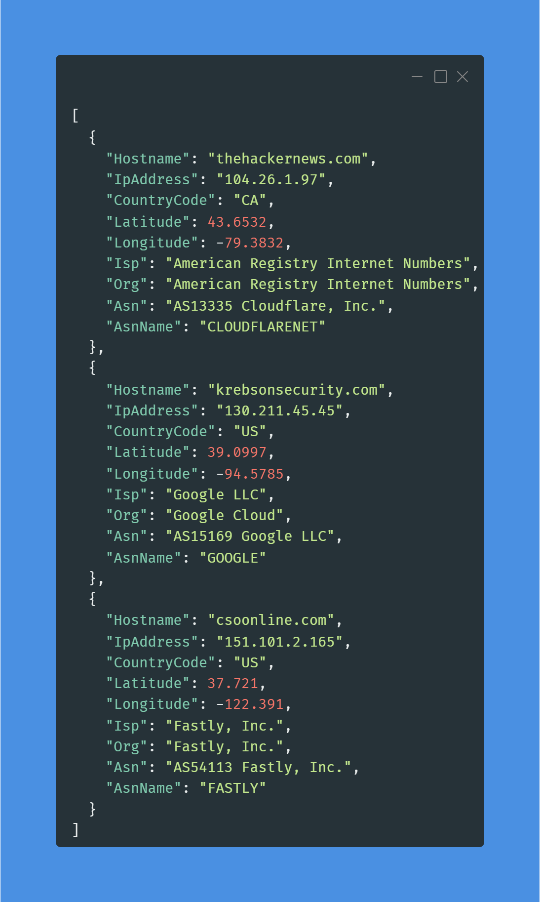

# 100 Days of Cloud & 100 Days of Cloud Security

#100DaysOfCloud #100DaysOfCyberSecurity snippets starting from 28 SEPT 2022 by your (allegedly) Favorite CISO: https://www.linkedin.com/in/jonathan-r-2b2742112/.

Hoping to spread some knowledge and encourage entry-level professionals to emulate this. For all intents and purposes the current industry hivemind would argue that as a CISO I, 1) probably shouldn't do this because "cIsOs DoNt NeEd To Be TeChNiCaL" and 2) A CISO shouldn't need to "prove" anything - which is a dangerous assumption and why we have busted ass security programs in F500 companies. Gatekeepers can bite my shiny metal ass.

In all seriousness, certs and degrees are fine but not everyone has the economic means to afford them at any given point. As a former hiring manager who built one of the most ambitious cyber security products INSIDE of a massive F500 company with more than 60% of the team being entry-level, I have an opinion that you can teach just about any skills to any candidate that can demonstrate they have a desire and passion to learn and display some personality in their projects.

When you create something like this, it demonstrates you can stick with something (100 days is a lot!), and how you document it and execute tells me far more about your aptitude and attitude than a cert or degree. By all means, don't feel bad for getting them, but for those looking to pivot or to highlight themselves: do this.

## Table of Contents

> - [Day 1](./days/day1/) AWS environment variables Bash script for Account ID, Account Name, Region & Organizations Principal ID

> - [Day 2](./days/day2/) Python script to find all Default VPCs in every Region in current Account

> - [Day 3](./days/day3/)Python script to find and delete all ***unused*** Default VPC and their dependencies in every Region in the current Account

> - [Day 4](./days/day4/) Python script to find all Default Security Groups for every VPC in every Region in the current Account

> - [Day 5](./days/day5/) No code, overview of AWS Network Security solutions

> - [Day 6](./days/day6/) Python script to find certain resources (EC2, RDS, ALB) using the Default SG in every Region in the current Account and deletes the default rules

> - [Day 7](./days/day7/) Python script to automated NMAP TCP scans against public-facing EC2 instances in all Regions in the current Account

> - [Day 8](./days/day8/) Python script to create and attach a basic DNS Firewall with the AWS-managed malware Domain List to all VPCs in your current Region

> - [Day 9](./days/day9/) Python script to create a basic Route 53 Resolver DNS Query Logging Configuration for all VPCs in your current Region and send the logs to CloudWatch

> - [Day 10](./days/day10/) Python AWS Lambda script to parse CloudWatch Logs and print basic information on DNS Firewall events within them. Optional code to send messages to SNS

> - [Day 11](./days/day11/) Python AWS Lambda script (modified Day 10) that enriches DNS Firewall findings with additional information.

> - [Day 12](./days/day12/) Python AWS Lambda script (modified Day 10 & 11) that enriches DNS Firewall findings with IP resolution from `socket` as well as provide geo-intel data for the IPs via ip-api.com.

> - [Day 13](./days/day13/) Python script that mirrors enrichment steps from Day 12 and demonstrates the usage of DynamoDB as a write-through cache for IP addresses and associated geolocation data. DynamoDB creation script included.

> - [Day 14](./days/day14/) Python script to create an AWS WAFv2 Web Access Control List (ACL) that contains an IP Set with the latest IOCs from the CINS Score feed.

> - [Day 15](./days/day15/) Modified Day 14 Python script that introduces logic for creating multiple types of IP Sets, updating existing ones, and converting hostnames to domains and into IP addresses. Uses IOCs from CINS Score and Coinblocker feeds. THIS WILL TRIGGER GUARDUDTY ALERTS.

> - [Day 16](./days/day16/) Redid this repo...that's it. LinkedIn post about plans.


## Day 7


### Day 7 LinkedIn Post

[Post Link](https://www.linkedin.com/feed/update/urn:li:share:6983067365072650240/)

Day 7 of #100daysofcloud & #100daysofcybersecurity, one week in already, time flies when you're having fun. As always - GitHub containing the code, IAM permissions, post contents and even a backup of the Carbon screenshot in the comments. Got some feedback on the formatting and I'll refactor it...eventually.

Continuing to stick with the networking angle and the almighty Security Group as it pertains to Attack Surface Management (ASM). #ASM is a simple discipline/tasking with a lot of takes on how its done. The simplest way to get started requires a good asset management program - using managed tools or your own scripts - like we have been doing and working backwards from what is internet-facing.

You will always have a surface, except in exigent cirucmstances depending on industry, especially if you run a SaaS app, self-manage enterprise services (mail servers, CDNs, etc.) or maybe use bastions. There are plenty of legitimate reasons and on its own it is never an issue until it is: new 0-Day drops, new exploit TTPs, new vulns, silly misconfiguration, AppSec issue found. With ASM you want to interdict these potential problems and continuously monitor them.

CSPM has gotten us laser focused on the infra-side configurations, but things like IMDSv2, Enclaves, EBS Encryption, etc. is not a problem until it becomes one due to a network/identity-based attack first. It's not that it is unimportant but with limited resources - always start where your biggest impacts (and biggest threats) lay.

The script provided builds on similar concepts we've touched on already: saving files, using multiple Python functions, trying to introduce logic to disqualify non-pertinent resources to lower our compute overhead. I also threw in some other fun tricks like conditionally turning lists to comma-separated strings.

We will use the Python3 wrapper to Network Mapper (#NMAP) and NMAP itself, the ubiqituous NetOps/OffSec/SecOps workhorse tool. I see it make all sorts of "Top 10 Tools to X" lists, here is how to use it. We will only be performing IPv4 TCP scans as that covers most use cases. If you're wanting ICMP or UDP or IPv6 you need to modify this.

You'll find all public EC2s, determine the address (using Socket if it only has a hostname...somehow), statically analyze the SG for open TCP rules, and feed the info to NMAP to run a port scan without host discovery. Then you get a small JSON file you can work backwards from for reporting.

To close ASM is not just EXTERNAL. While that's the easiest thing for adversaries to hit, lateral movement risks are harder to stomp out. Performing internal ASM tasks is great for governance and making sure minimum necessary network permissibility and proper segmentation is in effect. Don't be that guy/gal letting your teams run roughshod with permitting all manners of traffic across trust boundaries in your VPCs/VPNs/Direct Connects. That'll get ya killed in these mean cyber streets. All for now...

Stay Dangerous

#awssecurity

### Day 7 Code Snippet

#### Permissions

```json
{
    "Version": "2012-10-17",
    "Statement": [
        {
            "Sid": "VisualEditor0",
            "Effect": "Allow",
            "Action": [
                "ec2:DescribeInstances",
                "ec2:DescribeRegions",
                "ec2:DescribeSecurityGroups"
            ],
            "Resource": "*"
        }
    ]
}
```

#### Code Snippets

```python
import boto3
import socket
import nmap3
import json

# Instantiate a NMAP scanner for TCP scans to define ports
nmap = nmap3.NmapScanTechniques()

def get_aws_regions():
    '''
    Retrieves all opted-in AWS Regions for this Account
    '''
    ec2 = boto3.client('ec2')

    awsRegions = []

    try:
        # Get all Regions we are opted in for
        for r in ec2.describe_regions()['Regions']:
            regionName = str(r['RegionName'])
            optInStatus = str(r['OptInStatus'])
            if optInStatus == 'not-opted-in':
                continue
            else:
                awsRegions.append(regionName)
    except Exception as e:
        raise e
        
    print('Got all AWS Regions')

    del ec2

    return awsRegions

def public_ec2_scan_commander():
    '''
    Searches all Regions for Public EC2 instances, evaluates their security group rules, and conducts basic
    scans against them with NMAP and returns a list of scanned instances to another function to write to file
    '''
    awsRegions = get_aws_regions()

    # Empty list for instances with NMAP Results
    instances = []

    for region in awsRegions:
        # Create a new Session for the Region and pass it to an EC2 client
        session = boto3.Session(region_name=region)
        ec2 = session.client('ec2')
        paginator = ec2.get_paginator('describe_instances')
        # Paginate through RUNNING EC2s
        for page in paginator.paginate(
            Filters=[
                {
                    'Name': 'instance-state-name',
                    'Values': ['running']
                }
            ]
        ):
            for r in page['Reservations']:
                for i in r['Instances']:
                    # Check if the Instance is public
                    try:
                        pubIp = str(i['PublicIpAddress'])
                    except KeyError:
                        pubIp = None
                    try:
                        pubDns = str(i['PublicDnsName'])
                        # Public DNS is cheeky and will return an empty string instead of None >:(
                        if pubDns == '':
                            pubDns = None
                        else:
                            pubDns = pubDns
                    except KeyError:
                        pubDns = None
                    # Create our own Bool for Public-facing EC2 instances
                    if pubIp != None or pubDns != None:
                        isPublic = True
                    else:
                        isPublic = False
                    # Skip non-public instances
                    if isPublic == False:
                        continue
                    else:
                        instanceId = i['InstanceId']
                        # Loop SGs, there is typically only one, but this checks for more
                        for sg in i['SecurityGroups']:
                            # Feed the Security Group ID to another function and receive back info if
                            # there are port:address pairs that are open to the public internet
                            sgId = sg['GroupId']
                            portTargets = security_group_targeting_intel(sgId, region)
                            # Transform Python list to a comma-separated string if there is more than one target
                            if len(portTargets) > 1:
                                portTargetsString = ','.join(portTargets)
                            else:
                                portTargetsString = portTargets[0]
                            if (pubIp == None and pubDns != None): 
                                pubIp = socket.gethostbyname(pubDns)
                            nmapResults = nmap_scan(instanceId, region, pubIp, portTargetsString)
                            if nmapResults == None:
                                continue
                            else:
                                scanDict = {
                                    'InstanceId': instanceId,
                                    'PublicIp': pubIp,
                                    'AwsRegion': region,
                                    'NmapResults': nmapResults
                                }
                                instances.append(scanDict)

    print(f'Completed all scans!')

    return instances
                          
def security_group_targeting_intel(security_group_id, aws_region):
    '''
    Parses a Security Group's rules and looks for ports that allow traffic from the internet
    '''
    # Create a new Session for the Region and pass it to an EC2 client
    session = boto3.Session(region_name=aws_region)
    ec2 = session.client('ec2')

    # Empty list to contain port targets
    ports = []

    for rule in ec2.describe_security_groups(GroupIds=[security_group_id])['SecurityGroups'][0]['IpPermissions']:
        # Skip rules without an IPv4 CIDR
        if not rule['IpRanges']:
            continue
        else:
            # skip rules that do not allow traffic from the internet and that are not TCP
            if (
                rule['IpRanges'][0]['CidrIp'] != '0.0.0.0/0' or
                rule['IpProtocol'] != 'tcp'
            ):
                continue
            else:
                # write starting port to list if it's not been seen
                fromPort = str(rule['FromPort'])
                if fromPort not in ports:
                    ports.append(fromPort)
                else:
                    continue

    return ports

def nmap_scan(instance_id, region, public_ip, port_range):
    '''
    Performs a TCP scan of a given EC2 instance on a specific set of ports and returns the results
    '''
    print(f'Scanning {instance_id} in {region} on port(s) {port_range} on IP {public_ip}.')

    try:
        raw = nmap.nmap_tcp_scan(
            public_ip,
            args=f'-Pn -p {port_range}'
        )
        results = raw[public_ip]['ports']
    except KeyError:
        results = None

    return results

def nmap_report_to_file():
    '''
    Writes the NMAP scan results to a JSON file
    '''
    nmapResults = public_ec2_scan_commander()
    if nmapResults:
        with open('./ec2_nmap_scan_results.json', 'w') as jsonfile:
            json.dump(
                nmapResults,
                jsonfile,
                default=str,
                indent=4
            )

nmap_report_to_file()
```

## Day 8


### Day 8 LinkedIn Post

[Post Link]()

Day 8 of #100daysofcloud and #100daysofcybersecurity still on networking but moving to DNS-related controls. We will stay with this theme for 2-4 more days depending on what I can think of.

As always, code snippets & IAM permissions within linked GitHub in comments.

A few years back AWS released Route 53 Resolver DNS Firewall (DNSFW) which transparently attaches to the default Resolver associated with each VPC. This gives the ability to inspect DNS requests transiting your entire VPC with up to 100K domains. You can set rules to Count, Block or Allow giving you the ability to create incredibly restrictive DNS egress zones or block/alert on known domain IOCs.

AWS manages Domain Lists using threat intel from AWS, Crowdstrike and ProofPoint (same as GuardDuty, essentially) which keeps track of known malware C2, botnets and miner pools. So for every GuardDuty DNS-related alert you can likely use DNSFW as a Preventative control - and we will be looking into a real-time SOAR use case for that later on!

DNSFW works by creating a Rule Group (which is essentially the firewall) which stores Rules which are made up of a Domain List (which hold, domains, shockingly!) and a Priority and Action. For Block action you can customize the DNS response to your liking such as returning No Data or NXDOMAIN. You can craft your own Domain Lists up to 100K as mentioned. DNSFW is easy to associate, it does not require mutating route tables and routes like Network Firewall does. Making it akin to WAFv2 which is nice.

Logging is handled by the Resolver Query Logging - we will cover that tomorrow as well as streaming and processing the data in Lambda with some basic alerting!

DNSFW does get expensive if you have very chatty applications - I know for a fact that a self-hosted MongoDB Atlas is super chatty - found that out the hard way at IHSM when I ran up someone's account several 10s of 1000s of dollars. Whoops. At the very least I still do think it's worth attaching a managed Domain List and seeing if you have alerts in a VPC used by your production apps.

The script is single-Region and will create a very basic DNSFW using the Malware-domains managed Domain List. It sets the Action to Count and associates with your VPCs. Feel free to expand it as needed, everything has a function along with a way to create a unique request ID with the `uuid` module in Python.

All for now...Stay Dangerous

#dnssecurity #awssecurity #cloudsecurity #netops #networksecurity #netsec #infosec #cloud #aws 

### Day 8 Code Snippet

#### Permissions

```json
{
    "Version": "2012-10-17",
    "Statement": [
        {
            "Sid": "VisualEditor0",
            "Effect": "Allow",
            "Action": [
                "route53resolver:CreateFirewallRule",
                "route53resolver:CreateFirewallRuleGroup",
                "ec2:DescribeVpcs",
                "route53resolver:AssociateFirewallRuleGroup",
                "route53resolver:ListFirewallDomainLists"
            ],
            "Resource": "*"
        }
    ]
}
```

#### Code Snippet

```python
import boto3
import uuid

rt53r = boto3.client('route53resolver')

def create_dnsfw_for_vpc():
    '''
    This function creates and attaches a DNSFW with a managed domain list to all VPCs in your current Region
    '''
    # Create request id
    creatorRequestId = str(uuid.uuid4())
    # Call helper functions
    vpcs = find_vpcs()
    domainListId = find_default_malware_domain_list()
    firewallRuleGroupId = create_firewall_rule_group()

    # Create the DNSFW Rule
    create_firewall_rule(domainListId, firewallRuleGroupId)

    # Associate the Firewall Group with all VPCs
    for vpc in vpcs:
        try:
            rt53r.associate_firewall_rule_group(
                CreatorRequestId=creatorRequestId,
                FirewallRuleGroupId=firewallRuleGroupId,
                VpcId=vpc,
                Priority=101,
                Name=f'{vpc}100DaysOfCloudMalwareAlerts',
            )
            print(f'Associated VPC {vpc} with DNSFW {firewallRuleGroupId}!')
        except Exception as e:
            raise e

def find_vpcs():
    '''
    Loops VPCs in your current region and returns a list of them
    '''
    ec2 = boto3.client('ec2')

    vpcs = []
    try:
        for vpc in ec2.describe_vpcs()['Vpcs']:
            vpcId = vpc['VpcId']
            if vpc['State'] != 'available':
                continue
            else:
                if vpcId not in vpcs:
                    vpcs.append(vpcId)
    except Exception as e:
        raise e

    print('Gathered all VPCs in Region.')

    return vpcs

def find_default_malware_domain_list():
    '''
    Attempts to find the ID of the Route53 Resolver DNS Firewall Domain List associated with malware domains
    '''
    try:
        for fdl in rt53r.list_firewall_domain_lists()['FirewallDomainLists']:
            if fdl['Name'] == 'AWSManagedDomainsMalwareDomainList':
                domainListId = fdl['Id']
                break
            else:
                continue
    except Exception as e:
        raise e

    print('Found the Domain List ID for the "AWSManagedDomainsMalwareDomainList" managed list.')

    return domainListId

def create_firewall_rule_group():
    '''
    Creates and returns the ID of a finalized Route53 Resolver DNS Firewall Rule Group to be associated with VPCs
    '''
    # Create request id
    creatorRequestId = str(uuid.uuid4())

    try:
        firewallRuleGroupId = rt53r.create_firewall_rule_group(
            CreatorRequestId=creatorRequestId,
            Name='100DaysOfCloudMalwareRules',
            Tags=[
                {
                    'Key': 'Name',
                    'Value': '100DaysOfCloudMalwareRules'
                }
            ]
        )['FirewallRuleGroup']['Id']
    except Exception as e:
        raise e

    print('Created a new Route53 Resolver DNS Firewall Rule Group.')

    return firewallRuleGroupId

def create_firewall_rule(domain_list_id, firewall_group_id):
    '''
    Creates a Route53 Resolver DNS Firewall Rule that contains the managed Domain List for malware domains
    '''
    # Create request id
    creatorRequestId = str(uuid.uuid4())

    try:
        rt53r.create_firewall_rule(
            CreatorRequestId=creatorRequestId,
            FirewallRuleGroupId=firewall_group_id,
            FirewallDomainListId=domain_list_id,
            Priority=101,
            Action='ALERT',
            Name='100DaysOfCloudMalwareAlerts'
        )
    except Exception as e:
        raise e

    print(f'Created ALERT rule for Route53 Resolver DNS Firewall Rule Group {firewall_group_id}')

create_dnsfw_for_vpc()
```

## Day 9


### Day 9 LinkedIn Post

[Post Link](https://www.linkedin.com/feed/update/urn:li:share:6983876031027798016/)

Day 9 of #100daysofcloud & #100daysofcybersecurity with a continuation of AWS DNS Firewall, this time focused on logging considerations and setup. As usual, #github link with permissions and the #python code in the comments.

DNSFW logging is a bit unique in how it is setup, as mentioned yesterday, DNSFW is part of the Route 53 Resolver ecosystem which means it is directly dependent on it not just for performing the DNS protection it also needs it for logging. That is to say there is not a dedicated logging source *strictly* for DNSFW - it is shared with the regular Query Logging.

Sources like VPC Flow Logs has its own logical construct, CloudFront can output to Kinesis Streams, WAF has a dedicated Kinesis Firehose output, but you'll need to conduct custom parsing to get any DNSFW related activities if that is all you care about. That also means your logs will be naturally chattier as EVERY DNS query is being captured, not just what specific logs you want for the Firewall itself.

Logging logic is stored within a Route 53 Resolver Query Logging Configuration. It is simply a store of a destination (S3, CloudWatch Logs or Kinesis Firehose) and associates VPCs. For collating across many Regions/Accounts S3 would be the logical choice, or using Firehose in between along with a Transformation to buffer the logs into Parquet for cheaper storage and easier querying.


For the Firewall-specific logs, there will be extra keys added into the JSON logging payload, notably "firewall_rule_action", using that as a filter/query basis will grab matching logs only. Most of your logs will be from updates, EDR callbacks, and the SSM Agent and normal queries for your application. Still a good idea to get basic stats on that, most people don't know their DNS traffic anyway.

Anyway, today's script will setup a very basic Query Logging Config, send logs to CloudWatch, and attach to all VPCs in your Region. Tomorrow we'll mess with some basic querying in Lambda and I'll give you an efficient way to unfold and query CloudWatch Logs streamed to Lambda.

Stay Dangerous

#awssecurity #dnssecurity #dns #bigdata #logging #siem #query #cloudsecurity #aws #awslogs #json #parquet

### Day 9 Code Snippet

#### Permissions

```json
{
    "Version": "2012-10-17",
    "Statement": [
        {
            "Sid": "VisualEditor0",
            "Effect": "Allow",
            "Action": [
                "route53resolver:AssociateResolverQueryLogConfig",
                "ec2:DescribeVpcs",
                "logs:CreateLogGroup",
                "route53resolver:CreateResolverQueryLogConfig"
            ],
            "Resource": "*"
        }
    ]
}
```

#### Code Snippet

```python
import boto3
import uuid

rt53r = boto3.client('route53resolver')

def create_query_logging_for_vpc():
    '''
    This function creates and attaches a DNS Query Logging Config to all VPCs in your current Region and sends logs to CloudWatch
    '''
    # Create request id
    creatorRequestId = str(uuid.uuid4())
    # Call helper functions
    vpcs = find_vpcs()
    logGroupArn = create_log_group()
    # Create Log Config
    queryLogId = create_query_logging_config(logGroupArn)

    # Attach log config
    for vpc in vpcs:
        try:
            rt53r.associate_resolver_query_log_config(
                ResolverQueryLogConfigId=queryLogId,
                ResourceId=vpc
            )
            print(f'Attached Query Logging Config {queryLogId} to VPC {vpc}.')
        except Exception as e:
            raise e

def find_vpcs():
    '''
    Loops VPCs in your current region and returns a list of them
    '''
    ec2 = boto3.client('ec2')

    vpcs = []
    try:
        for vpc in ec2.describe_vpcs()['Vpcs']:
            vpcId = vpc['VpcId']
            if vpc['State'] != 'available':
                continue
            else:
                if vpcId not in vpcs:
                    vpcs.append(vpcId)
    except Exception as e:
        raise e

    print('Gathered all VPCs in Region.')

    return vpcs

def create_log_group():
    '''
    Creates a CloudWatch Log Group...that's it
    '''
    # Get AWS Account & Region info to generate ARN
    awsRegion = boto3.Session().region_name
    sts = boto3.client('sts')
    awsAccountId = sts.get_caller_identity()['Account']
    del sts

    # Create the Log Group & assemble the ARN
    cwl = boto3.client('logs')
    try:
        cwl.create_log_group(
            logGroupName='/aws/route53/100DaysOfCloudDNSQueryLogs',
            tags={'Name': '100DaysOfCloudDNSQueryLogs'}
        )
    except Exception as e:
        raise e

    logGroupArn = f'arn:aws:logs:{awsRegion}:{awsAccountId}:log-group:/aws/route53/100DaysOfCloudDNSQueryLogs:*'

    print(f'Created CloudWatch Log Group: {logGroupArn}.')
    
    return logGroupArn

def create_query_logging_config(log_group_arn):
    '''
    Creates a Route 53 Resolver Query Logging Configuration setting
    '''
    # Create request id
    creatorRequestId = str(uuid.uuid4())
    
    try:
        queryLogId = rt53r.create_resolver_query_log_config(
            Name='100DaysOfCloudQueryLogging',
            DestinationArn=log_group_arn,
            CreatorRequestId=creatorRequestId,
            Tags=[
                {
                    'Key': 'Name',
                    'Value': '100DaysOfCloudQueryLogging'
                }
            ]
        )['ResolverQueryLogConfig']['Id']
    except Exception as e:
        raise e

    print(f'Created Route 53 Resolver Query Logging Configuration: {queryLogId}.')

    return queryLogId

create_query_logging_for_vpc()
```

## Day 10


### Day 10 LinkedIn Post

[Post Link](https://www.linkedin.com/feed/update/urn:li:share:6984155402036727809/)

Day 10 of #100daysofcloud & #100daysofcybersecurity delving more into our #NetSec topic around #AWS #DNS #Firewall and logging activity from it. As usual, GitHub with the permissions and code snippets as needed will be within.

Today you'll need to put a bit of sweat equity in, you don't learn anything being told all of the answers, that's a theme I'll try to go for - plus these small bite-sized posts are defeated if every single one needed exhaustive setup. So hopefully you're comfortable with creating CloudWatch Logs Subscription Filters to Lambda & setting up permissions as needed.

DNS Query Logging in AWS will only add in DNS Firewall information when a match against a Rule is determined. This makes parsing a bit annoying as the logic will be centered on handling exceptions from the fact a piece of the log is missing. Outside of that - working with CloudWatch Logs streamed to Lambda is annoying. You get base64 encoded/zipped/stringified data in that needs to be decoded, decompressed and loaded into a useable format.

Every log type via CloudWatch Logs has it's own nuances. For DNS Query Logging as you loop through the payload you need to access the logs within a "message" key which is another stringified JSON object. This Lambda function handles all of this logic for you and can expanded for use with other CWL sources such as API Gateway and VPC Flow Logs. The function is also written properly, with business logic outside the handler, globals outside of the functions, and limited crap loaded into memory.

The Query Logs are a decently rich data source - provided basic orienteering intel, the action and domain list/rule group that DNSFW matched, and the source and query destination with some other DNS-related info. The logic here is very basic and just prints out what happened when a rule is matched. I put some minimal code to send the message to SNS if you wanted to do that.

This brings up Security #ChatOps - for DNS based threats - especially if they're from known or suspected C2 nodes/malware domains/mining pools you'd want to be alerted immediately especially for COUNT actions so you can deploy countermeasures. The more services chained together the more latency you pick up. You also want to ensure you do not pummel your IR Analysts with a ton of noise and that an ALERT is treated as such - don't just throw it into a SIEM and hope someone triages correctly.

As either a SOC Manager or a security leader in general you'll need to understand this prioritization & psychological impact it'll have. Push-based/pager style alert should really be reserved for something (potentially) terrible and not routine signaling.

Tomorrow we'll do a bit of enrichment, IOC garbage on Day 12, and continue through the #NetSec stuff until we're all exhausted.

Stay Dangerous

#cloudsecurity #awssecurity #infosec

### Day 10 Code Snippet

```python
import os
import boto3
import json
import base64
import zlib

#SNS_TOPIC_ARN = os.environ['SNS_TOPIC_ARN']
#sns = boto3.client('sns')

def lambda_handler(event, context):
    # parse CWL event
    data = event.get('awslogs', {}).get('data')
    log_parser(data)

def log_parser(data):
    # Base64 Decode, decompress with ZLIB, load into a dict with json.loads
    records = json.loads(zlib.decompress(base64.b64decode(data), 16 + zlib.MAX_WBITS))
    # Loop through the query log message
    for ql in records['logEvents']:
        # parse the nested "message" object and load this into JSON as well
        msg = json.loads(ql['message'])
        try:
            # If a log is not flagged by a firewall, it will not have the associated keys, any KeyError can be ignored
            fwRuleAction = msg['firewall_rule_action']
            fwDomainListId = msg['firewall_domain_list_id']
            # Parse regular logs
            acctId = msg['account_id']
            awsRegion = msg['region']
            vpcId = msg['vpc_id']
            queryTime = msg['query_timestamp']
            queryDestination = msg['query_name']
            sourceId = msg['srcids']['instance']
            # Assemble the message
            message = f'Query to {queryDestination} from {sourceId} within VPC {vpcId} in AWS Account {acctId} in {awsRegion} matched the DNS Firewall Domain List {fwDomainListId} with the {fwRuleAction} Action at {queryTime}.'
            
            print(message)
            # TODO: Implement
            #send_to_sns(message)
        except KeyError:
            continue

def send_to_sns(message):
    # TODO: Implement
    payload = {'Message': message}
    '''
    try:
        sns.publish(
            TopicArn=SNS_TOPIC_ARN,
            Message=payload
        )
    except Exception as e:
        print(e)
    '''
```

## Day 11

[Day 11 Carbon](./pics/day11.png)

### Day 11 LinkedIn Post

[Post Link](https://www.linkedin.com/feed/update/urn:li:share:6984565708814745600/)

Happy Saturday, Day 11 of #100daysofcloud & #100daysofcybersecurity brings us more parsing goodness with some VERY BASIC enrichment of our DNSFW Query Logs. GitHub in the comments, added a table of contents to it for you.

Today's Lambda function code is a modification of Day 10 that adds even more simplification to the function and introduces a new helper function to conduct enrichment. The topic of enrichment like anything is security is subjective, and before you (as a #SecDataOps or #Detection Engineer) decide to throw a ton of extra work - you must ask yourself "What" and "So What".

Having things like geolocation data, hostnames/IPs/domains, WHOIS, Shodan/Censys/Graylog, and other sort of information may not be pertinent to you. There is *always* a cost to enrichment - even if you are as optimized as possible - there's extra compute overhead, extra time (which may lead to an SLA breach), and more things that can break in your pipeline.

You shake these things out by figuring out downstream use cases, if you can afford to do w/o that data, can you afford to lose ALL data because you're missing the enrichment, and does anyone really care for it?

Another important data tenant is governance - it's too large to get into here but decided on schema ahead of time for things as predictable as cloud API results and log formats will save you a lot of effort. Do you want to stick with default fields or change to Pascal Case? Do you want nested objects or make them strings? Should you rename a field from source? Do you need all fields?

This script takes an opinion here on all of the above: adding extra field, using PascalCase, stringifying lists, and renaming some fields. See if you can find it all. The function doesn't send the data anymore - you can figure that out yourself. Today we use the `Socket` module to determine the IP from the queried domain. While your DNSFW may BLOCK/COUNT it what about your other firewalls (WAFs, NGFWs), EDR tools or AWS GuardDuty? Maybe having an IP is useful especially when hackers bamboozle you with a new DGA.

Tomorrow we will add A LOT more enrichment just to show you. Fun fact, this function is more efficient than yesterday's. Average memory used is 39MB versus 55MB and average time is about the same 10-65MS depending how many logs you get at once.

Stay Dangerous

#cloudsecurity #awssecurity #aws #cloud 

### Day 11 Code Snippet

#### Code Snippet

```python
import json
import base64
import zlib
import socket

def lambda_handler(event, context):
    # parse CWL event
    log_parser(event.get('awslogs', {}).get('data'))

def log_parser(data):
    # Empty list to contain finished payloads
    payloads = []
    # Base64 Decode, decompress with ZLIB, load into a dict with json.loads
    records = json.loads(zlib.decompress(base64.b64decode(data), 16 + zlib.MAX_WBITS))
    # Loop through the query log message
    for ql in records['logEvents']:
        # parse the nested "message" object and load this into JSON as well
        message = json.loads(ql['message'])
        try:
            # If a log is not flagged by a firewall, it will not have the associated keys, any KeyError can be ignored
            message['firewall_rule_action']
            # Send the pertinent messages to be enriched & write final result to list
            payloads.append(
                log_enrichment_and_normalization(
                    message
                )
            )
        except KeyError:
            continue

    payload_processor(payloads)

def log_enrichment_and_normalization(message):
    # Parse out the query name
    queryName = message['query_name']
    # Try to find out the IP Address...
    try:
        ip = socket.gethostbyname(queryName)
    except Exception as e:
        print(e)
        ip = None
    # Source ID may not be an instance in the future...
    try:
        srcId = message['srcids']['instance']
    except KeyError:
        srcId = None

    payload = {
        'AccountId': message['account_id'],
        'Region': message['region'],
        'VpcId': message['vpc_id'],
        'QueryTimestamp': message['query_timestamp'],
        'QueryName': queryName,
        'QueryIpAddress': ip,
        'QueryType': message['query_type'],
        'QueryClass': message['query_class'],
        'Rcode': message['rcode'],
        'Answers': str(message['answers']),
        'SrcAddr': message['srcaddr'],
        'SrcPort': message['srcport'],
        'Transport': message['transport'],
        'SrcId': srcId,
        'FirewallRuleAction': message['firewall_rule_action'],
        'FirewallRuleGroupId': message['firewall_rule_group_id'],
        'FirewallDomainListId': message['firewall_domain_list_id']
    }

    return payload

def payload_processor(payloads):
    # Receive and send chunks of payloads to SQS
    for payload in payloads:
        print(
            json.dumps(
                payload,
                indent=2,
                default=str
            )
        )
```

## Day 12

[Day 12 Carbon](./pics/day12.png)

### Day 12 LinkedIn Post

[Post Link](https://www.linkedin.com/feed/update/urn:li:share:6984932402322100224/)

Hello friends, hope everyone not working today is having a restful Sunday. It is Day 12 of #100daysofcloud & #100daysofcybersecurity continuing on the thread of possible real-time enrichment use cases on top of AWS DNSFW Query Logs.

Starting on Day 10 you learned how to deploy and optimize a Lambda function to parse CloudWatch Logs and exit if a desired state or item was not found (to lower costs & concurrent invocations). Day 11 saw as utilizing the Python `socket` module for a very basic way of finding the IP under a domain, today we continue to expand the Lambda function with a new "geo-intelligence" function.

Calling it that is insulting to real #GEOINT work that analysts do out there, but really its more akin to #OSINT, finding the geographical location corresponding to an IP address as well as the ASN, ORG and ISP. This information is mostly used to paint pretty map pictures for gimmicky websites and SOC/NOC dashboards but there can be some usage of it.

ISP/ASN/ORG can tell you about the nature of the hosting - is it Amazon, CloudFlare, Censys, Alibaba, Sinnet, etc? These usually correspond to a Country. Maybe you have data embargo concerns that need to be enforced due to contractual or regulatory obligations. Maybe you don't do business in a specific country but someone INSIDE your network is communicating outbound - that may be an issue. Maybe you're tired of chasing IOCs by country and need justification to block an entire country on your WAF or CDN (that would be more for inbound, not outbound connections).

Some data "tricks" exist within the code, namely planning for conditions when you don't get data back (an IP or the GEOINT). Always ensure your downstream datastore / BI tool can support a specific data type. DynamoDB doesn't like Floats but it's fine with Null/NONE. QuickSight can parse GEO data easy but OpenSearch/Elastic needs it in a specific format. ALWAYS FACTOR IN ALL DATA USE CASES!

Again, keep in mind overhead compute, troubleshooting, and whether you NEED to collect this data. Another important consideration to take (thanks to Brian for jogging this) is the concept of write-through caching. While Lambda is superfast, it's inefficient to continually query out OSINT for a specific domain or IP. Instead, consider writing to a cache such as Redis, Memcached, or using DynamoDB & DAX. You will attempt to GET (read) and write if it does not exist. 

Provided your Lambda is within a VPC and you have collocated caching infra (don't need to use managed services) or using PrivateLink it'll be a lot faster and lessen failure edge cases reading instead of continually querying a website.

Shoutout to IP API for a free, well-documented API and easy-to-use throttling indicators. All for now...

Stay Dangerous

### Day 12 Code Snippet

#### Code Snippet

```python
import json
import base64
import zlib
import socket
import urllib3
from time import sleep
# Pool Manager for urllib3 to (re)use
http = urllib3.PoolManager()

def lambda_handler(event, context):
    # parse CWL event
    log_parser(event.get('awslogs', {}).get('data'))

def log_parser(data):
    # Empty list to contain finished payloads
    payloads = []
    # Base64 Decode, decompress with ZLIB, load into a dict with json.loads
    records = json.loads(zlib.decompress(base64.b64decode(data), 16 + zlib.MAX_WBITS))
    # Loop through the query log message
    for ql in records['logEvents']:
        # parse the nested "message" object and load this into JSON as well
        message = json.loads(ql['message'])
        try:
            # If a log is not flagged by a firewall, it will not have the associated keys, any KeyError can be ignored
            message['firewall_rule_action']
            # Send the pertinent messages to be enriched & write final result to list
            payloads.append(
                log_enrichment_and_normalization(
                    message
                )
            )
        except KeyError:
            continue

    payload_processor(payloads)

def log_enrichment_and_normalization(message):
    # Parse out the query name
    queryName = message['query_name']
    # Try to find out the IP Address...
    try:
        ip = socket.gethostbyname(queryName)
    except Exception as e:
        print(e)
        ip = None

    if ip != None:
        geoint = geo_intelligence(ip)
        countryCode = geoint['CountryCode']
        latitude = int(geoint['Latitude'])
        longitude = int(geoint['Longitude'])
        isp = geoint['Isp']
        org = geoint['Org']
        asn = geoint['Asn']
        asnName = geoint['AsnName']
    else:
        countryCode = None
        latitude = int(0)
        longitude = int(0)
        isp = None
        org = None
        asn = None
        asnName = None
    # Source ID may not be an instance in the future...
    try:
        srcId = message['srcids']['instance']
    except KeyError:
        srcId = None

    payload = {
        'AccountId': message['account_id'],
        'Region': message['region'],
        'VpcId': message['vpc_id'],
        'QueryTimestamp': message['query_timestamp'],
        'QueryName': queryName,
        'QueryIpAddress': ip,
        'QueryType': message['query_type'],
        'QueryClass': message['query_class'],
        'Rcode': message['rcode'],
        'Answers': str(message['answers']),
        'SrcAddr': message['srcaddr'],
        'SrcPort': message['srcport'],
        'Transport': message['transport'],
        'SrcId': srcId,
        'FirewallRuleAction': message['firewall_rule_action'],
        'FirewallRuleGroupId': message['firewall_rule_group_id'],
        'FirewallDomainListId': message['firewall_domain_list_id'],
        'CountryCode': countryCode,
        'Latitude': latitude,
        'Longitude': longitude,
        'Isp': isp,
        'Org': org,
        'Asn': asn,
        'Latitude': latitude,
        'AsnName': asnName
    }

    return payload

def geo_intelligence(ip):
    # Generate request url for use
    url = f'http://ip-api.com/json/{ip}?fields=status,message,countryCode,lat,lon,isp,org,as,asname'
    # GET request
    r = http.request(
        'GET',
        url
    )
    ttlHeader = int(r.headers['X-Ttl'])
    requestsLeftHeader = int(r.headers['X-Rl'])
    # handle throttling
    if requestsLeftHeader == 0:
        ttlHeader = int(r.headers['X-Ttl'])
        waitTime = ttlHeader + 1
        sleep(waitTime)
        print('Request limit breached - retrying')
        del r
        # new request
        r = http.request(
            'GET',
            url
        )
        ipJson = json.loads(r.data.decode('utf-8'))
        countryCode = str(ipJson['countryCode'])
        latitude = float(ipJson['lat'])
        longitude = float(ipJson['lon'])
        isp = str(ipJson['isp'])
        org = str(ipJson['org'])
        asn = str(ipJson['as'])
        asnName = str(ipJson['asname'])
    # If not fail
    else:
        ipJson = json.loads(r.data.decode('utf-8'))
        countryCode = str(ipJson['countryCode'])
        latitude = float(ipJson['lat'])
        longitude = float(ipJson['lon'])
        isp = str(ipJson['isp'])
        org = str(ipJson['org'])
        asn = str(ipJson['as'])
        asnName = str(ipJson['asname'])

    geoint = {
        'CountryCode': countryCode,
        'Latitude': latitude,
        'Longitude': longitude,
        'Isp': isp,
        'Org': org,
        'Asn': asn,
        'Latitude': latitude,
        'AsnName': asnName
    }

    return geoint

def payload_processor(payloads):
    # Receive and send chunks of payloads to SQS
    for payload in payloads:
        print(
            json.dumps(
                payload,
                indent=2,
                default=str
            )
        )
```

## Day 13



### Day 13 LinkedIn Post

[Post Link](https://www.linkedin.com/feed/update/urn:li:share:6985295125828485120/)

Day 13 of #100daysofcloud & #100daysofcybersecurity taking a step back from the specifics of AWS #netsec tools and #logging to approach write-through caching.

In Day 12 I mentioned using tech such as DynamoDB or Redis as a write-through cache. A cache is any datastore that temporarily holds data to be retrieved and used later. That's a vast oversimplification, but caching is important for any setting which you will be frequently accessing specific data from a datastore that wouldn't be able to otherwise handle the request rate.

At least that's the "science" behind it, the "art" is balancing the scales of adding yet-another-technology to your stack and figuring out if you'll knockoff whatever is downstream if you keep querying it for whatever data it is.

As a #SecDataOps engineer learning caching tech, implementation and the decision trees behind it is important. When it comes to just-in-time enrichment it makes a lot of sense to use a cache. Whether it's because you're enriched in real-time before you deliver the data or it's ad-hoc as part of an IR Playbook or a SIEM rule that ingests IOCs or other enrichment it's probably much better to pull it from a cache. That goes doubly for real-time processing where you may run into throttling from a 3rd party API due to a high event-per-second rate like you can get from security/network logs in even a small environment.

I take the enrichment use cases from Days 11 and 12 and put it into a basic Python script and have an opinionated way of using a function to get if a value exists in DynamoDB. If it does not exist, you query IP API as usual and then write to DyanmoDB for subsequent calls. In my testing, if the values are cached, it saves you 5-10ms per item you query. That is with a Gateway Endpoint.

There are some other goodies in their like converting Floats to Decimals, creating Time-to-live values, and such. I include a bash script to create the table to match the script. DynamoDB expert-level topics may be covered later, there is a ton of great stuff you can do with DynamoDB to tune access patterns, improve efficiency, stream data, and more. I love it and it's my go-to datastore along with S3 for 95% of things I do.

Final note: Hostname/Domain -> IP isn't always 1:1. If a domain is a fronted by a CDN like Fastly, CloudFront or CloudFlare you'll have 10s if not 100s of possible IPs. So the table design only accounts for IPs not for their paired hostnames. Keys in DynamoDB enforce uniqueness and access. If I set a RANGE key of Hostname in addition to the HASH key of IP, you'd need to query and write with both. 

No permissions are included, don't want to give all the answers, you won't learn anything.

Stay Dangerous 

#threatintelligence #bigdata #aws #cloudsecurity #awssecurity 

### Day 13 Code Snippet

#### Shell Script

```shell
echo 'Enter a name for your table:'
read tablename
aws dynamodb create-table \
    --table-name $tablename \
    --attribute-definitions AttributeName=IpAddress,AttributeType=S \
    --key-schema AttributeName=IpAddress,KeyType=HASH \
    --billing-mode PAY_PER_REQUEST
sleep 5
aws dynamodb update-time-to-live \
    --table-name $tablename \
    --time-to-live-specification Enabled=true,AttributeName=Ttl
```

#### Python Script

```python
import os
import socket
import urllib3
import json
from decimal import Decimal
from time import sleep
import boto3
import botocore.exceptions
from datetime import datetime
# Env vars
IP_GEOINT_CACHE_TABLE_NAME = os.environ['IP_GEOINT_CACHE_TABLE_NAME'] # export IP_GEOINT_CACHE_TABLE_NAME='dyanmodb_table_here'
EPOCH_DAY = 86400

# Pool Manager for urllib3 to (re)use
http = urllib3.PoolManager()

# Scary people to find
SOME_HACKERS_I_GUESS = [
    'thehackernews.com',
    'krebsonsecurity.com',
    'csoonline.com',
    'darkreading.com',
    'threatpost.com',
    'welivesecurity.com',
    'www.infosecurity-magazine.com',
    'www.bleepingcomputer.com'
]

# Boto3 Clients
dynamodb = boto3.resource('dynamodb')
table = dynamodb.Table(IP_GEOINT_CACHE_TABLE_NAME)

def determine_ip_address(hostnames):
    '''
    Uses Socket to find the IP address for a given hostname
    '''
    enrichedHostnames = []
    for hostname in hostnames:
        try:
            ip = socket.gethostbyname(hostname)
        except Exception as e:
            print(e)
            ip = None

        if ip != None:
            # Get cached results
            geoint = get_cached_geo_intelligence(ip)
            # If there are not cached results, write fresh
            if geoint == None:
                print(f'No cached results found for {ip}!')
                geoint = geo_intelligence(ip)
            countryCode = geoint['CountryCode']
            latitude = float(geoint['Latitude'])
            longitude = float(geoint['Longitude'])
            isp = geoint['Isp']
            org = geoint['Org']
            asn = geoint['Asn']
            asnName = geoint['AsnName']
        else:
            countryCode = None
            latitude = int(0)
            longitude = int(0)
            isp = None
            org = None
            asn = None
            asnName = None

        enrichedHostname = {
            'Hostname': hostname,
            'IpAddress': ip,
            'CountryCode': countryCode,
            'Latitude': latitude,
            'Longitude': longitude,
            'Isp': isp,
            'Org': org,
            'Asn': asn,
            'AsnName': asnName
        }
        if enrichedHostname not in enrichedHostnames:
            enrichedHostnames.append(enrichedHostname)

    save_data_to_file(enrichedHostnames)

def get_cached_geo_intelligence(ip):
    '''
    Attempts to find cached geoint results for a given hostname
    '''
    try:
        r = table.get_item(
            Key={
                'IpAddress': ip
            }
        )
        if 'Item' in r:
            geoint = {
                'CountryCode': r['Item']['CountryCode'],
                'Latitude': float(r['Item']['Latitude']),
                'Longitude': float(r['Item']['Longitude']),
                'Isp': r['Item']['Isp'],
                'Org': r['Item']['Org'],
                'Asn': r['Item']['Asn'],
                'AsnName': r['Item']['AsnName']
            }
        else:
            geoint = None
    except botocore.exceptions.ClientError as error:
        raise error

    return geoint

def geo_intelligence(ip):
    # Generate request url for use
    url = f'http://ip-api.com/json/{ip}?fields=status,message,countryCode,lat,lon,isp,org,as,asname'
    # GET request
    r = http.request(
        'GET',
        url
    )
    ttlHeader = int(r.headers['X-Ttl'])
    requestsLeftHeader = int(r.headers['X-Rl'])
    # handle throttling
    if requestsLeftHeader == 0:
        ttlHeader = int(r.headers['X-Ttl'])
        waitTime = ttlHeader + 1
        sleep(waitTime)
        print('Request limit breached - retrying')
        del r
        # new request
        r = http.request(
            'GET',
            url
        )
        ipJson = json.loads(r.data.decode('utf-8'))
        countryCode = str(ipJson['countryCode'])
        latitude = float(ipJson['lat'])
        longitude = float(ipJson['lon'])
        isp = str(ipJson['isp'])
        org = str(ipJson['org'])
        asn = str(ipJson['as'])
        asnName = str(ipJson['asname'])
    # If not fail
    else:
        ipJson = json.loads(r.data.decode('utf-8'))
        countryCode = str(ipJson['countryCode'])
        latitude = float(ipJson['lat'])
        longitude = float(ipJson['lon'])
        isp = str(ipJson['isp'])
        org = str(ipJson['org'])
        asn = str(ipJson['as'])
        asnName = str(ipJson['asname'])

    # create ttl and insert into the Dict
    tstamp = int(datetime.utcnow().timestamp())
    oneWeek = 7 * EPOCH_DAY
    ttl = tstamp + oneWeek

    geoint = {
        'IpAddress': ip,
        'CountryCode': countryCode,
        'Latitude': latitude,
        'Longitude': longitude,
        'Isp': isp,
        'Org': org,
        'Asn': asn,
        'AsnName': asnName,
        'Ttl': ttl
    }
    try:
        # Write Floats as Decimals...
        table.put_item(
            Item=json.loads(
                json.dumps(
                    geoint
                ), 
                parse_float=Decimal
            )
        )
    except botocore.exceptions.ClientError as error:
        print(error)
        print('Failed to write results to DynamoDB')

    return geoint

def save_data_to_file(enriched_hostnames):
    '''
    Writes enriched hostnames to JSON file
    '''

    with open('./enriched_hostnames_list.json', 'w') as jsonfile:
        json.dump(
            enriched_hostnames,
            jsonfile,
            default=str,
            indent=2
        )

determine_ip_address(
    hostnames=SOME_HACKERS_I_GUESS
)
```

## Day 14


### Day 14 LinkedIn Post

[Post Link](https://www.linkedin.com/feed/update/urn:li:share:6985658695674118145)

Day 14 (holy crap it's been 2 weeks!?) of #100daysofcloud & #100daysofcybersecurity continuing to work our way down the AWS #netsec services with #WAF.

The current incarnation of AWS WAF is actually a much needed V2 that greatly expanded offerings with things as crazy as custom responses, header injection, CAPTCHA challenges, managed rule groups w/ versioning support, Bot Control, distributed logging, and new supported targets (Cognito & AppSync).

Like other WAFs, AWS WAF is a Layer 7 application level firewall that intercepts and inspects requests sent to it and determines what to do with the request, that's the simple answer.

The core of WAF is the Web Access Control List (Web ACL/WACL). The WACL is made up of one or more Rule Groups which can be Managed (provided by AWS & Partners) or Custom. Custom Rule Groups are made up of Rules you write/create with the engine which can pick apart anything from the URI, Headers, Body, and more to match against specific conditions such as IOCs in an IP Set, custom regex in a Regex Pattern Set, SQL Injection, XSS, or Rate-based Rules.

The Rules specify the Actions you want to take, you can return Custom Responses (HTTP 418 FTW lol), you can issue a CAPTCHA Challenge, and you can control fine-grained metrics monitoring & logging per Rule as well at the Rule Group level. You can override specific Rules/Rule Groups in the WACL and set more logging at that level.

For automation folks out there, you can orchestrate creation and assignment of WACLs using AWS Firewall Manager Service (which relies on AWS Config) or write it yourself. It is a decently large uplift from a #SecDataOps perspective to continuously inventory supported targets, update your rules, tune them, override, and more but it can be done.

Today's script is Step 0 for that and introduces some fun #Python tricks for conditional formating, downloading text files, turning text to a List, validating IOCs and ensuring Lists stay a certain size. We also look at the botocore exceptions library to gracefully deal with errors.

The Web ACL created will only contain an IP Set of the latest 10K IP IOCs from CINS Score and has user-agent based rules to block bastards using Nimbostratus and Masscan. I show you how to do ARN-references and set custom responses and visibility settings.

I'll spend a few more days expanding this, who knows, you may decide to use it for yourself!

Stay Dangerous

#waf #cloudsecurity #awssecurity #automation #firewall #network 

### Day 14 Code Snippet

#### Permissions

```json
{
    "Version": "2012-10-17",
    "Statement": [
        {
            "Sid": "VisualEditor0",
            "Effect": "Allow",
            "Action": [
                "wafv2:ListIPSets",
                "wafv2:UpdateIPSet",
                "wafv2:CreateIPSet"
            ],
            "Resource": "*"
        }
    ]
}
```

#### Code Snippet

```python
import urllib3
import boto3
import ipaddress
import botocore.exceptions
from datetime import datetime
from time import sleep

wafv2 = boto3.client('wafv2')

CINSSCORE_FILE_NAME = './ci_badguys.txt'
IPSET_NAME = '100DaysOfCloud-CINS'
WAF_RULE_GROUP_NAME = '100DaysOfCloudRules'
WAF_WACL_NAME = '100DaysOfCloudWACL'

def download_cinsscore():
    '''
    Downloads CI Badguys textfile from CINS Score IOC Feed and saves to file
    '''
    # Pool Manager for urllib3
    http = urllib3.PoolManager()

    url = 'http://cinsscore.com/list/ci-badguys.txt'
    try:
        # GET request
        r = http.request(
            'GET',
            url
        )

        with open(CINSSCORE_FILE_NAME, 'wb') as file:
            file.write(r.data)

        r.release_conn()

        print(f'Wrote CINS Score IOC feed to file.')
    except Exception as e:
        raise e

    del http
    del url

    return True

def parse_cinsscore():
    '''
    Reads out the CINS Score IOC file and parses the first 10K IOCs
    '''
    # Download the list
    download_cinsscore()
    # Empty list for new IOCs
    refinedIocs = []
    
    # Readout the file and close it
    iocFile = open(CINSSCORE_FILE_NAME, 'r')
    iocList = iocFile.readlines()
    iocFile.close()

    # Parse the list and strip the newline
    for ioc in iocList:
        # IP Sets accept up to 10K values, stop there
        if len(refinedIocs) < 10000:
            try:
                ioc = ioc.replace('\n','')
                # Check to ensure the IP Address is good...
                ipaddress.ip_address(ioc)
                # Write into the list as a CIDR
                if ioc not in refinedIocs:
                    refinedIocs.append(f'{ioc}/32')
                else:
                    continue
            except ValueError:
                print(f'{ioc} is invalid!')
                continue
        else:
            break

    print(f'Parsed {len(refinedIocs)} IOCs into a new list.')

    return refinedIocs

def wafv2_ip_set_creator():
    '''
    Creates an IP Set from the `parse_cinsscore` function
    '''
    # Generate timestamp for IP Set Description
    dtgNow = str(datetime.utcnow())
    # Create the IP Set
    try:
        r = wafv2.create_ip_set(
            Name=IPSET_NAME,
            Scope='REGIONAL',
            Description=f'IP Set containing CINS Score CI Bad Guys feed - IOCs loaded at {dtgNow}',
            IPAddressVersion='IPV4',
            Addresses=parse_cinsscore(),
            Tags=[
                {
                    'Key': 'Name',
                    'Value': IPSET_NAME
                }
            ]
        )
        ipSetArn = r['Summary']['ARN']
        # Wait 15 seconds for the IP Set to "stabilize"
        print('Waiting 15 seconds for the IP Set to stabilize')
        sleep(15.0)
        print(f'Succesfully created a new IP Set with an ARN of: {ipSetArn}')
    except botocore.exceptions.ClientError as error:
        if error.response['Error']['Code'] == 'WAFDuplicateItemException':
            for ipset in wafv2.list_ip_sets(Scope='REGIONAL')['IPSets']:
                if ipset['Name'] == IPSET_NAME:
                    ipSetArn = ipset['ARN']
                    break
                else:
                    continue
        else:
            raise error

    return ipSetArn

def wafv2_rule_group_controller():
    '''
    Creates a WAFv2 Rule Group using the CINS Score IP Set and some other rules...
    '''

    ipSetArn = wafv2_ip_set_creator()

    rules = [
        # BLOCK NIMBROSTRATUS BOTS
        {
            'Name': 'NimbrostratusBlock',
            'Priority': 0,
            'Statement': {
                'ByteMatchStatement': {
                    'SearchString': 'b"Nimbostratus"',
                    'FieldToMatch': {
                        'SingleHeader': {
                            'Name': 'user-agent'
                        }
                    },
                    'TextTransformations': [
                        {
                            'Priority': 0,
                            'Type': 'NONE'
                        },
                        {
                            'Priority': 1,
                            'Type': 'LOWERCASE'
                        }
                    ],
                    'PositionalConstraint': 'CONTAINS'
                }
            },
            'Action': {
                'Block': {
                    'CustomResponse': {
                        'ResponseCode': 418
                    }
                }
            },
            'VisibilityConfig': {
                'SampledRequestsEnabled': True,
                'CloudWatchMetricsEnabled': True,
                'MetricName': 'NimbrostratusBlock'
            }
        },
        # BLOCK MASSCAN BOTS
        {
            'Name': 'MasscanBlocker',
            'Priority': 1,
            'Statement': {
                'ByteMatchStatement': {
                    'SearchString': 'b"masscan"',
                    'FieldToMatch': {
                        'SingleHeader': {
                            'Name': 'user-agent'
                        }
                    },
                    'TextTransformations': [
                        {
                            'Priority': 0,
                            'Type': 'NONE'
                        },
                        {
                            'Priority': 1,
                            'Type': 'LOWERCASE'
                        }
                    ],
                    'PositionalConstraint': 'CONTAINS'
                }
            },
            'Action': {
                'Block': {
                    'CustomResponse': {
                        'ResponseCode': 418
                    }
                }
            },
            'VisibilityConfig': {
                'SampledRequestsEnabled': True,
                'CloudWatchMetricsEnabled': True,
                'MetricName': 'MasscanBlocker'
            }
        },
        # BLOCK IP SET ADDRESS IN SOURCE IP
        {
            'Name': 'IpSetBlockSource',
            'Priority': 3,
            'Statement': {
                'IPSetReferenceStatement': {
                    'ARN': ipSetArn
                }
            },
            'Action': {
                'Block': {
                    'CustomResponse': {
                        'ResponseCode': 418
                    }
                }
            },
            'VisibilityConfig': {
                'SampledRequestsEnabled': True,
                'CloudWatchMetricsEnabled': True,
                'MetricName': 'IpSetBlockSource'
            }
        },
        # BLOCK IP SET ADDRESS IN XFF HEADERS
        {
            'Name': 'IpSetXFFBlock',
            'Priority': 5,
            'Statement': {
                'IPSetReferenceStatement': {
                    'ARN': ipSetArn,
                    'IPSetForwardedIPConfig': {
                        'HeaderName': 'X-Forwarded-For',
                        'FallbackBehavior': 'NO_MATCH',
                        'Position': 'ANY'
                    }
                }
            },
            'Action': {
                'Block': {
                    'CustomResponse': {
                        'ResponseCode': 418
                    }
                }
            },
            'VisibilityConfig': {
                'SampledRequestsEnabled': True,
                'CloudWatchMetricsEnabled': True,
                'MetricName': 'IpSetXFFBlock'
            }
        }
    ]

    # List to contain all unique Rule Group names to perform check against for CREATE or UPDATE
    ruleGroups = []

    for rg in wafv2.list_rule_groups(Scope='REGIONAL')['RuleGroups']:
        if rg['Name'] not in ruleGroups:
            ruleGroups.append(rg['Name'])

    # If the Rule Group is NOT in the list, call the function to create
    if WAF_RULE_GROUP_NAME not in ruleGroups:
        print(f'Rule Group named {WAF_RULE_GROUP_NAME} does not exist, creating it!')
        rgArn = wafv2_rule_group_creator(
            rule_group_rules=rules,
            rule_group_name=WAF_RULE_GROUP_NAME
        )
    else:
        print(f'{WAF_RULE_GROUP_NAME} already exists!')
        for rg in wafv2.list_rule_groups(Scope='REGIONAL')['RuleGroups']:
            if rg['Name'] == WAF_RULE_GROUP_NAME:
                rgArn = rg['ARN']
                break
            else:
                continue

    return rgArn

def wafv2_rule_group_creator(rule_group_rules, rule_group_name):
    '''
    This function creates a brand new WAFv2 Rule Group by receiving a name and set of rules from the `wafv2_rule_group_manager()` function and
    provides the ARN back to the calling function
    '''
    # Generate timestamp for IP Set Description
    dtgNow = str(datetime.utcnow())
    # Create the Rule Group
    try:
        r = wafv2.create_rule_group(
            Name=rule_group_name,
            Scope='REGIONAL',
            Capacity=750,
            Description=f'WAFv2 Rule Group created for 100DaysOfCloud contains an CINS Score IP Set and some scanner blocking - Rules as of {dtgNow}',
            Rules=rule_group_rules,
            VisibilityConfig={
                'SampledRequestsEnabled': True,
                'CloudWatchMetricsEnabled': True,
                'MetricName': rule_group_name
            },
            Tags=[
                {
                    'Key': 'Name',
                    'Value': rule_group_name
                }
            ]
        )
        rgArn = r['Summary']['ARN']
        print(f'Succesfully created a new Rule Group with an ARN of: {rgArn}')
    except Exception as e:
        raise e

    return rgArn

def wafv2_wacl_creator():
    # Generate timestamp for IP Set Description
    dtgNow = str(datetime.utcnow())
    # Create WACL
    try:
        wafv2.create_web_acl(
            Name=WAF_WACL_NAME,
            Scope='REGIONAL',
            Description=f'Created for 100DaysOfCloud contains an CINS Score IP Set and some scanner blocking - Rules as of {dtgNow}',
            DefaultAction={
                'Allow': {}
            },
            Rules=[
                {
                    'Name': '100DaysOfCloudPrimary',
                    'Priority': 1,
                    'Statement': {
                        'RuleGroupReferenceStatement': {
                            'ARN': wafv2_rule_group_controller()
                        }
                    },
                    "OverrideAction": {
                        "None": {}
                    },
                    'VisibilityConfig': {
                        'SampledRequestsEnabled': True,
                        'CloudWatchMetricsEnabled': True,
                        'MetricName': '100DaysOfCloudPrimary'
                    }
                }
            ],
            VisibilityConfig={
                'SampledRequestsEnabled': True,
                'CloudWatchMetricsEnabled': True,
                'MetricName': WAF_WACL_NAME
            },
            Tags=[
                {
                    'Key': 'Name',
                    'Value': WAF_WACL_NAME
                }
            ]
        )
        print(f'Web ACL {WAF_WACL_NAME} has been created!')
    except botocore.exceptions.ClientError as error:
        if error.response['Error']['Code'] == 'WAFDuplicateItemException':
            print(f'{WAF_WACL_NAME} Web ACL Already exists!')
        else:
            raise error

wafv2_wacl_creator()
```

## Day 15


### Day 15 Linked Post

[Post Link](https://www.linkedin.com/feed/update/urn:li:share:6986021719715000320/)

Day 15 of #100daysofcloud & #100daysofcybersecurity continuing with AWS WAF and IOC management. As a forewarning, using this script within your AWS account boundary will trigger a massive amount of GuardDuty findings, so maybe process it outside or set up a temporary exemption for a known clean & safe instance.

Day 15 is a modification of Day 14 but I removed the Rule Group & Web ACL creation to focus on IP Sets. I introduced logic that will check if a certain IP Set exits by name and contains logic to create it or update it. I also show you how to create multiple IP sets.

One of the IP Sets uses an IOC feed that contains Hostnames with logic to split it into a proper top-level domain and use our friend Socket to determine the IP address - which is where the learning comes in.

Firstly, there is a reason why cryptojacking and other domain-based IOCs are hard to react to, there are so damn many and they change so much just like IPs. While it may be higher on the Pyramid of Pain it's only just so. When the mining pool lies dormant there may not be any record either so trying to find the IPs from them is hard. Goes to show you another reason to have layered & redundant defenses but attempting to stop activity and going with an Allowlist-oriented egress versus stopping individual IOCs is MUCH MORE VALUABLE (but harder).

Another point this brings up is IOC management. Many open source lists are not updated anymore, or if they are, they do not age out IOCs. Aging of IOCs is a hot topic. You can argue you only want what is known to be active, others argue to keep them all because attackers change up, some argue not to use them at all.

This script will take almost 20 minutes to run on a decent machine, since you're looking at each hostname (even with logic to skip past any you've seen), turning them into domains and finding the IP. Most fail. I got 3226 IPs from 1000s of active domains out of 10s of 1000s of hostnames.

You should strongly consider a dedicated CTI platform that can perform management of IOCs for you. MISP is the best open source bet but you still need to have a datastore that can accept TTLs (to age out records) and you'll need to perform parsing to determine if an IP is legit (i.e. not a private IP), dedupe and other things.

That doesn't factor in compute/storage costs, human capital of building an IOC #SecDataOps system, and having yet another pipeline to maintain. Then there are false positives and also understanding your precise threat environment. Is cryptojacking even a valid threat to you if you only use ALBs, APIGW, and Lambda?

It'll be faster for WAF and other #netsec automation - if you use IOCs - to work from a central place and set a cap on IP Sets. 10K CIDRs get consumed very quickly. For IOCs I recommend harvesting them yourself using honeypots...which we may get into in a few weeks.

Stay Dangerous

#waf #cloudsecurity #awssecurity #ioc #cti #threatintelligence #bigdata #aws

### Day 15 Code Snippet

#### Pernissions

```json
{
    "Version": "2012-10-17",
    "Statement": [
        {
            "Sid": "VisualEditor0",
            "Effect": "Allow",
            "Action": [
                "wafv2:ListIPSets",
                "wafv2:UpdateIPSet",
                "wafv2:CreateIPSet"
            ],
            "Resource": "*"
        }
    ]
}
```

#### Code Snippet

```python
from xml import dom
import urllib3
import boto3
import socket
import ipaddress
import botocore.exceptions
from datetime import datetime
from time import sleep

wafv2 = boto3.client('wafv2')

CINSSCORE_URL = 'http://cinsscore.com/list/ci-badguys.txt'
CINSSCORE_FILE_NAME = './ci_badguys.txt'
COINBLOCKER_URL = 'https://zerodot1.gitlab.io/CoinBlockerLists/list.txt'
COINBLOCKER_FILE_NAME = './coinblockerlist.txt'
CINSSCORE_IPSET_NAME = '100DaysOfCloud-CINS'
COINBLOCKER_IPSET_NAME = '100DaysOfCloud-COINBLOCKER'

def download_ioc_feeds():
    '''
    Downloads and saves various IOC feeds to file
    '''
    # Pool Manager for urllib3
    http = urllib3.PoolManager()
    # CINSSCORE
    try:
        # GET request
        r = http.request(
            'GET',
            CINSSCORE_URL
        )

        with open(CINSSCORE_FILE_NAME, 'wb') as file:
            file.write(r.data)

        r.release_conn()
        del r

        print(f'Wrote CINS Score IOC feed to file.')
    except Exception as e:
        raise e

    # COINBLOCKER
    try:
        # GET request
        r = http.request(
            'GET',
            COINBLOCKER_URL
        )

        with open(COINBLOCKER_FILE_NAME, 'wb') as file:
            file.write(r.data)

        r.release_conn()
        del r

        print(f'Wrote CINS Score IOC feed to file.')
    except Exception as e:
        raise e

    del http

    return True

def parse_cinsscore():
    '''
    Reads out the CINS Score IOC file and parses the first 10K IOCs
    '''
    # Empty list for new IOCs
    cinscoreIocs = []
    
    # Readout the file and close it
    cinsscoreIocFile = open(CINSSCORE_FILE_NAME, 'r')
    cinsscoreIocList = cinsscoreIocFile.readlines()
    cinsscoreIocFile.close()

    # Parse the list and strip the newline
    for ioc in cinsscoreIocList:
        # IP Sets accept up to 10K values, stop there
        if len(cinscoreIocs) < 10000:
            try:
                ioc = ioc.replace('\n','')
                # Check to ensure the IP Address is good...
                ipaddress.ip_address(ioc)
                # Write into the list as a CIDR
                if ioc not in cinscoreIocs:
                    cinscoreIocs.append(f'{ioc}/32')
                else:
                    continue
            except ValueError:
                print(f'{ioc} is invalid!')
                continue
        else:
            break

    print(f'Parsed {len(cinscoreIocs)} IOCs into a new list.')

    return cinscoreIocs

def parse_coinblocker():
    '''
    Reads out the CINS Score IOC file and parses the first 10K IOCs
    '''
    # Empty list for new IOCs
    coinblockerIocs = []
    
    # Readout the file and close it
    coinblockerIocFile = open(COINBLOCKER_FILE_NAME, 'r')
    coinblockerIocList = coinblockerIocFile.readlines()
    coinblockerIocFile.close()

    # List for domains that have been seen
    seenDomains = []
    
    # Parse the list and strip the newline
    for ioc in coinblockerIocList:
        # IP Sets accept up to 10K values, stop there
        if len(coinblockerIocs) < 10000:
            try:
                ioc = ioc.replace('\n','')
                # Find the top-level domain instead
                splitter = ioc.split('.')
                domain = f'{splitter[-2]}.{splitter[-1]}'
                if domain not in seenDomains:
                    seenDomains.append(domain)
                else:
                    continue
                # Attempt to transform domain IOC into an IP
                ip = domain_to_ip(domain)
                if ip == None:
                    continue
                # Check to ensure the IP Address is good...
                ipaddress.ip_address(ip)
                # Write into the list as a CIDR
                if ip not in coinblockerIocs:
                    coinblockerIocs.append(f'{ip}/32')
                else:
                    continue
            except ValueError:
                print(f'{ip} is invalid!')
                continue
        else:
            break

    del seenDomains

    print(f'Parsed {len(coinblockerIocs)} IOCs into a new list.')

    return coinblockerIocs

def domain_to_ip(domain):
    '''
    This function receives Domain IOCs and attempts to convert them into IP addresses using `socket`
    '''
    try:
        ip = socket.gethostbyname(domain)
    except Exception as e:
        print(f'Socket error {e} encountered for {domain}')
        ip = None

    return ip

def wafv2_ip_set_commander():
    '''
    Controls or updates multiple IP Sets from various IOC feeds
    '''
    # Download fresh feeds
    download_ioc_feeds()

    # Retrieve parsed IOCs
    cinsscoreIocs = parse_cinsscore()
    coinblockerIocs = parse_coinblocker()

    # Determine if the IP Sets exist. Create a list of IP Sets to reference, if any exist
    ipsets = []

    # Save ListIpSets results to a variable, it will need to be accessed multiple times
    listIpSets = wafv2.list_ip_sets(Scope='REGIONAL')['IPSets']

    # Write unique WAFv2 IP Set names into the list
    for ipset in listIpSets:
        ipsetName = ipset['Name']
        if ipsetName not in ipsets:
            ipsets.append(ipsetName)

    # CINS Score Create/Update loop
    if CINSSCORE_IPSET_NAME not in ipsets:
        cinsscoreIpSetArn = waf_ip_set_creator(
            ip_set_name=CINSSCORE_IPSET_NAME,
            ioc_payload=cinsscoreIocs
        )
    else:
        for ipset in listIpSets:
            if ipset['Name'] == CINSSCORE_IPSET_NAME:
                ipSetId = ipset['Id']
                ipSetLockToken = ipset['LockToken']
                cinsscoreIpSetArn = ipset['ARN']
                waf_ip_set_updater(
                    ip_set_name=CINSSCORE_IPSET_NAME,
                    ip_set_id=ipSetId,
                    ip_set_lock_token=ipSetLockToken,
                    ioc_payload=cinsscoreIocs
                )
                break
            else:
                continue

    # Coinblocker Create/Update loop
    if COINBLOCKER_IPSET_NAME not in ipsets:
        coinblockerIpSetArn = waf_ip_set_creator(
            ip_set_name=COINBLOCKER_IPSET_NAME,
            ioc_payload=coinblockerIocs
        )
    else:
        for ipset in listIpSets:
            if ipset['Name'] == COINBLOCKER_IPSET_NAME:
                ipSetId = ipset['Id']
                ipSetLockToken = ipset['LockToken']
                coinblockerIpSetArn = ipset['ARN']
                waf_ip_set_updater(
                    ip_set_name=COINBLOCKER_IPSET_NAME,
                    ip_set_id=ipSetId,
                    ip_set_lock_token=ipSetLockToken,
                    ioc_payload=coinblockerIocs
                )
                break
            else:
                continue
    
    return cinsscoreIpSetArn, coinblockerIpSetArn

def waf_ip_set_creator(ip_set_name, ioc_payload):
    '''
    Receives a name and IOC payload from `wafv2_ip_set_commander` and creates a new IP Set and returns the ARN
    '''
    # Generate timestamp for IP Set Description
    dtgNow = str(datetime.utcnow())
    # Create the IP Set
    try:
        r = wafv2.create_ip_set(
            Name=ip_set_name,
            Scope='REGIONAL',
            Description=f'IP Set corresponding to IOCs of the named IP Set - IOCs loaded at {dtgNow}',
            IPAddressVersion='IPV4',
            Addresses=ioc_payload,
            Tags=[
                {
                    'Key': 'Name',
                    'Value': ip_set_name
                }
            ]
        )
        ipSetArn = r['Summary']['ARN']
        # Wait 15 seconds for the IP Set to "stabilize"
        print(f'Succesfully created a new IP Set {ip_set_name}. Waiting 7 seconds for the IP Set to stabilize')
        sleep(7)
    except botocore.exceptions.ClientError as error:
        raise error

    return ipSetArn

def waf_ip_set_updater(ip_set_name, ip_set_id, ip_set_lock_token, ioc_payload):
    '''
    Receives a name, ID, lock token, and IOC payload from `wafv2_ip_set_commander` and updates an existing IP Set and returns the ARN
    '''
    # Generate timestamp for IP Set Description
    dtgNow = str(datetime.utcnow())
    # Update the IP Set
    try:
        wafv2.update_ip_set(
            Name=ip_set_name,
            Scope='REGIONAL',
            Id=ip_set_id,
            Description=f'IP Set corresponding to IOCs of the named IP Set - IOCs loaded at {dtgNow}',
            Addresses=ioc_payload,
            LockToken=ip_set_lock_token
        )
        print(f'Sucessfully updated IP Set {ip_set_name}')
    except Exception as e:
        raise e

def day15_placeholder():
    '''
    Nothing yet...
    '''
    # With multiple `return` statements, the values are provided as a tuple which can be accessed like a list
    ipSets = wafv2_ip_set_commander()

    print(f'CINS Score IP Set ARN is {ipSets[0]}')
    print(f'Coinblocker IP Set ARN is {ipSets[1]}')

day15_placeholder()
```

## Day 16

### Day 16 Linked Post

### Day 16 Code Snippet

## Day 17

### Day 17 Linked Post

### Day 17 Code Snippet

## Day 18

### Day 18 Linked Post

### Day 18 Code Snippet

## Day 19

### Day 19 Linked Post

### Day 19 Code Snippet

## Day 20

### Day 20 Linked Post

### Day 20 Code Snippet

## Day 21

### Day 21 Linked Post

### Day 21 Code Snippet

## Day 22

### Day 22 Linked Post

### Day 22 Code Snippet

## Day 23

### Day 23 Linked Post

### Day 23 Code Snippet

## Day 24

### Day 24 Linked Post

### Day 24 Code Snippet