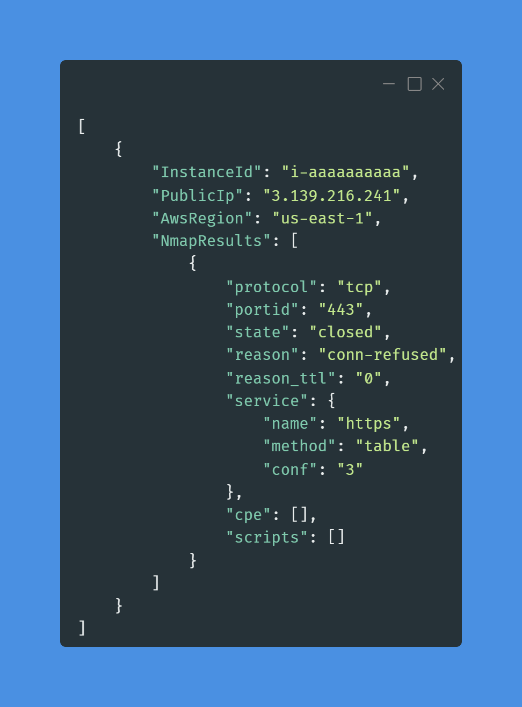
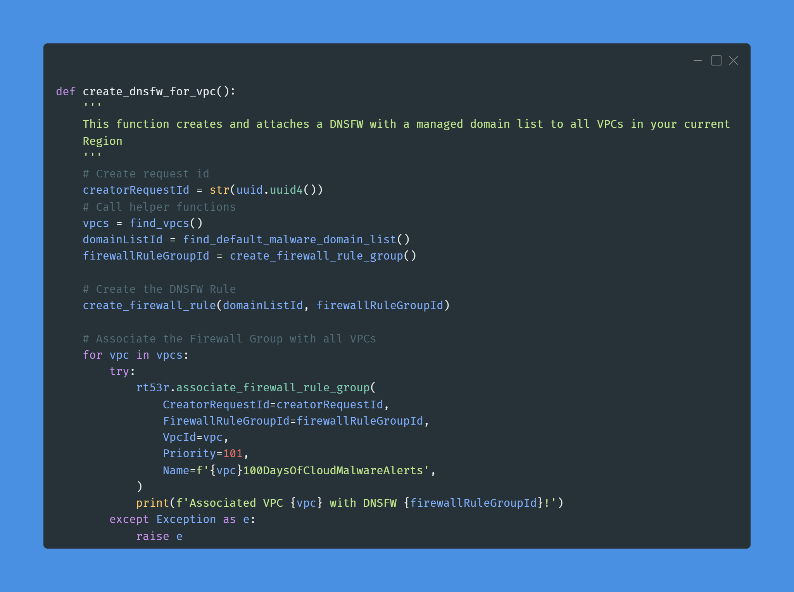
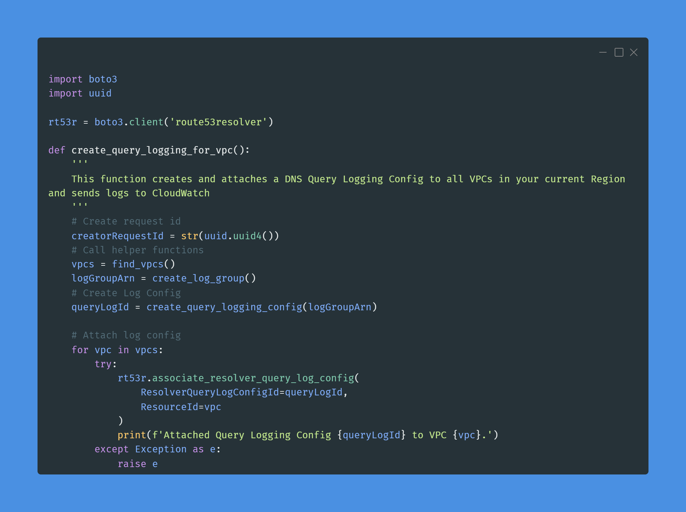
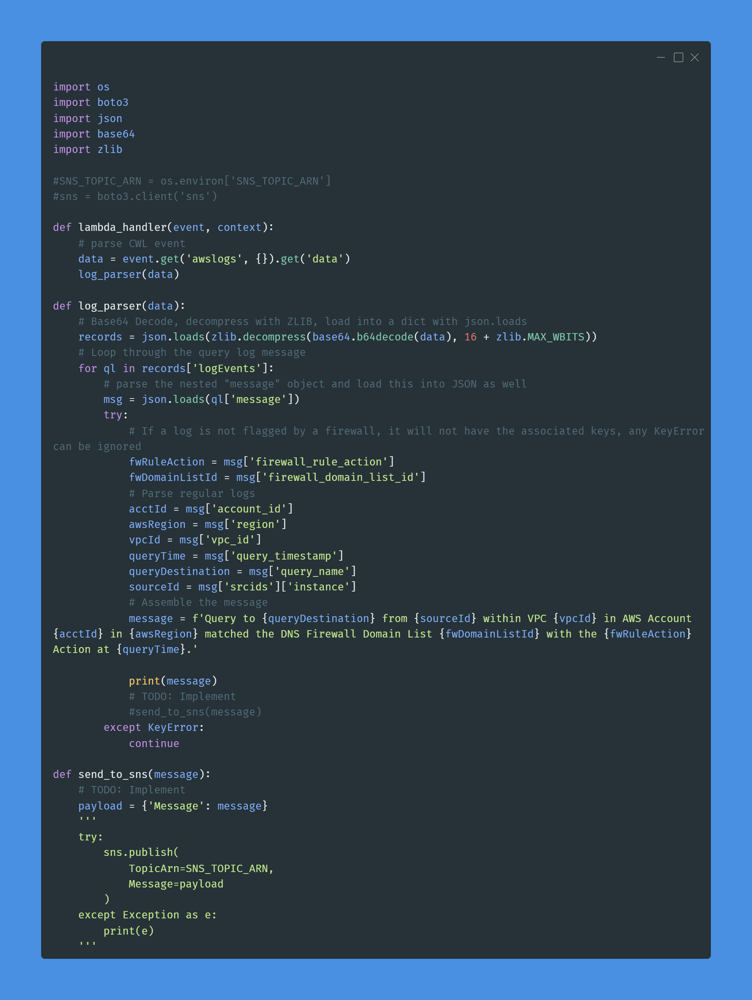

# 100 Days of Cloud & 100 Days of Cloud Security

#100DaysOfCloud #100DaysOfCyberSecurity snippets starting from 28 SEPT 2022 by your (allegedly) Favorite CISO: https://www.linkedin.com/in/jonathan-r-2b2742112/.

Hoping to spread some knowledge and encourage entry-level professionals to emulate this. For all intents and purposes the current industry hivemind would argue that as a CISO I, 1) probably shouldn't do this because "cIsOs DoNt NeEd To Be TeChNiCaL" and 2) A CISO shouldn't need to "prove" anything - which is a dangerous assumption and why we have busted ass security programs in F500 companies. Gatekeepers can bite my shiny metal ass.

In all seriousness, certs and degrees are fine but not everyone has the economic means to afford them at any given point. As a former hiring manager who built one of the most ambitious cyber security products INSIDE of a massive F500 company with more than 60% of the team being entry-level, I have an opinion that you can teach just about any skills to any candidate that can demonstrate they have a desire and passion to learn and display some personality in their projects.

When you create something like this, it demonstrates you can stick with something (100 days is a lot!), and how you document it and execute tells me far more about your aptitude and attitude than a cert or degree. By all means, don't feel bad for getting them, but for those looking to pivot or to highlight themselves: do this.

## Table of Contents

> - [Day 1](#day-1) AWS environment variables Bash script for Account ID, Account Name, Region & Organizations Principal ID

> - [Day 2](#day-2) Python script to find all Default VPCs in every Region in current Account

> - [Day 3](#day-3) Python script to find and delete all ***unused*** Default VPC and their dependencies in every Region in the current Account

> - [Day 4](#day-4) Python script to find all Default Security Groups for every VPC in every Region in the current Account

> - [Day 5](#day-5) No code, overview of AWS Network Security solutions

> - [Day 6](#day-6) Python script to find certain resources (EC2, RDS, ALB) using the Default SG in every Region in the current Account and deletes the default rules

> - [Day 7](#day-7) Python script to automated NMAP TCP scans against public-facing EC2 instances in all Regions in the current Account

> - [Day 8](#day-8) Python script to create and attach a basic DNS Firewall with the AWS-managed malware Domain List to all VPCs in your current Region

> - [Day 9](#day-9) Python script to create a basic Route 53 Resolver DNS Query Logging Configuration for all VPCs in your current Region and send the logs to CloudWatch

> - [Day 10](#day-10) Python AWS Lambda script to parse CloudWatch Logs and print basic information on DNS Firewall events within them. Optional code to send messages to SNS

> - [Day 11](#day-11) Python AWS Lambda script (modified Day 10) that enriches DNS Firewall findings with additional information.

> - [Day 12](#day-12) Python AWS Lambda script (modified Day 10 & 11) that enriches DNS Firewall findings with IP resolution from `socket` as well as provide geo-intel data for the IPs via ip-api.com.

## Day 1


### Day 1 LinkedIn Post

[Post Link](https://www.linkedin.com/feed/update/urn:li:activity:6980913548331786240/)

Time to do something I never partook in: #100daysofcloud #100daysofcybersecurity. It kind of favors the micro-content and maybe you will learn a thing or two from your (allegedly) Favorite CISO.

In AWS, you're going to run into times where you need to know your Account ID, Account Name, Organizations ID, or current Region. Maybe it's for uniqueness, maybe its to provide to another command, maybe it is to fill in an environment variable, or maybe to write an IAM policy condition, or just because you want to know. Don't get so caught up in justification.

These are some of my favorite. Using Carbon to create these nifty terminal pictures too. I'll mostly focus on AWS with CLI & Python, may throw in some M365 E5 Security stuff in there too just to keep you on your toes. Feel free to make requests too and engage with me, or suffer the consequences of learning NOTHING HAHHAHAHAHA...okay, I'll stop.

Anyway, code for you copy-paste people:

```bash
sudo apt install -y jq
# Get your Account ID
AWS_ACCOUNT_ID=$(aws sts get-caller-identity | jq '.Account' -r)
echo $AWS_ACCOUNT_ID
# Get your Region
AWS_REGION=$(aws configure get region)
echo $AWS_REGION
# Get your Account name
AWS_ACCOUNT_NAME=$(aws organizations describe-account --account-id $AWS_ACCOUNT_ID | jq '.Account.Name' -r)
echo $AWS_ACCOUNT_NAME
# Get your AWS Organizations ID
AWS_ORGANIZATIONS_PRINCIPAL_ID=$(aws organizations describe-organization | jq '.Organization.Id' -r)
echo $AWS_ORGANIZATIONS_PRINCIPAL_ID
```

Stay Dangerous

#security #learning #python #cli #aws #cloudsecurity #bash

### Day 2 Code Snippet

```bash
sudo apt install -y jq
# Get your Account ID
AWS_ACCOUNT_ID=$(aws sts get-caller-identity | jq '.Account' -r)
echo $AWS_ACCOUNT_ID
# Get your Region
AWS_REGION=$(aws configure get region)
echo $AWS_REGION
# Get your Account name
AWS_ACCOUNT_NAME=$(aws organizations describe-account --account-id $AWS_ACCOUNT_ID | jq '.Account.Name' -r)
echo $AWS_ACCOUNT_NAME
# Get your AWS Organizations ID
AWS_ORGANIZATIONS_PRINCIPAL_ID=$(aws organizations describe-organization | jq '.Organization.Id' -r)
echo $AWS_ORGANIZATIONS_PRINCIPAL_ID
```

## Day 2


### Day 2 LinkedIn Post

[Post Link](https://www.linkedin.com/feed/update/urn:li:activity:6981255353304817664/)

Day 2 of #100daysofcloud & #100daysofcybersecurity is a Python script to locate any default VPCs in any AWS Region in your *current* Account. Script is in the attached Carbon Screenshot. I'll begin porting these to GitHub soon.

Every single AWS Account out there has default VPCs created in every Region, there are a lot of AWS services such as RDS, Neptune, Redshift, SageMaker, EC2, and so forth that look for the Default VPC to attach to. It's meant to help you out but is a relic of a bygone era when the hardest thing you may have had to do was properly create a VPC with Public & Private Subnets and not blackhole your NATGW lol.

Now with landing zones, IAC, and endless templates and console wizards there is hardly a need for it. While a vast majority of AWS incidents I have been involved in use an identity vector, there are still some that use the network vector especially for your "garden snake" variety attack like cryptojacking. Attackers will spin up massive ECS, EKS or EC2 fleets and mine. I've also seen SFTP servers hosted in a different Region go undetected as the adversary used it to exfiltrate data from within the trust boundary.

This is a big deal because the major detective controls in AWS are all Regional. Even if you use multi-region CloudTrail, would you be able to tell 100% that a Create operation is malicious? Are you even monitoring CloudTrail or just dumping it off? Maybe the IP Address will give it away - since the attacker needs to gain Initial Access first - but can you build an ML workload to detect anomalies between identities & IP addresses accurately?

Interestingly enough, there is not a cloud network oriented Technique/Sub-Technique in MITRE ATT&CK. The closest you get is T1583.003: Acquire Infrastructure: Virtual Private Server for Resource Development / living-off-the-land and for Persistence this is an identity-related one but, T1078.004: Valid Accounts: Cloud Accounts.

Day 3 I'll show you how to delete them and in the future we will have multi-account use cases. For this one you need ec2:DescribeVpcs and ec2:DescribeRegions permissions only.

Stay Dangerous

#cloudsecurity #awssecurity #aws #security #infosec #learning #cloud

### Day 2 Code Snippet

```python
import boto3

def get_aws_regions():
    '''
    Retrieves all opted-in AWS Regions for this Account
    '''
    ec2 = boto3.client('ec2')

    awsRegions = []

    try:
        # Get all Regions we are opted in for
        for r in ec2.describe_regions()['Regions']:
            regionName = str(r['RegionName'])
            optInStatus = str(r['OptInStatus'])
            if optInStatus == 'not-opted-in':
                continue
            else:
                awsRegions.append(regionName)
    except Exception as e:
        raise e
        
    print('Got all AWS Regions')

    del ec2

    return awsRegions

def find_default_vpcs():
    '''
    Loops through every AWS Region and looks for Default VPCs
    '''
    awsRegions = get_aws_regions()

    for region in awsRegions:
        # Create a new Session for the Region and pass it to an EC2 client
        session = boto3.Session(region_name=region)
        ec2 = session.client('ec2')
        # Find those VPCs - use a list comprehension to determine if there any VPCs to begin with
        if ec2.describe_vpcs()['Vpcs']:
            for vpc in ec2.describe_vpcs()['Vpcs']:
                # Now let's find the default VPC
                vpcId = vpc['VpcId']
                isDefault = vpc['IsDefault']
                if isDefault == True:
                    print(f'VPC {vpcId} in {region} is the Default VPC!')
                else:
                    print(f'VPC {vpcId} in {region} is a custom VPC.')
        else:
            print(f'There are no VPCs in {region}.')

find_default_vpcs()
```

## Day 3


### Day 3 LinkedIn Post

[Post Link](https://www.linkedin.com/feed/update/urn:li:share:6981629745717215233/)

It is Day 3 of #100daysofcloud & #100daysofcybersecurity and I have a spicy one for you that builds on Day 2 *AND* I have a GitHub that will keep the full code snippets, Carbon screenshots, and the post for posterity. More reason to engage here so we can extrapolate, exchange ideas, and give you a reason to look back.

The post & code will be mirrored after each post. Link will always be in the comments as to not anger the algorithm. I do this so people can see & learn not to stoke some bullshit impressions ego.

Day 3 has the extended script which teaches us how to separate discrete units of logics in our Python scripts into functions and call them from a main script. We are also making our first #SOAR (Security Orchestration & Automated Response) #playbook for sorts.

Focusing on the latter, SOAR is a muddy, multi-disciplinary space that describes any tool or "thing" which automates some security tasks for use and/or orchestrates it on our behalf. This can be a workflow tool that will automatically response to a given input - such as responding to a Splunk alert and sending alerts to PagerDuty, it can be a #CNAPP that generates an IAM Permissions Boundary for you, or a tool that will destroy instances spawned by a known malicious actor. You can use anything for SOAR, and in my experience, you're 99% better of BUILDING it yourself.

That said, SOAR is a contentious topic. You need a lot of Delete/Update/Describe/List permissions and if an adversary gained control of this SOAR #identity, bad things can happen. Also, product teams and your security organization may dislike of you having orbital nukes to crush their non-compliant resources. There is always the risk you delete something legit or have a runaway SOAR workflow that eats itself (I've seen that before). Before doing this you should weigh all the pros & cons and honestly without GREAT #Detection, using #Responsive #Controls is not good enough. All opt for Preventative measures AND #EDUCATE & #EMPOWER YOUR PARTNERS!!

On the #Python side, this script has functions which carry out specific tasks passed on an input. In our case we have a function for yeeting IGWs and another for Subnets. This helps keep your code clean, helps with debugging, looks cool as hell, and can improve performance for not needing to use a lot of try/except and for-loops within a big ass code monolith. You can go even further with defining Classes and calling your Python scripts like legit modules such as Boto3 and Pandas, but we'll do that...later?

Anyway, IAM Permissions needed are in GitHub too. If you do setup SOAR identities best practice is to control the trust boundary with who/what can use it. Minimum necessary permissions - try to keep identities per a playbook if you can (for destructive ones) - and maybe even use IP/network conditions (VPC, VPCE, SourceIp) and MFA.

Seriously though, destroy the Default VPCs, they are nothing but a free persistence & defense evasion area for adversaries.

Stay Dangerous

### Day 3 Code Snippet

#### Permissions

```json
{
    "Version": "2012-10-17",
    "Statement": [
        {
            "Sid": "VpcYeeter",
            "Effect": "Allow",
            "Action": [
                "ec2:DescribeInternetGateways",
                "ec2:DescribeNetworkInterfaces",
                "ec2:DeleteSubnet",
                "ec2:DescribeVpcs",
                "ec2:DescribeRegions",
                "ec2:DeleteInternetGateway",
                "ec2:DetachInternetGateway",
                "ec2:DeleteVpc",
                "ec2:DescribeSubnets"
            ],
            "Resource": "*",
            "Condition": {
                "ForAnyValue:StringEquals": {
                    "aws:SourceVpce": "vpce-123123" # REPLACE THIS VALUE IF YOURE USING VPC ENDPOINTS
                },
                "IpAddress": {
                    "aws:SourceIp": "192.168.1.1" # REPLACE THIS IF YOU WANT TO USE THE PRIVATE IP OF AN EIP/ENI!!!
                }
            }
        }
    ]
}
```

#### Code

```python
import boto3
from time import sleep

def get_aws_regions():
    '''
    Retrieves all opted-in AWS Regions for this Account
    '''
    ec2 = boto3.client('ec2')

    awsRegions = []

    try:
        # Get all Regions we are opted in for
        for r in ec2.describe_regions()['Regions']:
            regionName = str(r['RegionName'])
            optInStatus = str(r['OptInStatus'])
            if optInStatus == 'not-opted-in':
                continue
            else:
                awsRegions.append(regionName)
    except Exception as e:
        raise e
        
    print('Got all AWS Regions')

    del ec2

    return awsRegions

def seek_and_destroy_default_vpcs():
    '''
    Loops through every AWS Region and looks for Default VPCs
    '''
    awsRegions = get_aws_regions()

    for region in awsRegions:
        # Create a new Session for the Region and pass it to an EC2 client
        session = boto3.Session(region_name=region)
        ec2 = session.client('ec2')
        # Find those VPCs - use a list comprehension to determine if there any VPCs to begin with
        if ec2.describe_vpcs()['Vpcs']:
            for vpc in ec2.describe_vpcs()['Vpcs']:
                # Now let's find the default VPC
                vpcId = vpc['VpcId']
                isDefault = vpc['IsDefault']
                if isDefault == True:
                    # supply VPC ID to filter to find any ENIs with a list comprehension
                    if ec2.describe_network_interfaces(
                        Filters=[
                            {
                                'Name': 'vpc-id',
                                'Values': [vpcId]
                            }
                        ]
                    )['NetworkInterfaces']:
                        # ENIs found - likely has workloads or at least a NATGW that you should check on first...
                        print(f'Default VPC {vpcId} in {region} currently has attached ENIs and cannot be automatically deleted!')
                    else:
                        # Time to SOAR the shit out those default VPCs
                        # Delete the IGWs
                        seek_and_destroy_igws(aws_region=region,vpc_id=vpcId)
                        # Delete the Subnets
                        seek_and_destory_subnets(aws_region=region,vpc_id=vpcId)
                        try:
                            ec2.delete_vpc(VpcId=vpcId)
                            print(f'Yeeted {vpcId} in {region} straight to VPC Hell!')
                        except Exception as e:
                            print(f'Failed to delete {vpcId} in {region} due to \n {e}')
                else:
                    print(f'VPC {vpcId} in {region} is a custom VPC.')
        else:
            print(f'There are no VPCs in {region}.')

def seek_and_destroy_igws(aws_region, vpc_id):
    '''
    This function receives a VPC ID and uses it to find, detach and tear asunder any Internet Gateways and skip rope with its entrails
    '''
    session = boto3.Session(region_name=aws_region)
    ec2 = session.client('ec2')
    try:
        # get the IGW for the VPC
        for igw in ec2.describe_internet_gateways(
            Filters=[
                {
                    'Name': 'attachment.vpc-id',
                    'Values': [vpc_id]
                }
            ]
        )['InternetGateways']:
            igwId = igw['InternetGatewayId']
            # detach the IGW and wait for 2 seconds because a waiter does not exist and I do not want to write one...
            ec2.detach_internet_gateway(
                DryRun=False,
                InternetGatewayId=igwId,
                VpcId=vpc_id
            )
            sleep(2)
            ec2.delete_internet_gateway(
                DryRun=False,
                InternetGatewayId=igwId
            )
            print(f'Internet Gateway for {vpc_id} in {aws_region} was completely and utterly destroyed!')
    except Exception as e:
        print(f'Encountered error trying to remove/delete IGWs for {vpc_id} in {aws_region} \n {e}')

def seek_and_destory_subnets(aws_region, vpc_id):
    '''
    This function receives a VPC ID and uses it to find, and absolutely crush any and all Subnets brazen enough to exist
    '''
    session = boto3.Session(region_name=aws_region)
    ec2 = session.client('ec2')
    try:
        for subnet in ec2.describe_subnets(
            Filters=[
                {
                    'Name': 'vpc-id',
                    'Values': [vpc_id]
                }
            ]
        )['Subnets']:
            subnetId = subnet['SubnetId']
            ec2.delete_subnet(
                SubnetId=subnetId,
                DryRun=False
            )
        print(f'All Subnets for {vpc_id} in {aws_region} were beaten to a pulp and have left this mortal coil!')
    except Exception as e:
        print(f'Encountered error trying to delete Subnets for {vpc_id} in {aws_region} \n {e}')

seek_and_destroy_default_vpcs()
```

## Day 4


### Day 4 LinkedIn Post

[Post Link](https://www.linkedin.com/feed/update/urn:li:share:6982011824653099008/)

Day 4 of #100daysofcloud & #100daysofcybersecurity, sticking with the theme of #SOAR playbooks, automation, and the thrice-cursed AWS "default" resources. As always, #GitHub in the links with the full code snippet and required permissions for it.

In Day's 2 and 3 we discussed the #Default #VPC and other bygone relics which AWS keeps around. Included within EVERY VPC is the Default Security Group (SG), which you cannot delete, so you need to get creative.

The Default SG has a rule which allows "full talk-to-self" that means anything that SG is attached to has unfettered network access across all ports & protocols. It is the opposite of least privilege, it is an anti-pattern at best and lets network-savvy attackers easily live off the land at worst.

To make the SG even worse, and really all SGs, is the default egress rule allows all outbound traffic. SGs are #stateful, which means that any connection opened is allowed in, so even if there is not a direct rule allowing access - if you or an #adversary opens a connection it can talk unfettered because of the egress. The only way to stop that is with a #Network #ACL - which are more trouble than they're worth - or using something like Network #Firewall, #DNS Firewall or an appliance with very specifically crafted rules.

A best practice is to NOT use that SG and blow all the rules away. Day 4's script lets you do that. However, I do not account for edge cases, it only deletes the DEFAULT RULES IT COMES WITH. It will add a tag telling people not to use it and will print out any extra rules. Security Hub and other CSPMs will tell you if anyone is USING it. The other issue is for #ClickOps that SG is chosen by default because...well...it's the default. So if you are not using IAC fervently, I bet you have a resource using it.

As always, #Responsive / #Destructive tech is controversial. Do not run this thing without making sure no one is using it. If they are, educate them, you can easily create & associate better SGs and THEN you can blow that shit to pieces.

As an industry we are rightfully concentrating on identity but network attack paths will continue to be a problem and it's an area that is often neglected too much. Blow away Default VPCs before this one to avoid extra work. When the VPC dies the Default SG dies. All for now...

Stay Dangerous

#cloudsecurity #awssecurity #aws #security 

### Day 4 Code Snippet

#### Permissions

```json
{
    "Version": "2012-10-17",
    "Statement": [
        {
            "Sid": "VisualEditor0",
            "Effect": "Allow",
            "Action": [
                "ec2:RevokeSecurityGroupIngress",
                "ec2:DescribeSecurityGroupRules",
                "ec2:CreateTags",
                "ec2:RevokeSecurityGroupEgress",
                "ec2:DescribeRegions",
                "ec2:DescribeSecurityGroups"
            ],
            "Resource": "*"
        }
    ]
}
```

#### Code

```python
import boto3
import json

sts = boto3.client('sts')
AWS_ACCOUNT_ID = sts.get_caller_identity()['Account']
del sts

def get_aws_regions():
    '''
    Retrieves all opted-in AWS Regions for this Account
    '''
    ec2 = boto3.client('ec2')

    awsRegions = []

    try:
        # Get all Regions we are opted in for
        for r in ec2.describe_regions()['Regions']:
            regionName = str(r['RegionName'])
            optInStatus = str(r['OptInStatus'])
            if optInStatus == 'not-opted-in':
                continue
            else:
                awsRegions.append(regionName)
    except Exception as e:
        raise e
        
    print('Got all AWS Regions')

    del ec2

    return awsRegions

def default_sg_flayer():
    '''
    Loops through every AWS Region and looks for Default SGs, removes the ingress & egress default rules, adds a new tag,
    and then runs a report if there are any leftover rules
    '''
    awsRegions = get_aws_regions()

    for region in awsRegions:
        # Create a new Session for the Region and pass it to an EC2 client
        session = boto3.Session(region_name=region)
        ec2 = session.client('ec2')
        # Default Security Group always has a Group Name of 'default'
        response = ec2.describe_security_groups(
            Filters=[
                {
                    'Name': 'group-name',
                    'Values': ['default']
                }
            ]
        )
        # Ignore empty returns
        if not response['SecurityGroups']:
            continue
        else:
            # Parse Default SGs. Use For loop as there can be multiple SGs per Region
            for sg in response['SecurityGroups']:
                #print(json.dumps(sg,indent=4,default=str))
                sgId = sg['GroupId']
                # Remove the self-ref SG Rule, if there are any ingress rules
                if sg['IpPermissions']:
                    print(f'Removing ingress for Default SG {sgId} in {region}.')
                    default_sg_ingress_removal(region, sgId)
                # Remove the egress rule, if there are any egress rules
                if sg['IpPermissionsEgress']:
                    print(f'Removing egress for Default SG {sgId} in {region}.')
                    default_sg_egress_removal(region, sgId)
                # Add a new tag to the default SG as a warning
                print(f'Adding new warning name tag to Default SG {sgId} in {region}.')
                default_sg_tagger(region, sgId)
                # Report if there are any left over rules
                print(f'Checking if there are remaining rules for Default SG {sgId} in {region}.')
                default_sg_remaining_rules_report(region, sgId)

def default_sg_ingress_removal(region, security_group_id):
    '''
    Removes the Default SG self-referenced ingress rule ONLY
    '''
    session = boto3.Session(region_name=region)
    ec2 = session.client('ec2')

    try:
        r = ec2.revoke_security_group_ingress(
            DryRun=False,
            GroupId=security_group_id,
            IpPermissions=[
                {
                    'IpProtocol': '-1',
                    'UserIdGroupPairs': [
                        {
                            'GroupId': security_group_id,
                            'UserId': AWS_ACCOUNT_ID
                        }
                    ]
                }
            ]
        )
        if r['Return'] == True:
            print(f'Revoked self-referenced Ingress for Default SG {security_group_id} in {region}.')
        else:
            print(f'Failed to revoke self-referenced Ingress for Default SG {security_group_id} in {region}.')
    except Exception as e:
        print(f'Failed to revoke self-referenced Ingress for Default SG {security_group_id} in {region}.')
        print(e)

def default_sg_egress_removal(region, security_group_id):
    '''
    Removes the Default SG allow-all Egress rule ONLY
    '''
    session = boto3.Session(region_name=region)
    ec2 = session.client('ec2')

    try:
        r = ec2.revoke_security_group_egress(
            DryRun=False,
            GroupId=security_group_id,
            IpPermissions=[
                {
                    'IpProtocol': '-1',
                    'IpRanges': [
                        {
                            'CidrIp': '0.0.0.0/0'
                        }
                    ]
                }
            ]
        )
        if r['Return'] == True:
            print(f'Revoked allow-all Egress for Default SG {security_group_id} in {region}.')
        else:
            print(f'Failed to revoke allow-all Egress for Default SG {security_group_id} in {region}.')
    except Exception as e:
        print(f'Failed to revoke allow-all Egress for Default SG {security_group_id} in {region}.')
        print(e)

def default_sg_tagger(region, security_group_id):
    '''
    Adds tags to the Default SG so people know not to touch it...hopefully
    '''
    session = boto3.Session(region_name=region)
    ec2 = session.client('ec2')

    try:
        ec2.create_tags(
            DryRun=False,
            Resources=[security_group_id],
            Tags=[
                {
                    'Key': 'Name',
                    'Value': 'DEFAULT_DO_NOT_USE'
                }
            ]
        )
        print(f'Tagged Default SG {security_group_id} in {region}.')
    except Exception as e:
        print(f'Failed to tag Default SG {security_group_id} in {region}.')
        print(e)

def default_sg_remaining_rules_report(region, security_group_id):
    '''
    Describes if there are any other rules left on the default SG
    '''
    session = boto3.Session(region_name=region)
    ec2 = session.client('ec2')

    r = ec2.describe_security_group_rules(
        Filters=[
            {
                'Name': 'group-id',
                'Values': [security_group_id]
            },
        ]
    )
    if r['SecurityGroupRules']:
        print(
            json.dumps(
                r['SecurityGroupRules'],
                indent=4,
                default=str
            )
        )

default_sg_flayer()
```

## Day 5

### Day 5 LinkedIn Post

[Post Link](https://www.linkedin.com/feed/update/urn:li:activity:6982403353934753792/)

Day 5 of #100daysofcloud & #100daysofcybersecurity. No code today, Giants football is on and I got some #steakposting to get to later. Will back this up to GitHub tomorrow but there will not be any snippets, just theory today.

Sticking with the #network #security concepts for the next few days on AWS, going to cover off some other tools. I get that identity is overwhelmingly the largest vector of initial access, but not every compromised identity is a true admin, I'm sure the adversaries would love that. That is why they laterally move. That is why cryptojacking is such a boring attack. That is why data exfiltration is simple for #ransomware gangs and #doublextortion is a thing.

While paring down egress for Security Groups will be really hard to do for your edge, there are other tools you can add in for a hardened network edge. Firstly, for private security groups, write your SGs per layer of your app - be it Private Lambda, EC2s running a webapp, EKS Nodes, etc. You can reference the other SG you know incoming traffic will be instead of allowing an entire Subnet or VPC CIDR.

Application Load Balancers have some built in security settings such as overriding WAF Fail Open in case WAF ever falls down, ALB will not allow the uninspected traffic through. That is a tradeoff of availability for confidentiality and I do not know anyone who does that. HTTP Desync Attack protection helps mitigate HTTP request smuggling, and you can also drop invalid HTTP headers. You should also turn on access logging, it is in a weird CEF-like format, but Athena has a way to parse it.

Next up is AWS WAF. Web App Firewalls protect against web app attacks - if you do not know how to write the rules (AWS does make it easy) you can use the managed rule groups to counter known bad IPs, SQLI, XSS, CSRF, specific parts of the request, and more. While there are ways around some of the protections, like very large requests, with some of the more advanced features like CAPTCHA challenges and bot protection. The logs are easy to parse and can be moved with Firehose (and converted to Parquet) and you can even do some fun NSPM/ML work with it (that's for later). You can orchestrate across your Organization use FMS as well, even auto-attaching.

Next is CloudFront. Not a security tool on its own but CDNs help absorb DDOS (along with Shield), great log source, but with Lambda@Edge you can intercept requests and do some really interesting things dropping suspect requests that look like XSS by enforcing to setting certain headers. We'll do a Day on this soon.

Network Firewall is a stateful NGFW-ish tool, it's operates like a Gateway, and works a lot like Suricata IDS/IPS to. You can create fine-grained rules to inspect the request and drop traffic that doesn't match specific ports/protocols and IPs. You can write Suricata-type rules for deep inspection and it also supports FMS and AWS Managed Threat Lists. Great for ingress/egress centralization.

Stay Dangerous

### Day 5 Code Snippet

NO CODE SNIPPET

## Day 6


### Day 6 LinkedIn Post

[Post Link](https://www.linkedin.com/feed/update/urn:li:share:6982693255305953283/)

Day 6 of #100daysofcloud & #100daysofcybersecurity we're still on our network game. Meant to do this for Day 5, but regarding finding what resources use the Default SG can be done via #CSPM or #AWS Config - but let's do it the "hard way" - and it will prove a few points as well.

Financial considerations in security typically isn't broached outside of complaints about (lack of) budgets. That's valid, but not here. Despite being a "vendor #CISO" I'm very build-first. Outside of architecture and engineering chops a team needs are financial considerations - how to forecast usage/consumption and how it looks scaled up 2/5/10/20X for example. This is pertinent when it comes to AWS (and other #CSP) services since being regional it means needing to pay for it per-Region.

When it comes to a real cost-benefit analysis - is it worth to your team to run a $5/month bill up per every AWS Region when outside of your main region(s) it will just be an unnecessary discretionary cost. Why not whip up some scripts for #Detective Controls for things you want to find without needing to administer and pay for a multi-region deployment that has limited use.

That is where today's script comes in. Sure, you can throw on AWS Config & AWS Security Hub and write an Insight in SecHub to find resources using the default SG - but it's more money and work to just turn the services on before you see value. If you already know what you want, run a script: this script looks just at EC2, RDS and ALBs using Default SGs.

The second theme is around data consistency in your collection. Nearly every API has a different way it returns information, especially nested metadata. For security groups EC2 gives you a name, RDS has the ID and status, ALB just gives you IDs. You'll run into this a lot where every API you interface with needs its own parsing logic. You also need to ensure that you settle on what the data should look like - Pascal vs Camel Case, what you'll name the keys, if you maintain the API's naming or use your own, are you going to be further joining or enriching?

This script has an opinion. Normalized schema and pascal case, but you'll need to make the determination on your own. Recap: it's almost always more efficient to script your own detection, always be cognizant of costs, and settling on things as minor as schema and SLAs around your data collection leads to future #SecDataOps excellence.

Stay Dangerous

#awssecurity #cloudsecurity #security #bigdata

### Day 6 Code Snippet

#### Permissions

```json
{
    "Version": "2012-10-17",
    "Statement": [
        {
            "Sid": "VisualEditor0",
            "Effect": "Allow",
            "Action": [
                "elasticloadbalancing:DescribeLoadBalancers",
                "ec2:DescribeInstances",
                "ec2:DescribeRegions",
                "rds:DescribeDBInstances",
                "ec2:DescribeSecurityGroups"
            ],
            "Resource": "*"
        }
    ]
}
```

#### Code Snippets

```python
import boto3
import json

sts = boto3.client('sts')
AWS_ACCOUNT_ID = sts.get_caller_identity()['Account']
del sts

def get_aws_regions():
    '''
    Retrieves all opted-in AWS Regions for this Account
    '''
    ec2 = boto3.client('ec2')

    awsRegions = []

    try:
        # Get all Regions we are opted in for
        for r in ec2.describe_regions()['Regions']:
            regionName = str(r['RegionName'])
            optInStatus = str(r['OptInStatus'])
            if optInStatus == 'not-opted-in':
                continue
            else:
                awsRegions.append(regionName)
    except Exception as e:
        raise e
        
    print('Got all AWS Regions')

    del ec2

    return awsRegions

def default_sg_sniffer():
    '''
    This function commands all other functions, finds and assembles a list of resources and
    writes to a file using multiprocessing
    '''

    # TODO: Consider multiprocessing this bullshit?

    print(f'Locating EC2 instances using the Default Security Group.')
    ec2Instances = find_ec2_using_default()
    print(f'Found {len(ec2Instances)} EC2 instance(s) using the Default Security Group.')

    print(f'Locating RDS instances using the Default Security Group.')
    rdsInstances = find_rds_using_default()
    print(f'Found {len(rdsInstances)} RDS instance(s) using the Default Security Group.')

    print(f'Locating ALB load balancers using the Default Security Group.')
    albLbs = find_alb_using_default()
    print(f'Found {len(albLbs)} ALB load balancer(s) using the Default Security Group.')

    # Use extend() to combine the lists before writing to file - we will add them to the first list, "ec2Instances"
    # only in the event that there are actually things to write
    if (
        len(ec2Instances) and 
        len(rdsInstances) and 
        len(albLbs) != 0
    ):
        ec2Instances.extend(rdsInstances)
        ec2Instances.extend(albLbs)
        
        # Write the new chonky combined list to JSON for all your reporting-related terror to inflict upon the world
        with open('./default_sg_resources.json', 'w') as jsonfile:
            json.dump(
                ec2Instances,
                jsonfile,
                indent=2,
                default=str
            )

        print('Wrote all non-compliant resources to file.')
    else:
        print('There are not any non-compliant resources to write to a file.')

def find_ec2_using_default():
    '''
    Searches all Regions for EC2 instances using the Default Security Group
    '''
    awsRegions = get_aws_regions()

    # Empty list for instances
    instances = []

    for region in awsRegions:
        # Create a new Session for the Region and pass it to an EC2 client
        session = boto3.Session(region_name=region)
        ec2 = session.client('ec2')
        paginator = ec2.get_paginator('describe_instances')
        # Paginate through EC2s
        for page in paginator.paginate(
            Filters=[
                {
                    'Name': 'instance-state-name',
                    'Values': [
                        'running',
                        'stopped'
                    ]
                }
            ]
        ):
            for r in page['Reservations']:
                for i in r['Instances']:
                    instanceId = i['InstanceId']
                    # Loop SGs, there is typically only one, but this checks for more
                    for sg in i['SecurityGroups']:
                        # Continue looping, unless a "default" SG is found, then add instance to list & break
                        if sg['GroupName'] == 'default':
                            defaultEc2Dict = {
                                'AccountId': AWS_ACCOUNT_ID,
                                'AwsRegion': region,
                                'ResourceId': instanceId,
                                'ResourceType': 'EC2Instance'
                            }
                            # append to list
                            instances.append(defaultEc2Dict)
                            break
                        else:
                            continue

    return instances

def find_rds_using_default():
    '''
    Searches all Regions for RDS instances using the Default Security Group
    '''
    awsRegions = get_aws_regions()

    # Empty list for instances
    instances = []

    for region in awsRegions:
        # Create a new Session for the Region and pass it to an RDS client and an EC2 client
        session = boto3.Session(region_name=region)
        rds = session.client('rds')
        # EC2 Client is needed to find the name associated to an SG by ID
        ec2 = session.client('ec2')
        paginator = rds.get_paginator('describe_db_instances')
        for page in paginator.paginate():
            for r in page['DBInstances']:
                instanceId = r['DBInstanceIdentifier']
                # Loop SGs, there is typically only one, but this checks for more
                for sg in r['VpcSecurityGroups']:
                    sgId = sg['VpcSecurityGroupId']
                    # Pass the SG ID to the DescribeSecurityGroups API to parse the name. If the name is default add
                    # the DB information to the list and break the loop
                    if ec2.describe_security_groups(GroupIds=[sgId])['SecurityGroups'][0]['GroupName'] == 'default':
                        defaultRdsDict = {
                            'AccountId': AWS_ACCOUNT_ID,
                            'AwsRegion': region,
                            'ResourceId': instanceId,
                            'ResourceType': 'RDSInstance'
                        }
                        # append to list
                        instances.append(defaultRdsDict)
                        break
                    else:
                        continue

    return instances

def find_alb_using_default():
    '''
    Searches all Regions for Application Load Balancers using the Default Security Group
    '''
    awsRegions = get_aws_regions()

    # Empty list for lbs
    lbalancers = []

    for region in awsRegions:
        # Create a new Session for the Region and pass it to an ELBv2 client and en EC2 client
        session = boto3.Session(region_name=region)
        elbv2 = session.client('elbv2')
        # EC2 Client is needed to find the name associated to an SG by ID
        ec2 = session.client('ec2')
        paginator = elbv2.get_paginator('describe_load_balancers')
        # Paginate through ALBs
        for page in paginator.paginate():
            for l in page['LoadBalancers']:
                lbName = l['LoadBalancerName']
                # Similar to RDS & EC2, ALBs can have multiple load balancers, but like RDS only the ID is returned
                for sg in l['SecurityGroups']:
                    # Pass the SG ID to the DescribeSecurityGroups API to parse the name. If the name is default add
                    # the DB information to the list and break the loop
                    # The list of "SecurityGroups" only returns the IDs as is, no need for additional parsing...
                    if ec2.describe_security_groups(GroupIds=[sg])['SecurityGroups'][0]['GroupName'] == 'default':
                        defaultAlbDict = {
                            'AccountId': AWS_ACCOUNT_ID,
                            'AwsRegion': region,
                            'ResourceId': lbName,
                            'ResourceType': 'ALBLoadBalancer'
                        }
                        # append to list
                        lbalancers.append(defaultAlbDict)
                        break
                    else:
                        continue

    return lbalancers

default_sg_sniffer()
```

## Day 7



### Day 7 LinkedIn Post

[Post Link](https://www.linkedin.com/feed/update/urn:li:share:6983067365072650240/)

Day 7 of #100daysofcloud & #100daysofcybersecurity, one week in already, time flies when you're having fun. As always - GitHub containing the code, IAM permissions, post contents and even a backup of the Carbon screenshot in the comments. Got some feedback on the formatting and I'll refactor it...eventually.

Continuing to stick with the networking angle and the almighty Security Group as it pertains to Attack Surface Management (ASM). #ASM is a simple discipline/tasking with a lot of takes on how its done. The simplest way to get started requires a good asset management program - using managed tools or your own scripts - like we have been doing and working backwards from what is internet-facing.

You will always have a surface, except in exigent cirucmstances depending on industry, especially if you run a SaaS app, self-manage enterprise services (mail servers, CDNs, etc.) or maybe use bastions. There are plenty of legitimate reasons and on its own it is never an issue until it is: new 0-Day drops, new exploit TTPs, new vulns, silly misconfiguration, AppSec issue found. With ASM you want to interdict these potential problems and continuously monitor them.

CSPM has gotten us laser focused on the infra-side configurations, but things like IMDSv2, Enclaves, EBS Encryption, etc. is not a problem until it becomes one due to a network/identity-based attack first. It's not that it is unimportant but with limited resources - always start where your biggest impacts (and biggest threats) lay.

The script provided builds on similar concepts we've touched on already: saving files, using multiple Python functions, trying to introduce logic to disqualify non-pertinent resources to lower our compute overhead. I also threw in some other fun tricks like conditionally turning lists to comma-separated strings.

We will use the Python3 wrapper to Network Mapper (#NMAP) and NMAP itself, the ubiqituous NetOps/OffSec/SecOps workhorse tool. I see it make all sorts of "Top 10 Tools to X" lists, here is how to use it. We will only be performing IPv4 TCP scans as that covers most use cases. If you're wanting ICMP or UDP or IPv6 you need to modify this.

You'll find all public EC2s, determine the address (using Socket if it only has a hostname...somehow), statically analyze the SG for open TCP rules, and feed the info to NMAP to run a port scan without host discovery. Then you get a small JSON file you can work backwards from for reporting.

To close ASM is not just EXTERNAL. While that's the easiest thing for adversaries to hit, lateral movement risks are harder to stomp out. Performing internal ASM tasks is great for governance and making sure minimum necessary network permissibility and proper segmentation is in effect. Don't be that guy/gal letting your teams run roughshod with permitting all manners of traffic across trust boundaries in your VPCs/VPNs/Direct Connects. That'll get ya killed in these mean cyber streets. All for now...

Stay Dangerous

#awssecurity

### Day 7 Code Snippet

#### Permissions

```json
{
    "Version": "2012-10-17",
    "Statement": [
        {
            "Sid": "VisualEditor0",
            "Effect": "Allow",
            "Action": [
                "ec2:DescribeInstances",
                "ec2:DescribeRegions",
                "ec2:DescribeSecurityGroups"
            ],
            "Resource": "*"
        }
    ]
}
```

#### Code Snippets

```python
import boto3
import socket
import nmap3
import json

# Instantiate a NMAP scanner for TCP scans to define ports
nmap = nmap3.NmapScanTechniques()

def get_aws_regions():
    '''
    Retrieves all opted-in AWS Regions for this Account
    '''
    ec2 = boto3.client('ec2')

    awsRegions = []

    try:
        # Get all Regions we are opted in for
        for r in ec2.describe_regions()['Regions']:
            regionName = str(r['RegionName'])
            optInStatus = str(r['OptInStatus'])
            if optInStatus == 'not-opted-in':
                continue
            else:
                awsRegions.append(regionName)
    except Exception as e:
        raise e
        
    print('Got all AWS Regions')

    del ec2

    return awsRegions

def public_ec2_scan_commander():
    '''
    Searches all Regions for Public EC2 instances, evaluates their security group rules, and conducts basic
    scans against them with NMAP and returns a list of scanned instances to another function to write to file
    '''
    awsRegions = get_aws_regions()

    # Empty list for instances with NMAP Results
    instances = []

    for region in awsRegions:
        # Create a new Session for the Region and pass it to an EC2 client
        session = boto3.Session(region_name=region)
        ec2 = session.client('ec2')
        paginator = ec2.get_paginator('describe_instances')
        # Paginate through RUNNING EC2s
        for page in paginator.paginate(
            Filters=[
                {
                    'Name': 'instance-state-name',
                    'Values': ['running']
                }
            ]
        ):
            for r in page['Reservations']:
                for i in r['Instances']:
                    # Check if the Instance is public
                    try:
                        pubIp = str(i['PublicIpAddress'])
                    except KeyError:
                        pubIp = None
                    try:
                        pubDns = str(i['PublicDnsName'])
                        # Public DNS is cheeky and will return an empty string instead of None >:(
                        if pubDns == '':
                            pubDns = None
                        else:
                            pubDns = pubDns
                    except KeyError:
                        pubDns = None
                    # Create our own Bool for Public-facing EC2 instances
                    if pubIp != None or pubDns != None:
                        isPublic = True
                    else:
                        isPublic = False
                    # Skip non-public instances
                    if isPublic == False:
                        continue
                    else:
                        instanceId = i['InstanceId']
                        # Loop SGs, there is typically only one, but this checks for more
                        for sg in i['SecurityGroups']:
                            # Feed the Security Group ID to another function and receive back info if
                            # there are port:address pairs that are open to the public internet
                            sgId = sg['GroupId']
                            portTargets = security_group_targeting_intel(sgId, region)
                            # Transform Python list to a comma-separated string if there is more than one target
                            if len(portTargets) > 1:
                                portTargetsString = ','.join(portTargets)
                            else:
                                portTargetsString = portTargets[0]
                            if (pubIp == None and pubDns != None): 
                                pubIp = socket.gethostbyname(pubDns)
                            nmapResults = nmap_scan(instanceId, region, pubIp, portTargetsString)
                            if nmapResults == None:
                                continue
                            else:
                                scanDict = {
                                    'InstanceId': instanceId,
                                    'PublicIp': pubIp,
                                    'AwsRegion': region,
                                    'NmapResults': nmapResults
                                }
                                instances.append(scanDict)

    print(f'Completed all scans!')

    return instances
                          
def security_group_targeting_intel(security_group_id, aws_region):
    '''
    Parses a Security Group's rules and looks for ports that allow traffic from the internet
    '''
    # Create a new Session for the Region and pass it to an EC2 client
    session = boto3.Session(region_name=aws_region)
    ec2 = session.client('ec2')

    # Empty list to contain port targets
    ports = []

    for rule in ec2.describe_security_groups(GroupIds=[security_group_id])['SecurityGroups'][0]['IpPermissions']:
        # Skip rules without an IPv4 CIDR
        if not rule['IpRanges']:
            continue
        else:
            # skip rules that do not allow traffic from the internet and that are not TCP
            if (
                rule['IpRanges'][0]['CidrIp'] != '0.0.0.0/0' or
                rule['IpProtocol'] != 'tcp'
            ):
                continue
            else:
                # write starting port to list if it's not been seen
                fromPort = str(rule['FromPort'])
                if fromPort not in ports:
                    ports.append(fromPort)
                else:
                    continue

    return ports

def nmap_scan(instance_id, region, public_ip, port_range):
    '''
    Performs a TCP scan of a given EC2 instance on a specific set of ports and returns the results
    '''
    print(f'Scanning {instance_id} in {region} on port(s) {port_range} on IP {public_ip}.')

    try:
        raw = nmap.nmap_tcp_scan(
            public_ip,
            args=f'-Pn -p {port_range}'
        )
        results = raw[public_ip]['ports']
    except KeyError:
        results = None

    return results

def nmap_report_to_file():
    '''
    Writes the NMAP scan results to a JSON file
    '''
    nmapResults = public_ec2_scan_commander()
    if nmapResults:
        with open('./ec2_nmap_scan_results.json', 'w') as jsonfile:
            json.dump(
                nmapResults,
                jsonfile,
                default=str,
                indent=4
            )

nmap_report_to_file()
```

## Day 8



### Day 8 LinkedIn Post

[Post Link]()

Day 8 of #100daysofcloud and #100daysofcybersecurity still on networking but moving to DNS-related controls. We will stay with this theme for 2-4 more days depending on what I can think of.

As always, code snippets & IAM permissions within linked GitHub in comments.

A few years back AWS released Route 53 Resolver DNS Firewall (DNSFW) which transparently attaches to the default Resolver associated with each VPC. This gives the ability to inspect DNS requests transiting your entire VPC with up to 100K domains. You can set rules to Count, Block or Allow giving you the ability to create incredibly restrictive DNS egress zones or block/alert on known domain IOCs.

AWS manages Domain Lists using threat intel from AWS, Crowdstrike and ProofPoint (same as GuardDuty, essentially) which keeps track of known malware C2, botnets and miner pools. So for every GuardDuty DNS-related alert you can likely use DNSFW as a Preventative control - and we will be looking into a real-time SOAR use case for that later on!

DNSFW works by creating a Rule Group (which is essentially the firewall) which stores Rules which are made up of a Domain List (which hold, domains, shockingly!) and a Priority and Action. For Block action you can customize the DNS response to your liking such as returning No Data or NXDOMAIN. You can craft your own Domain Lists up to 100K as mentioned. DNSFW is easy to associate, it does not require mutating route tables and routes like Network Firewall does. Making it akin to WAFv2 which is nice.

Logging is handled by the Resolver Query Logging - we will cover that tomorrow as well as streaming and processing the data in Lambda with some basic alerting!

DNSFW does get expensive if you have very chatty applications - I know for a fact that a self-hosted MongoDB Atlas is super chatty - found that out the hard way at IHSM when I ran up someone's account several 10s of 1000s of dollars. Whoops. At the very least I still do think it's worth attaching a managed Domain List and seeing if you have alerts in a VPC used by your production apps.

The script is single-Region and will create a very basic DNSFW using the Malware-domains managed Domain List. It sets the Action to Count and associates with your VPCs. Feel free to expand it as needed, everything has a function along with a way to create a unique request ID with the `uuid` module in Python.

All for now...Stay Dangerous

#dnssecurity #awssecurity #cloudsecurity #netops #networksecurity #netsec #infosec #cloud #aws 

### Day 8 Code Snippet

#### Permissions

```json
{
    "Version": "2012-10-17",
    "Statement": [
        {
            "Sid": "VisualEditor0",
            "Effect": "Allow",
            "Action": [
                "route53resolver:CreateFirewallRule",
                "route53resolver:CreateFirewallRuleGroup",
                "ec2:DescribeVpcs",
                "route53resolver:AssociateFirewallRuleGroup",
                "route53resolver:ListFirewallDomainLists"
            ],
            "Resource": "*"
        }
    ]
}
```

#### Code Snippet

```python
import boto3
import uuid

rt53r = boto3.client('route53resolver')

def create_dnsfw_for_vpc():
    '''
    This function creates and attaches a DNSFW with a managed domain list to all VPCs in your current Region
    '''
    # Create request id
    creatorRequestId = str(uuid.uuid4())
    # Call helper functions
    vpcs = find_vpcs()
    domainListId = find_default_malware_domain_list()
    firewallRuleGroupId = create_firewall_rule_group()

    # Create the DNSFW Rule
    create_firewall_rule(domainListId, firewallRuleGroupId)

    # Associate the Firewall Group with all VPCs
    for vpc in vpcs:
        try:
            rt53r.associate_firewall_rule_group(
                CreatorRequestId=creatorRequestId,
                FirewallRuleGroupId=firewallRuleGroupId,
                VpcId=vpc,
                Priority=101,
                Name=f'{vpc}100DaysOfCloudMalwareAlerts',
            )
            print(f'Associated VPC {vpc} with DNSFW {firewallRuleGroupId}!')
        except Exception as e:
            raise e

def find_vpcs():
    '''
    Loops VPCs in your current region and returns a list of them
    '''
    ec2 = boto3.client('ec2')

    vpcs = []
    try:
        for vpc in ec2.describe_vpcs()['Vpcs']:
            vpcId = vpc['VpcId']
            if vpc['State'] != 'available':
                continue
            else:
                if vpcId not in vpcs:
                    vpcs.append(vpcId)
    except Exception as e:
        raise e

    print('Gathered all VPCs in Region.')

    return vpcs

def find_default_malware_domain_list():
    '''
    Attempts to find the ID of the Route53 Resolver DNS Firewall Domain List associated with malware domains
    '''
    try:
        for fdl in rt53r.list_firewall_domain_lists()['FirewallDomainLists']:
            if fdl['Name'] == 'AWSManagedDomainsMalwareDomainList':
                domainListId = fdl['Id']
                break
            else:
                continue
    except Exception as e:
        raise e

    print('Found the Domain List ID for the "AWSManagedDomainsMalwareDomainList" managed list.')

    return domainListId

def create_firewall_rule_group():
    '''
    Creates and returns the ID of a finalized Route53 Resolver DNS Firewall Rule Group to be associated with VPCs
    '''
    # Create request id
    creatorRequestId = str(uuid.uuid4())

    try:
        firewallRuleGroupId = rt53r.create_firewall_rule_group(
            CreatorRequestId=creatorRequestId,
            Name='100DaysOfCloudMalwareRules',
            Tags=[
                {
                    'Key': 'Name',
                    'Value': '100DaysOfCloudMalwareRules'
                }
            ]
        )['FirewallRuleGroup']['Id']
    except Exception as e:
        raise e

    print('Created a new Route53 Resolver DNS Firewall Rule Group.')

    return firewallRuleGroupId

def create_firewall_rule(domain_list_id, firewall_group_id):
    '''
    Creates a Route53 Resolver DNS Firewall Rule that contains the managed Domain List for malware domains
    '''
    # Create request id
    creatorRequestId = str(uuid.uuid4())

    try:
        rt53r.create_firewall_rule(
            CreatorRequestId=creatorRequestId,
            FirewallRuleGroupId=firewall_group_id,
            FirewallDomainListId=domain_list_id,
            Priority=101,
            Action='ALERT',
            Name='100DaysOfCloudMalwareAlerts'
        )
    except Exception as e:
        raise e

    print(f'Created ALERT rule for Route53 Resolver DNS Firewall Rule Group {firewall_group_id}')

create_dnsfw_for_vpc()
```

## Day 9



### Day 9 LinkedIn Post

[Post Link](https://www.linkedin.com/feed/update/urn:li:share:6983876031027798016/)

Day 9 of #100daysofcloud & #100daysofcybersecurity with a continuation of AWS DNS Firewall, this time focused on logging considerations and setup. As usual, #github link with permissions and the #python code in the comments.

DNSFW logging is a bit unique in how it is setup, as mentioned yesterday, DNSFW is part of the Route 53 Resolver ecosystem which means it is directly dependent on it not just for performing the DNS protection it also needs it for logging. That is to say there is not a dedicated logging source *strictly* for DNSFW - it is shared with the regular Query Logging.

Sources like VPC Flow Logs has its own logical construct, CloudFront can output to Kinesis Streams, WAF has a dedicated Kinesis Firehose output, but you'll need to conduct custom parsing to get any DNSFW related activities if that is all you care about. That also means your logs will be naturally chattier as EVERY DNS query is being captured, not just what specific logs you want for the Firewall itself.

Logging logic is stored within a Route 53 Resolver Query Logging Configuration. It is simply a store of a destination (S3, CloudWatch Logs or Kinesis Firehose) and associates VPCs. For collating across many Regions/Accounts S3 would be the logical choice, or using Firehose in between along with a Transformation to buffer the logs into Parquet for cheaper storage and easier querying.


For the Firewall-specific logs, there will be extra keys added into the JSON logging payload, notably "firewall_rule_action", using that as a filter/query basis will grab matching logs only. Most of your logs will be from updates, EDR callbacks, and the SSM Agent and normal queries for your application. Still a good idea to get basic stats on that, most people don't know their DNS traffic anyway.

Anyway, today's script will setup a very basic Query Logging Config, send logs to CloudWatch, and attach to all VPCs in your Region. Tomorrow we'll mess with some basic querying in Lambda and I'll give you an efficient way to unfold and query CloudWatch Logs streamed to Lambda.

Stay Dangerous

#awssecurity #dnssecurity #dns #bigdata #logging #siem #query #cloudsecurity #aws #awslogs #json #parquet

### Day 9 Code Snippet

#### Permissions

```json
{
    "Version": "2012-10-17",
    "Statement": [
        {
            "Sid": "VisualEditor0",
            "Effect": "Allow",
            "Action": [
                "route53resolver:AssociateResolverQueryLogConfig",
                "ec2:DescribeVpcs",
                "logs:CreateLogGroup",
                "route53resolver:CreateResolverQueryLogConfig"
            ],
            "Resource": "*"
        }
    ]
}
```

#### Code Snippet

```python
import boto3
import uuid

rt53r = boto3.client('route53resolver')

def create_query_logging_for_vpc():
    '''
    This function creates and attaches a DNS Query Logging Config to all VPCs in your current Region and sends logs to CloudWatch
    '''
    # Create request id
    creatorRequestId = str(uuid.uuid4())
    # Call helper functions
    vpcs = find_vpcs()
    logGroupArn = create_log_group()
    # Create Log Config
    queryLogId = create_query_logging_config(logGroupArn)

    # Attach log config
    for vpc in vpcs:
        try:
            rt53r.associate_resolver_query_log_config(
                ResolverQueryLogConfigId=queryLogId,
                ResourceId=vpc
            )
            print(f'Attached Query Logging Config {queryLogId} to VPC {vpc}.')
        except Exception as e:
            raise e

def find_vpcs():
    '''
    Loops VPCs in your current region and returns a list of them
    '''
    ec2 = boto3.client('ec2')

    vpcs = []
    try:
        for vpc in ec2.describe_vpcs()['Vpcs']:
            vpcId = vpc['VpcId']
            if vpc['State'] != 'available':
                continue
            else:
                if vpcId not in vpcs:
                    vpcs.append(vpcId)
    except Exception as e:
        raise e

    print('Gathered all VPCs in Region.')

    return vpcs

def create_log_group():
    '''
    Creates a CloudWatch Log Group...that's it
    '''
    # Get AWS Account & Region info to generate ARN
    awsRegion = boto3.Session().region_name
    sts = boto3.client('sts')
    awsAccountId = sts.get_caller_identity()['Account']
    del sts

    # Create the Log Group & assemble the ARN
    cwl = boto3.client('logs')
    try:
        cwl.create_log_group(
            logGroupName='/aws/route53/100DaysOfCloudDNSQueryLogs',
            tags={'Name': '100DaysOfCloudDNSQueryLogs'}
        )
    except Exception as e:
        raise e

    logGroupArn = f'arn:aws:logs:{awsRegion}:{awsAccountId}:log-group:/aws/route53/100DaysOfCloudDNSQueryLogs:*'

    print(f'Created CloudWatch Log Group: {logGroupArn}.')
    
    return logGroupArn

def create_query_logging_config(log_group_arn):
    '''
    Creates a Route 53 Resolver Query Logging Configuration setting
    '''
    # Create request id
    creatorRequestId = str(uuid.uuid4())
    
    try:
        queryLogId = rt53r.create_resolver_query_log_config(
            Name='100DaysOfCloudQueryLogging',
            DestinationArn=log_group_arn,
            CreatorRequestId=creatorRequestId,
            Tags=[
                {
                    'Key': 'Name',
                    'Value': '100DaysOfCloudQueryLogging'
                }
            ]
        )['ResolverQueryLogConfig']['Id']
    except Exception as e:
        raise e

    print(f'Created Route 53 Resolver Query Logging Configuration: {queryLogId}.')

    return queryLogId

create_query_logging_for_vpc()
```

## Day 10



### Day 10 LinkedIn Post

[Post Link](https://www.linkedin.com/feed/update/urn:li:share:6984155402036727809/)

Day 10 of #100daysofcloud & #100daysofcybersecurity delving more into our #NetSec topic around #AWS #DNS #Firewall and logging activity from it. As usual, GitHub with the permissions and code snippets as needed will be within.

Today you'll need to put a bit of sweat equity in, you don't learn anything being told all of the answers, that's a theme I'll try to go for - plus these small bite-sized posts are defeated if every single one needed exhaustive setup. So hopefully you're comfortable with creating CloudWatch Logs Subscription Filters to Lambda & setting up permissions as needed.

DNS Query Logging in AWS will only add in DNS Firewall information when a match against a Rule is determined. This makes parsing a bit annoying as the logic will be centered on handling exceptions from the fact a piece of the log is missing. Outside of that - working with CloudWatch Logs streamed to Lambda is annoying. You get base64 encoded/zipped/stringified data in that needs to be decoded, decompressed and loaded into a useable format.

Every log type via CloudWatch Logs has it's own nuances. For DNS Query Logging as you loop through the payload you need to access the logs within a "message" key which is another stringified JSON object. This Lambda function handles all of this logic for you and can expanded for use with other CWL sources such as API Gateway and VPC Flow Logs. The function is also written properly, with business logic outside the handler, globals outside of the functions, and limited crap loaded into memory.

The Query Logs are a decently rich data source - provided basic orienteering intel, the action and domain list/rule group that DNSFW matched, and the source and query destination with some other DNS-related info. The logic here is very basic and just prints out what happened when a rule is matched. I put some minimal code to send the message to SNS if you wanted to do that.

This brings up Security #ChatOps - for DNS based threats - especially if they're from known or suspected C2 nodes/malware domains/mining pools you'd want to be alerted immediately especially for COUNT actions so you can deploy countermeasures. The more services chained together the more latency you pick up. You also want to ensure you do not pummel your IR Analysts with a ton of noise and that an ALERT is treated as such - don't just throw it into a SIEM and hope someone triages correctly.

As either a SOC Manager or a security leader in general you'll need to understand this prioritization & psychological impact it'll have. Push-based/pager style alert should really be reserved for something (potentially) terrible and not routine signaling.

Tomorrow we'll do a bit of enrichment, IOC garbage on Day 12, and continue through the #NetSec stuff until we're all exhausted.

Stay Dangerous

#cloudsecurity #awssecurity #infosec

### Day 10 Code Snippet

```python
import os
import boto3
import json
import base64
import zlib

#SNS_TOPIC_ARN = os.environ['SNS_TOPIC_ARN']
#sns = boto3.client('sns')

def lambda_handler(event, context):
    # parse CWL event
    data = event.get('awslogs', {}).get('data')
    log_parser(data)

def log_parser(data):
    # Base64 Decode, decompress with ZLIB, load into a dict with json.loads
    records = json.loads(zlib.decompress(base64.b64decode(data), 16 + zlib.MAX_WBITS))
    # Loop through the query log message
    for ql in records['logEvents']:
        # parse the nested "message" object and load this into JSON as well
        msg = json.loads(ql['message'])
        try:
            # If a log is not flagged by a firewall, it will not have the associated keys, any KeyError can be ignored
            fwRuleAction = msg['firewall_rule_action']
            fwDomainListId = msg['firewall_domain_list_id']
            # Parse regular logs
            acctId = msg['account_id']
            awsRegion = msg['region']
            vpcId = msg['vpc_id']
            queryTime = msg['query_timestamp']
            queryDestination = msg['query_name']
            sourceId = msg['srcids']['instance']
            # Assemble the message
            message = f'Query to {queryDestination} from {sourceId} within VPC {vpcId} in AWS Account {acctId} in {awsRegion} matched the DNS Firewall Domain List {fwDomainListId} with the {fwRuleAction} Action at {queryTime}.'
            
            print(message)
            # TODO: Implement
            #send_to_sns(message)
        except KeyError:
            continue

def send_to_sns(message):
    # TODO: Implement
    payload = {'Message': message}
    '''
    try:
        sns.publish(
            TopicArn=SNS_TOPIC_ARN,
            Message=payload
        )
    except Exception as e:
        print(e)
    '''
```

## Day 11

[Day 11 Carbon](./pics/day11.png)

### Day 11 LinkedIn Post

[Post Link](https://www.linkedin.com/feed/update/urn:li:share:6984565708814745600/)

Happy Saturday, Day 11 of #100daysofcloud & #100daysofcybersecurity brings us more parsing goodness with some VERY BASIC enrichment of our DNSFW Query Logs. GitHub in the comments, added a table of contents to it for you.

Today's Lambda function code is a modification of Day 10 that adds even more simplification to the function and introduces a new helper function to conduct enrichment. The topic of enrichment like anything is security is subjective, and before you (as a #SecDataOps or #Detection Engineer) decide to throw a ton of extra work - you must ask yourself "What" and "So What".

Having things like geolocation data, hostnames/IPs/domains, WHOIS, Shodan/Censys/Graylog, and other sort of information may not be pertinent to you. There is *always* a cost to enrichment - even if you are as optimized as possible - there's extra compute overhead, extra time (which may lead to an SLA breach), and more things that can break in your pipeline.

You shake these things out by figuring out downstream use cases, if you can afford to do w/o that data, can you afford to lose ALL data because you're missing the enrichment, and does anyone really care for it?

Another important data tenant is governance - it's too large to get into here but decided on schema ahead of time for things as predictable as cloud API results and log formats will save you a lot of effort. Do you want to stick with default fields or change to Pascal Case? Do you want nested objects or make them strings? Should you rename a field from source? Do you need all fields?

This script takes an opinion here on all of the above: adding extra field, using PascalCase, stringifying lists, and renaming some fields. See if you can find it all. The function doesn't send the data anymore - you can figure that out yourself. Today we use the `Socket` module to determine the IP from the queried domain. While your DNSFW may BLOCK/COUNT it what about your other firewalls (WAFs, NGFWs), EDR tools or AWS GuardDuty? Maybe having an IP is useful especially when hackers bamboozle you with a new DGA.

Tomorrow we will add A LOT more enrichment just to show you. Fun fact, this function is more efficient than yesterday's. Average memory used is 39MB versus 55MB and average time is about the same 10-65MS depending how many logs you get at once.

Stay Dangerous

#cloudsecurity #awssecurity #aws #cloud 

### Day 11 Code Snippet

#### Code Snippet

```python
import json
import base64
import zlib
import socket

def lambda_handler(event, context):
    # parse CWL event
    log_parser(event.get('awslogs', {}).get('data'))

def log_parser(data):
    # Empty list to contain finished payloads
    payloads = []
    # Base64 Decode, decompress with ZLIB, load into a dict with json.loads
    records = json.loads(zlib.decompress(base64.b64decode(data), 16 + zlib.MAX_WBITS))
    # Loop through the query log message
    for ql in records['logEvents']:
        # parse the nested "message" object and load this into JSON as well
        message = json.loads(ql['message'])
        try:
            # If a log is not flagged by a firewall, it will not have the associated keys, any KeyError can be ignored
            message['firewall_rule_action']
            # Send the pertinent messages to be enriched & write final result to list
            payloads.append(
                log_enrichment_and_normalization(
                    message
                )
            )
        except KeyError:
            continue

    payload_processor(payloads)

def log_enrichment_and_normalization(message):
    # Parse out the query name
    queryName = message['query_name']
    # Try to find out the IP Address...
    try:
        ip = socket.gethostbyname(queryName)
    except Exception as e:
        print(e)
        ip = None
    # Source ID may not be an instance in the future...
    try:
        srcId = message['srcids']['instance']
    except KeyError:
        srcId = None

    payload = {
        'AccountId': message['account_id'],
        'Region': message['region'],
        'VpcId': message['vpc_id'],
        'QueryTimestamp': message['query_timestamp'],
        'QueryName': queryName,
        'QueryIpAddress': ip,
        'QueryType': message['query_type'],
        'QueryClass': message['query_class'],
        'Rcode': message['rcode'],
        'Answers': str(message['answers']),
        'SrcAddr': message['srcaddr'],
        'SrcPort': message['srcport'],
        'Transport': message['transport'],
        'SrcId': srcId,
        'FirewallRuleAction': message['firewall_rule_action'],
        'FirewallRuleGroupId': message['firewall_rule_group_id'],
        'FirewallDomainListId': message['firewall_domain_list_id']
    }

    return payload

def payload_processor(payloads):
    # Receive and send chunks of payloads to SQS
    for payload in payloads:
        print(
            json.dumps(
                payload,
                indent=2,
                default=str
            )
        )
```

## Day 12

[Day 12 Carbon](./pics/day12.png)

### Day 12 LinkedIn Post

[Post Link](https://www.linkedin.com/feed/update/urn:li:share:6984932402322100224/)

Hello friends, hope everyone not working today is having a restful Sunday. It is Day 12 of #100daysofcloud & #100daysofcybersecurity continuing on the thread of possible real-time enrichment use cases on top of AWS DNSFW Query Logs.

Starting on Day 10 you learned how to deploy and optimize a Lambda function to parse CloudWatch Logs and exit if a desired state or item was not found (to lower costs & concurrent invocations). Day 11 saw as utilizing the Python `socket` module for a very basic way of finding the IP under a domain, today we continue to expand the Lambda function with a new "geo-intelligence" function.

Calling it that is insulting to real #GEOINT work that analysts do out there, but really its more akin to #OSINT, finding the geographical location corresponding to an IP address as well as the ASN, ORG and ISP. This information is mostly used to paint pretty map pictures for gimmicky websites and SOC/NOC dashboards but there can be some usage of it.

ISP/ASN/ORG can tell you about the nature of the hosting - is it Amazon, CloudFlare, Censys, Alibaba, Sinnet, etc? These usually correspond to a Country. Maybe you have data embargo concerns that need to be enforced due to contractual or regulatory obligations. Maybe you don't do business in a specific country but someone INSIDE your network is communicating outbound - that may be an issue. Maybe you're tired of chasing IOCs by country and need justification to block an entire country on your WAF or CDN (that would be more for inbound, not outbound connections).

Some data "tricks" exist within the code, namely planning for conditions when you don't get data back (an IP or the GEOINT). Always ensure your downstream datastore / BI tool can support a specific data type. DynamoDB doesn't like Floats but it's fine with Null/NONE. QuickSight can parse GEO data easy but OpenSearch/Elastic needs it in a specific format. ALWAYS FACTOR IN ALL DATA USE CASES!

Again, keep in mind overhead compute, troubleshooting, and whether you NEED to collect this data. Another important consideration to take (thanks to Brian for jogging this) is the concept of write-through caching. While Lambda is superfast, it's inefficient to continually query out OSINT for a specific domain or IP. Instead, consider writing to a cache such as Redis, Memcached, or using DynamoDB & DAX. You will attempt to GET (read) and write if it does not exist. 

Provided your Lambda is within a VPC and you have collocated caching infra (don't need to use managed services) or using PrivateLink it'll be a lot faster and lessen failure edge cases reading instead of continually querying a website.

Shoutout to IP API for a free, well-documented API and easy-to-use throttling indicators. All for now...

Stay Dangerous

### Day 12 Code Snippet

#### Code Snippet

```python
import json
import base64
import zlib
import socket
import urllib3
from time import sleep
# Pool Manager for urllib3 to (re)use
http = urllib3.PoolManager()

def lambda_handler(event, context):
    # parse CWL event
    log_parser(event.get('awslogs', {}).get('data'))

def log_parser(data):
    # Empty list to contain finished payloads
    payloads = []
    # Base64 Decode, decompress with ZLIB, load into a dict with json.loads
    records = json.loads(zlib.decompress(base64.b64decode(data), 16 + zlib.MAX_WBITS))
    # Loop through the query log message
    for ql in records['logEvents']:
        # parse the nested "message" object and load this into JSON as well
        message = json.loads(ql['message'])
        try:
            # If a log is not flagged by a firewall, it will not have the associated keys, any KeyError can be ignored
            message['firewall_rule_action']
            # Send the pertinent messages to be enriched & write final result to list
            payloads.append(
                log_enrichment_and_normalization(
                    message
                )
            )
        except KeyError:
            continue

    payload_processor(payloads)

def log_enrichment_and_normalization(message):
    # Parse out the query name
    queryName = message['query_name']
    # Try to find out the IP Address...
    try:
        ip = socket.gethostbyname(queryName)
    except Exception as e:
        print(e)
        ip = None

    if ip != None:
        geoint = geo_intelligence(ip)
        countryCode = geoint['CountryCode']
        latitude = int(geoint['Latitude'])
        longitude = int(geoint['Longitude'])
        isp = geoint['Isp']
        org = geoint['Org']
        asn = geoint['Asn']
        asnName = geoint['AsnName']
    else:
        countryCode = None
        latitude = int(0)
        longitude = int(0)
        isp = None
        org = None
        asn = None
        asnName = None
    # Source ID may not be an instance in the future...
    try:
        srcId = message['srcids']['instance']
    except KeyError:
        srcId = None

    payload = {
        'AccountId': message['account_id'],
        'Region': message['region'],
        'VpcId': message['vpc_id'],
        'QueryTimestamp': message['query_timestamp'],
        'QueryName': queryName,
        'QueryIpAddress': ip,
        'QueryType': message['query_type'],
        'QueryClass': message['query_class'],
        'Rcode': message['rcode'],
        'Answers': str(message['answers']),
        'SrcAddr': message['srcaddr'],
        'SrcPort': message['srcport'],
        'Transport': message['transport'],
        'SrcId': srcId,
        'FirewallRuleAction': message['firewall_rule_action'],
        'FirewallRuleGroupId': message['firewall_rule_group_id'],
        'FirewallDomainListId': message['firewall_domain_list_id'],
        'CountryCode': countryCode,
        'Latitude': latitude,
        'Longitude': longitude,
        'Isp': isp,
        'Org': org,
        'Asn': asn,
        'Latitude': latitude,
        'AsnName': asnName
    }

    return payload

def geo_intelligence(ip):
    # Generate request url for use
    url = f'http://ip-api.com/json/{ip}?fields=status,message,countryCode,lat,lon,isp,org,as,asname'
    # GET request
    r = http.request(
        'GET',
        url
    )
    ttlHeader = int(r.headers['X-Ttl'])
    requestsLeftHeader = int(r.headers['X-Rl'])
    # handle throttling
    if requestsLeftHeader == 0:
        ttlHeader = int(r.headers['X-Ttl'])
        waitTime = ttlHeader + 1
        sleep(waitTime)
        print('Request limit breached - retrying')
        del r
        # new request
        r = http.request(
            'GET',
            url
        )
        ipJson = json.loads(r.data.decode('utf-8'))
        countryCode = str(ipJson['countryCode'])
        latitude = float(ipJson['lat'])
        longitude = float(ipJson['lon'])
        isp = str(ipJson['isp'])
        org = str(ipJson['org'])
        asn = str(ipJson['as'])
        asnName = str(ipJson['asname'])
    # If not fail
    else:
        ipJson = json.loads(r.data.decode('utf-8'))
        countryCode = str(ipJson['countryCode'])
        latitude = float(ipJson['lat'])
        longitude = float(ipJson['lon'])
        isp = str(ipJson['isp'])
        org = str(ipJson['org'])
        asn = str(ipJson['as'])
        asnName = str(ipJson['asname'])

    geoint = {
        'CountryCode': countryCode,
        'Latitude': latitude,
        'Longitude': longitude,
        'Isp': isp,
        'Org': org,
        'Asn': asn,
        'Latitude': latitude,
        'AsnName': asnName
    }

    return geoint

def payload_processor(payloads):
    # Receive and send chunks of payloads to SQS
    for payload in payloads:
        print(
            json.dumps(
                payload,
                indent=2,
                default=str
            )
        )
```

## Day 13

### Day 13 LinkedIn Post

### Day 13 Code Snippet

## Day 14

### Day 14 LinkedIn Post

### Day 14 Code Snippet