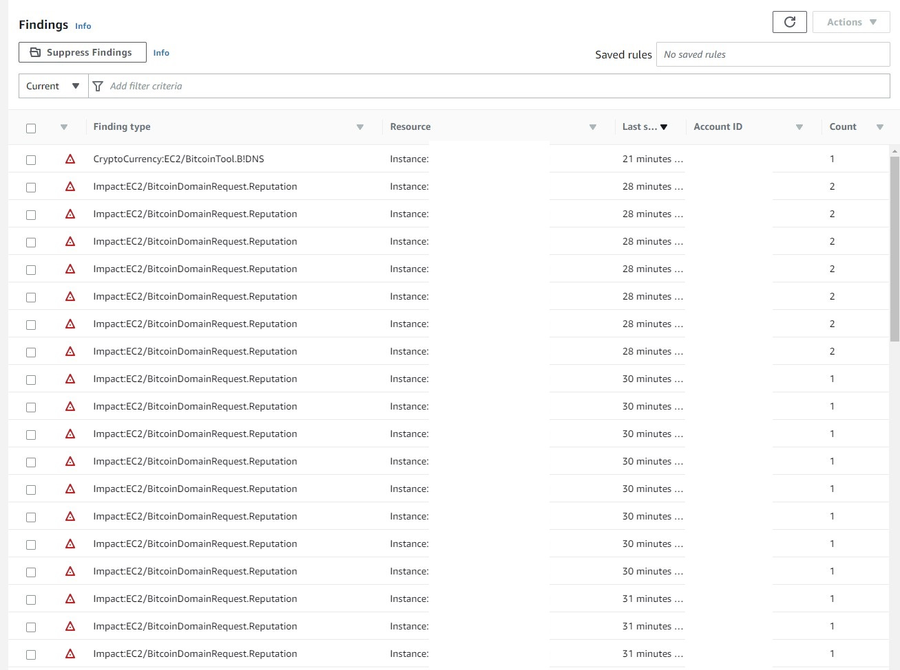

# 100 Days of Cloud & 100 Days of Cloud Security

#100DaysOfCloud #100DaysOfCyberSecurity snippets starting from 28 SEPT 2022 by your (allegedly) Favorite CISO: https://www.linkedin.com/in/jonathan-r-2b2742112/.

Hoping to spread some knowledge and encourage entry-level professionals to emulate this. For all intents and purposes the current industry hivemind would argue that as a CISO I, 1) probably shouldn't do this because "cIsOs DoNt NeEd To Be TeChNiCaL" and 2) A CISO shouldn't need to "prove" anything - which is a dangerous assumption and why we have busted ass security programs in F500 companies. Gatekeepers can bite my shiny metal ass.

In all seriousness, certs and degrees are fine but not everyone has the economic means to afford them at any given point. As a former hiring manager who built one of the most ambitious cyber security products INSIDE of a massive F500 company with more than 60% of the team being entry-level, I have an opinion that you can teach just about any skills to any candidate that can demonstrate they have a desire and passion to learn and display some personality in their projects.

When you create something like this, it demonstrates you can stick with something (100 days is a lot!), and how you document it and execute tells me far more about your aptitude and attitude than a cert or degree. By all means, don't feel bad for getting them, but for those looking to pivot or to highlight themselves: do this.

## Table of Contents

> - [Day 1](./days/day1/) AWS environment variables Bash script for Account ID, Account Name, Region & Organizations Principal ID

> - [Day 2](./days/day2/) Python script to find all Default VPCs in every Region in current Account

> - [Day 3](./days/day3/)Python script to find and delete all ***unused*** Default VPC and their dependencies in every Region in the current Account

> - [Day 4](./days/day4/) Python script to find all Default Security Groups for every VPC in every Region in the current Account

> - [Day 5](./days/day5/) No code, overview of AWS Network Security solutions

> - [Day 6](./days/day6/) Python script to find certain resources (EC2, RDS, ALB) using the Default SG in every Region in the current Account and deletes the default rules

> - [Day 7](./days/day7/) Python script to automated NMAP TCP scans against public-facing EC2 instances in all Regions in the current Account

> - [Day 8](./days/day8/) Python script to create and attach a basic DNS Firewall with the AWS-managed malware Domain List to all VPCs in your current Region

> - [Day 9](./days/day9/) Python script to create a basic Route 53 Resolver DNS Query Logging Configuration for all VPCs in your current Region and send the logs to CloudWatch

> - [Day 10](./days/day10/) Python AWS Lambda script to parse CloudWatch Logs and print basic information on DNS Firewall events within them. Optional code to send messages to SNS

> - [Day 11](./days/day11/) Python AWS Lambda script (modified Day 10) that enriches DNS Firewall findings with additional information.

> - [Day 12](./days/day12/) Python AWS Lambda script (modified Day 10 & 11) that enriches DNS Firewall findings with IP resolution from `socket` as well as provide geo-intel data for the IPs via ip-api.com.

> - [Day 13](./days/day13/) Python script that mirrors enrichment steps from Day 12 and demonstrates the usage of DynamoDB as a write-through cache for IP addresses and associated geolocation data. DynamoDB creation script included.

> - [Day 14](./days/day14/) Python script to create an AWS WAFv2 Web Access Control List (ACL) that contains an IP Set with the latest IOCs from the CINS Score feed.

> - [Day 15](./days/day15/) Modified Day 14 Python script that introduces logic for creating multiple types of IP Sets, updating existing ones, and converting hostnames to domains and into IP addresses. Uses IOCs from CINS Score and Coinblocker feeds. THIS WILL TRIGGER GUARDUDTY ALERTS.

> - [Day 16](./days/day16/) Redid this repo...that's it. LinkedIn post about plans.


## Day 14


### Day 14 LinkedIn Post

[Post Link](https://www.linkedin.com/feed/update/urn:li:share:6985658695674118145)

Day 14 (holy crap it's been 2 weeks!?) of #100daysofcloud & #100daysofcybersecurity continuing to work our way down the AWS #netsec services with #WAF.

The current incarnation of AWS WAF is actually a much needed V2 that greatly expanded offerings with things as crazy as custom responses, header injection, CAPTCHA challenges, managed rule groups w/ versioning support, Bot Control, distributed logging, and new supported targets (Cognito & AppSync).

Like other WAFs, AWS WAF is a Layer 7 application level firewall that intercepts and inspects requests sent to it and determines what to do with the request, that's the simple answer.

The core of WAF is the Web Access Control List (Web ACL/WACL). The WACL is made up of one or more Rule Groups which can be Managed (provided by AWS & Partners) or Custom. Custom Rule Groups are made up of Rules you write/create with the engine which can pick apart anything from the URI, Headers, Body, and more to match against specific conditions such as IOCs in an IP Set, custom regex in a Regex Pattern Set, SQL Injection, XSS, or Rate-based Rules.

The Rules specify the Actions you want to take, you can return Custom Responses (HTTP 418 FTW lol), you can issue a CAPTCHA Challenge, and you can control fine-grained metrics monitoring & logging per Rule as well at the Rule Group level. You can override specific Rules/Rule Groups in the WACL and set more logging at that level.

For automation folks out there, you can orchestrate creation and assignment of WACLs using AWS Firewall Manager Service (which relies on AWS Config) or write it yourself. It is a decently large uplift from a #SecDataOps perspective to continuously inventory supported targets, update your rules, tune them, override, and more but it can be done.

Today's script is Step 0 for that and introduces some fun #Python tricks for conditional formating, downloading text files, turning text to a List, validating IOCs and ensuring Lists stay a certain size. We also look at the botocore exceptions library to gracefully deal with errors.

The Web ACL created will only contain an IP Set of the latest 10K IP IOCs from CINS Score and has user-agent based rules to block bastards using Nimbostratus and Masscan. I show you how to do ARN-references and set custom responses and visibility settings.

I'll spend a few more days expanding this, who knows, you may decide to use it for yourself!

Stay Dangerous

#waf #cloudsecurity #awssecurity #automation #firewall #network 

### Day 14 Code Snippet

#### Permissions

```json
{
    "Version": "2012-10-17",
    "Statement": [
        {
            "Sid": "VisualEditor0",
            "Effect": "Allow",
            "Action": [
                "wafv2:ListIPSets",
                "wafv2:UpdateIPSet",
                "wafv2:CreateIPSet"
            ],
            "Resource": "*"
        }
    ]
}
```

#### Code Snippet

```python
import urllib3
import boto3
import ipaddress
import botocore.exceptions
from datetime import datetime
from time import sleep

wafv2 = boto3.client('wafv2')

CINSSCORE_FILE_NAME = './ci_badguys.txt'
IPSET_NAME = '100DaysOfCloud-CINS'
WAF_RULE_GROUP_NAME = '100DaysOfCloudRules'
WAF_WACL_NAME = '100DaysOfCloudWACL'

def download_cinsscore():
    '''
    Downloads CI Badguys textfile from CINS Score IOC Feed and saves to file
    '''
    # Pool Manager for urllib3
    http = urllib3.PoolManager()

    url = 'http://cinsscore.com/list/ci-badguys.txt'
    try:
        # GET request
        r = http.request(
            'GET',
            url
        )

        with open(CINSSCORE_FILE_NAME, 'wb') as file:
            file.write(r.data)

        r.release_conn()

        print(f'Wrote CINS Score IOC feed to file.')
    except Exception as e:
        raise e

    del http
    del url

    return True

def parse_cinsscore():
    '''
    Reads out the CINS Score IOC file and parses the first 10K IOCs
    '''
    # Download the list
    download_cinsscore()
    # Empty list for new IOCs
    refinedIocs = []
    
    # Readout the file and close it
    iocFile = open(CINSSCORE_FILE_NAME, 'r')
    iocList = iocFile.readlines()
    iocFile.close()

    # Parse the list and strip the newline
    for ioc in iocList:
        # IP Sets accept up to 10K values, stop there
        if len(refinedIocs) < 10000:
            try:
                ioc = ioc.replace('\n','')
                # Check to ensure the IP Address is good...
                ipaddress.ip_address(ioc)
                # Write into the list as a CIDR
                if ioc not in refinedIocs:
                    refinedIocs.append(f'{ioc}/32')
                else:
                    continue
            except ValueError:
                print(f'{ioc} is invalid!')
                continue
        else:
            break

    print(f'Parsed {len(refinedIocs)} IOCs into a new list.')

    return refinedIocs

def wafv2_ip_set_creator():
    '''
    Creates an IP Set from the `parse_cinsscore` function
    '''
    # Generate timestamp for IP Set Description
    dtgNow = str(datetime.utcnow())
    # Create the IP Set
    try:
        r = wafv2.create_ip_set(
            Name=IPSET_NAME,
            Scope='REGIONAL',
            Description=f'IP Set containing CINS Score CI Bad Guys feed - IOCs loaded at {dtgNow}',
            IPAddressVersion='IPV4',
            Addresses=parse_cinsscore(),
            Tags=[
                {
                    'Key': 'Name',
                    'Value': IPSET_NAME
                }
            ]
        )
        ipSetArn = r['Summary']['ARN']
        # Wait 15 seconds for the IP Set to "stabilize"
        print('Waiting 15 seconds for the IP Set to stabilize')
        sleep(15.0)
        print(f'Succesfully created a new IP Set with an ARN of: {ipSetArn}')
    except botocore.exceptions.ClientError as error:
        if error.response['Error']['Code'] == 'WAFDuplicateItemException':
            for ipset in wafv2.list_ip_sets(Scope='REGIONAL')['IPSets']:
                if ipset['Name'] == IPSET_NAME:
                    ipSetArn = ipset['ARN']
                    break
                else:
                    continue
        else:
            raise error

    return ipSetArn

def wafv2_rule_group_controller():
    '''
    Creates a WAFv2 Rule Group using the CINS Score IP Set and some other rules...
    '''

    ipSetArn = wafv2_ip_set_creator()

    rules = [
        # BLOCK NIMBROSTRATUS BOTS
        {
            'Name': 'NimbrostratusBlock',
            'Priority': 0,
            'Statement': {
                'ByteMatchStatement': {
                    'SearchString': 'b"Nimbostratus"',
                    'FieldToMatch': {
                        'SingleHeader': {
                            'Name': 'user-agent'
                        }
                    },
                    'TextTransformations': [
                        {
                            'Priority': 0,
                            'Type': 'NONE'
                        },
                        {
                            'Priority': 1,
                            'Type': 'LOWERCASE'
                        }
                    ],
                    'PositionalConstraint': 'CONTAINS'
                }
            },
            'Action': {
                'Block': {
                    'CustomResponse': {
                        'ResponseCode': 418
                    }
                }
            },
            'VisibilityConfig': {
                'SampledRequestsEnabled': True,
                'CloudWatchMetricsEnabled': True,
                'MetricName': 'NimbrostratusBlock'
            }
        },
        # BLOCK MASSCAN BOTS
        {
            'Name': 'MasscanBlocker',
            'Priority': 1,
            'Statement': {
                'ByteMatchStatement': {
                    'SearchString': 'b"masscan"',
                    'FieldToMatch': {
                        'SingleHeader': {
                            'Name': 'user-agent'
                        }
                    },
                    'TextTransformations': [
                        {
                            'Priority': 0,
                            'Type': 'NONE'
                        },
                        {
                            'Priority': 1,
                            'Type': 'LOWERCASE'
                        }
                    ],
                    'PositionalConstraint': 'CONTAINS'
                }
            },
            'Action': {
                'Block': {
                    'CustomResponse': {
                        'ResponseCode': 418
                    }
                }
            },
            'VisibilityConfig': {
                'SampledRequestsEnabled': True,
                'CloudWatchMetricsEnabled': True,
                'MetricName': 'MasscanBlocker'
            }
        },
        # BLOCK IP SET ADDRESS IN SOURCE IP
        {
            'Name': 'IpSetBlockSource',
            'Priority': 3,
            'Statement': {
                'IPSetReferenceStatement': {
                    'ARN': ipSetArn
                }
            },
            'Action': {
                'Block': {
                    'CustomResponse': {
                        'ResponseCode': 418
                    }
                }
            },
            'VisibilityConfig': {
                'SampledRequestsEnabled': True,
                'CloudWatchMetricsEnabled': True,
                'MetricName': 'IpSetBlockSource'
            }
        },
        # BLOCK IP SET ADDRESS IN XFF HEADERS
        {
            'Name': 'IpSetXFFBlock',
            'Priority': 5,
            'Statement': {
                'IPSetReferenceStatement': {
                    'ARN': ipSetArn,
                    'IPSetForwardedIPConfig': {
                        'HeaderName': 'X-Forwarded-For',
                        'FallbackBehavior': 'NO_MATCH',
                        'Position': 'ANY'
                    }
                }
            },
            'Action': {
                'Block': {
                    'CustomResponse': {
                        'ResponseCode': 418
                    }
                }
            },
            'VisibilityConfig': {
                'SampledRequestsEnabled': True,
                'CloudWatchMetricsEnabled': True,
                'MetricName': 'IpSetXFFBlock'
            }
        }
    ]

    # List to contain all unique Rule Group names to perform check against for CREATE or UPDATE
    ruleGroups = []

    for rg in wafv2.list_rule_groups(Scope='REGIONAL')['RuleGroups']:
        if rg['Name'] not in ruleGroups:
            ruleGroups.append(rg['Name'])

    # If the Rule Group is NOT in the list, call the function to create
    if WAF_RULE_GROUP_NAME not in ruleGroups:
        print(f'Rule Group named {WAF_RULE_GROUP_NAME} does not exist, creating it!')
        rgArn = wafv2_rule_group_creator(
            rule_group_rules=rules,
            rule_group_name=WAF_RULE_GROUP_NAME
        )
    else:
        print(f'{WAF_RULE_GROUP_NAME} already exists!')
        for rg in wafv2.list_rule_groups(Scope='REGIONAL')['RuleGroups']:
            if rg['Name'] == WAF_RULE_GROUP_NAME:
                rgArn = rg['ARN']
                break
            else:
                continue

    return rgArn

def wafv2_rule_group_creator(rule_group_rules, rule_group_name):
    '''
    This function creates a brand new WAFv2 Rule Group by receiving a name and set of rules from the `wafv2_rule_group_manager()` function and
    provides the ARN back to the calling function
    '''
    # Generate timestamp for IP Set Description
    dtgNow = str(datetime.utcnow())
    # Create the Rule Group
    try:
        r = wafv2.create_rule_group(
            Name=rule_group_name,
            Scope='REGIONAL',
            Capacity=750,
            Description=f'WAFv2 Rule Group created for 100DaysOfCloud contains an CINS Score IP Set and some scanner blocking - Rules as of {dtgNow}',
            Rules=rule_group_rules,
            VisibilityConfig={
                'SampledRequestsEnabled': True,
                'CloudWatchMetricsEnabled': True,
                'MetricName': rule_group_name
            },
            Tags=[
                {
                    'Key': 'Name',
                    'Value': rule_group_name
                }
            ]
        )
        rgArn = r['Summary']['ARN']
        print(f'Succesfully created a new Rule Group with an ARN of: {rgArn}')
    except Exception as e:
        raise e

    return rgArn

def wafv2_wacl_creator():
    # Generate timestamp for IP Set Description
    dtgNow = str(datetime.utcnow())
    # Create WACL
    try:
        wafv2.create_web_acl(
            Name=WAF_WACL_NAME,
            Scope='REGIONAL',
            Description=f'Created for 100DaysOfCloud contains an CINS Score IP Set and some scanner blocking - Rules as of {dtgNow}',
            DefaultAction={
                'Allow': {}
            },
            Rules=[
                {
                    'Name': '100DaysOfCloudPrimary',
                    'Priority': 1,
                    'Statement': {
                        'RuleGroupReferenceStatement': {
                            'ARN': wafv2_rule_group_controller()
                        }
                    },
                    "OverrideAction": {
                        "None": {}
                    },
                    'VisibilityConfig': {
                        'SampledRequestsEnabled': True,
                        'CloudWatchMetricsEnabled': True,
                        'MetricName': '100DaysOfCloudPrimary'
                    }
                }
            ],
            VisibilityConfig={
                'SampledRequestsEnabled': True,
                'CloudWatchMetricsEnabled': True,
                'MetricName': WAF_WACL_NAME
            },
            Tags=[
                {
                    'Key': 'Name',
                    'Value': WAF_WACL_NAME
                }
            ]
        )
        print(f'Web ACL {WAF_WACL_NAME} has been created!')
    except botocore.exceptions.ClientError as error:
        if error.response['Error']['Code'] == 'WAFDuplicateItemException':
            print(f'{WAF_WACL_NAME} Web ACL Already exists!')
        else:
            raise error

wafv2_wacl_creator()
```

## Day 15



### Day 15 Linked Post

[Post Link](https://www.linkedin.com/feed/update/urn:li:share:6986021719715000320/)

Day 15 of #100daysofcloud & #100daysofcybersecurity continuing with AWS WAF and IOC management. As a forewarning, using this script within your AWS account boundary will trigger a massive amount of GuardDuty findings, so maybe process it outside or set up a temporary exemption for a known clean & safe instance.

Day 15 is a modification of Day 14 but I removed the Rule Group & Web ACL creation to focus on IP Sets. I introduced logic that will check if a certain IP Set exits by name and contains logic to create it or update it. I also show you how to create multiple IP sets.

One of the IP Sets uses an IOC feed that contains Hostnames with logic to split it into a proper top-level domain and use our friend Socket to determine the IP address - which is where the learning comes in.

Firstly, there is a reason why cryptojacking and other domain-based IOCs are hard to react to, there are so damn many and they change so much just like IPs. While it may be higher on the Pyramid of Pain it's only just so. When the mining pool lies dormant there may not be any record either so trying to find the IPs from them is hard. Goes to show you another reason to have layered & redundant defenses but attempting to stop activity and going with an Allowlist-oriented egress versus stopping individual IOCs is MUCH MORE VALUABLE (but harder).

Another point this brings up is IOC management. Many open source lists are not updated anymore, or if they are, they do not age out IOCs. Aging of IOCs is a hot topic. You can argue you only want what is known to be active, others argue to keep them all because attackers change up, some argue not to use them at all.

This script will take almost 20 minutes to run on a decent machine, since you're looking at each hostname (even with logic to skip past any you've seen), turning them into domains and finding the IP. Most fail. I got 3226 IPs from 1000s of active domains out of 10s of 1000s of hostnames.

You should strongly consider a dedicated CTI platform that can perform management of IOCs for you. MISP is the best open source bet but you still need to have a datastore that can accept TTLs (to age out records) and you'll need to perform parsing to determine if an IP is legit (i.e. not a private IP), dedupe and other things.

That doesn't factor in compute/storage costs, human capital of building an IOC #SecDataOps system, and having yet another pipeline to maintain. Then there are false positives and also understanding your precise threat environment. Is cryptojacking even a valid threat to you if you only use ALBs, APIGW, and Lambda?

It'll be faster for WAF and other #netsec automation - if you use IOCs - to work from a central place and set a cap on IP Sets. 10K CIDRs get consumed very quickly. For IOCs I recommend harvesting them yourself using honeypots...which we may get into in a few weeks.

Stay Dangerous

#waf #cloudsecurity #awssecurity #ioc #cti #threatintelligence #bigdata #aws

### Day 15 Code Snippet

#### Pernissions

```json
{
    "Version": "2012-10-17",
    "Statement": [
        {
            "Sid": "VisualEditor0",
            "Effect": "Allow",
            "Action": [
                "wafv2:ListIPSets",
                "wafv2:UpdateIPSet",
                "wafv2:CreateIPSet"
            ],
            "Resource": "*"
        }
    ]
}
```

#### Code Snippet

```python
from xml import dom
import urllib3
import boto3
import socket
import ipaddress
import botocore.exceptions
from datetime import datetime
from time import sleep

wafv2 = boto3.client('wafv2')

CINSSCORE_URL = 'http://cinsscore.com/list/ci-badguys.txt'
CINSSCORE_FILE_NAME = './ci_badguys.txt'
COINBLOCKER_URL = 'https://zerodot1.gitlab.io/CoinBlockerLists/list.txt'
COINBLOCKER_FILE_NAME = './coinblockerlist.txt'
CINSSCORE_IPSET_NAME = '100DaysOfCloud-CINS'
COINBLOCKER_IPSET_NAME = '100DaysOfCloud-COINBLOCKER'

def download_ioc_feeds():
    '''
    Downloads and saves various IOC feeds to file
    '''
    # Pool Manager for urllib3
    http = urllib3.PoolManager()
    # CINSSCORE
    try:
        # GET request
        r = http.request(
            'GET',
            CINSSCORE_URL
        )

        with open(CINSSCORE_FILE_NAME, 'wb') as file:
            file.write(r.data)

        r.release_conn()
        del r

        print(f'Wrote CINS Score IOC feed to file.')
    except Exception as e:
        raise e

    # COINBLOCKER
    try:
        # GET request
        r = http.request(
            'GET',
            COINBLOCKER_URL
        )

        with open(COINBLOCKER_FILE_NAME, 'wb') as file:
            file.write(r.data)

        r.release_conn()
        del r

        print(f'Wrote CINS Score IOC feed to file.')
    except Exception as e:
        raise e

    del http

    return True

def parse_cinsscore():
    '''
    Reads out the CINS Score IOC file and parses the first 10K IOCs
    '''
    # Empty list for new IOCs
    cinscoreIocs = []
    
    # Readout the file and close it
    cinsscoreIocFile = open(CINSSCORE_FILE_NAME, 'r')
    cinsscoreIocList = cinsscoreIocFile.readlines()
    cinsscoreIocFile.close()

    # Parse the list and strip the newline
    for ioc in cinsscoreIocList:
        # IP Sets accept up to 10K values, stop there
        if len(cinscoreIocs) < 10000:
            try:
                ioc = ioc.replace('\n','')
                # Check to ensure the IP Address is good...
                ipaddress.ip_address(ioc)
                # Write into the list as a CIDR
                if ioc not in cinscoreIocs:
                    cinscoreIocs.append(f'{ioc}/32')
                else:
                    continue
            except ValueError:
                print(f'{ioc} is invalid!')
                continue
        else:
            break

    print(f'Parsed {len(cinscoreIocs)} IOCs into a new list.')

    return cinscoreIocs

def parse_coinblocker():
    '''
    Reads out the CINS Score IOC file and parses the first 10K IOCs
    '''
    # Empty list for new IOCs
    coinblockerIocs = []
    
    # Readout the file and close it
    coinblockerIocFile = open(COINBLOCKER_FILE_NAME, 'r')
    coinblockerIocList = coinblockerIocFile.readlines()
    coinblockerIocFile.close()

    # List for domains that have been seen
    seenDomains = []
    
    # Parse the list and strip the newline
    for ioc in coinblockerIocList:
        # IP Sets accept up to 10K values, stop there
        if len(coinblockerIocs) < 10000:
            try:
                ioc = ioc.replace('\n','')
                # Find the top-level domain instead
                splitter = ioc.split('.')
                domain = f'{splitter[-2]}.{splitter[-1]}'
                if domain not in seenDomains:
                    seenDomains.append(domain)
                else:
                    continue
                # Attempt to transform domain IOC into an IP
                ip = domain_to_ip(domain)
                if ip == None:
                    continue
                # Check to ensure the IP Address is good...
                ipaddress.ip_address(ip)
                # Write into the list as a CIDR
                if ip not in coinblockerIocs:
                    coinblockerIocs.append(f'{ip}/32')
                else:
                    continue
            except ValueError:
                print(f'{ip} is invalid!')
                continue
        else:
            break

    del seenDomains

    print(f'Parsed {len(coinblockerIocs)} IOCs into a new list.')

    return coinblockerIocs

def domain_to_ip(domain):
    '''
    This function receives Domain IOCs and attempts to convert them into IP addresses using `socket`
    '''
    try:
        ip = socket.gethostbyname(domain)
    except Exception as e:
        print(f'Socket error {e} encountered for {domain}')
        ip = None

    return ip

def wafv2_ip_set_commander():
    '''
    Controls or updates multiple IP Sets from various IOC feeds
    '''
    # Download fresh feeds
    download_ioc_feeds()

    # Retrieve parsed IOCs
    cinsscoreIocs = parse_cinsscore()
    coinblockerIocs = parse_coinblocker()

    # Determine if the IP Sets exist. Create a list of IP Sets to reference, if any exist
    ipsets = []

    # Save ListIpSets results to a variable, it will need to be accessed multiple times
    listIpSets = wafv2.list_ip_sets(Scope='REGIONAL')['IPSets']

    # Write unique WAFv2 IP Set names into the list
    for ipset in listIpSets:
        ipsetName = ipset['Name']
        if ipsetName not in ipsets:
            ipsets.append(ipsetName)

    # CINS Score Create/Update loop
    if CINSSCORE_IPSET_NAME not in ipsets:
        cinsscoreIpSetArn = waf_ip_set_creator(
            ip_set_name=CINSSCORE_IPSET_NAME,
            ioc_payload=cinsscoreIocs
        )
    else:
        for ipset in listIpSets:
            if ipset['Name'] == CINSSCORE_IPSET_NAME:
                ipSetId = ipset['Id']
                ipSetLockToken = ipset['LockToken']
                cinsscoreIpSetArn = ipset['ARN']
                waf_ip_set_updater(
                    ip_set_name=CINSSCORE_IPSET_NAME,
                    ip_set_id=ipSetId,
                    ip_set_lock_token=ipSetLockToken,
                    ioc_payload=cinsscoreIocs
                )
                break
            else:
                continue

    # Coinblocker Create/Update loop
    if COINBLOCKER_IPSET_NAME not in ipsets:
        coinblockerIpSetArn = waf_ip_set_creator(
            ip_set_name=COINBLOCKER_IPSET_NAME,
            ioc_payload=coinblockerIocs
        )
    else:
        for ipset in listIpSets:
            if ipset['Name'] == COINBLOCKER_IPSET_NAME:
                ipSetId = ipset['Id']
                ipSetLockToken = ipset['LockToken']
                coinblockerIpSetArn = ipset['ARN']
                waf_ip_set_updater(
                    ip_set_name=COINBLOCKER_IPSET_NAME,
                    ip_set_id=ipSetId,
                    ip_set_lock_token=ipSetLockToken,
                    ioc_payload=coinblockerIocs
                )
                break
            else:
                continue
    
    return cinsscoreIpSetArn, coinblockerIpSetArn

def waf_ip_set_creator(ip_set_name, ioc_payload):
    '''
    Receives a name and IOC payload from `wafv2_ip_set_commander` and creates a new IP Set and returns the ARN
    '''
    # Generate timestamp for IP Set Description
    dtgNow = str(datetime.utcnow())
    # Create the IP Set
    try:
        r = wafv2.create_ip_set(
            Name=ip_set_name,
            Scope='REGIONAL',
            Description=f'IP Set corresponding to IOCs of the named IP Set - IOCs loaded at {dtgNow}',
            IPAddressVersion='IPV4',
            Addresses=ioc_payload,
            Tags=[
                {
                    'Key': 'Name',
                    'Value': ip_set_name
                }
            ]
        )
        ipSetArn = r['Summary']['ARN']
        # Wait 15 seconds for the IP Set to "stabilize"
        print(f'Succesfully created a new IP Set {ip_set_name}. Waiting 7 seconds for the IP Set to stabilize')
        sleep(7)
    except botocore.exceptions.ClientError as error:
        raise error

    return ipSetArn

def waf_ip_set_updater(ip_set_name, ip_set_id, ip_set_lock_token, ioc_payload):
    '''
    Receives a name, ID, lock token, and IOC payload from `wafv2_ip_set_commander` and updates an existing IP Set and returns the ARN
    '''
    # Generate timestamp for IP Set Description
    dtgNow = str(datetime.utcnow())
    # Update the IP Set
    try:
        wafv2.update_ip_set(
            Name=ip_set_name,
            Scope='REGIONAL',
            Id=ip_set_id,
            Description=f'IP Set corresponding to IOCs of the named IP Set - IOCs loaded at {dtgNow}',
            Addresses=ioc_payload,
            LockToken=ip_set_lock_token
        )
        print(f'Sucessfully updated IP Set {ip_set_name}')
    except Exception as e:
        raise e

def day15_placeholder():
    '''
    Nothing yet...
    '''
    # With multiple `return` statements, the values are provided as a tuple which can be accessed like a list
    ipSets = wafv2_ip_set_commander()

    print(f'CINS Score IP Set ARN is {ipSets[0]}')
    print(f'Coinblocker IP Set ARN is {ipSets[1]}')

day15_placeholder()
```

## Day 16

### Day 16 Linked Post

### Day 16 Code Snippet

## Day 17

### Day 17 Linked Post

### Day 17 Code Snippet

## Day 18

### Day 18 Linked Post

### Day 18 Code Snippet

## Day 19

### Day 19 Linked Post

### Day 19 Code Snippet

## Day 20

### Day 20 Linked Post

### Day 20 Code Snippet

## Day 21

### Day 21 Linked Post

### Day 21 Code Snippet

## Day 22

### Day 22 Linked Post

### Day 22 Code Snippet

## Day 23

### Day 23 Linked Post

### Day 23 Code Snippet

## Day 24

### Day 24 Linked Post

### Day 24 Code Snippet